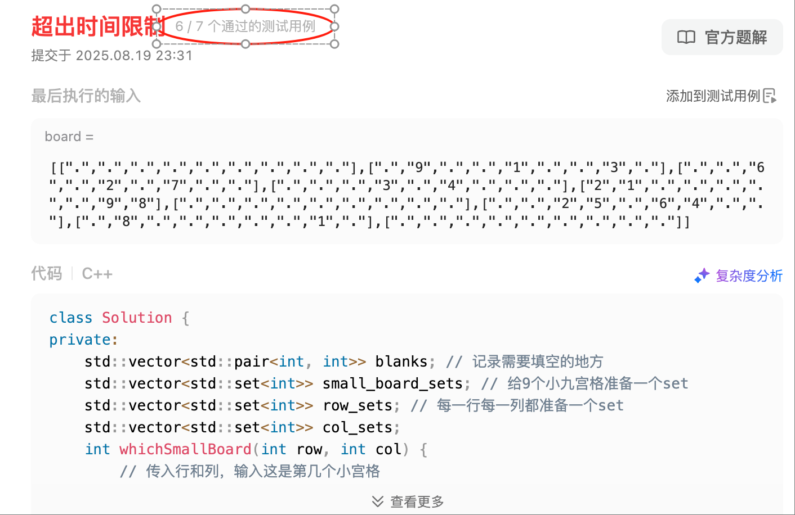

# 回溯算法

- [回溯算法](#回溯算法)
  - [回溯算法理论基础](#回溯算法理论基础)
  - [组合](#组合)
  - [组合总和 III](#组合总和-iii)
  - [电话号码的字母组合](#电话号码的字母组合)
  - [组合总和](#组合总和)
  - [组合总和II (重要, used数组的运用)](#组合总和ii-重要-used数组的运用)
  - [分割回文串（需要复习）](#分割回文串需要复习)
    - [利用dp数组进行优化](#利用dp数组进行优化)
  - [复原 IP 地址（需要复习）](#复原-ip-地址需要复习)
  - [子集（经典题目，要和组合问题区分开来）](#子集经典题目要和组合问题区分开来)


## 回溯算法理论基础

**此部分内容来自：[https://programmercarl.com/...](https://programmercarl.com/%E5%9B%9E%E6%BA%AF%E7%AE%97%E6%B3%95%E7%90%86%E8%AE%BA%E5%9F%BA%E7%A1%80.html#%E7%90%86%E8%AE%BA%E5%9F%BA%E7%A1%80)**

回溯算法本质就是一种暴力搜索，效率是不高的。

在回溯的基础上我们可以剪枝来获得更好的性能。

回溯法，一般可以解决如下几种问题：

- 组合问题：N个数里面按一定规则找出k个数的集合
- 切割问题：一个字符串按一定规则有几种切割方式
- 子集问题：一个N个数的集合里有多少符合条件的子集
- 排列问题：N个数按一定规则全排列，有几种排列方式
- 棋盘问题：N皇后，解数独等等

排列和组合的区别：这个也不用多说了，排列是要强调顺序的，组合是set，不强调顺序。

比如用回溯遍历下面这张图：


回溯算法的模版是：

```cpp
void backtracking(参数) {
    if (终止条件) {
        存放结果;
        return;
    }

    for (选择：本层集合中元素（树中节点孩子的数量就是集合的大小）) {
        处理节点;
        backtracking(路径，选择列表); // 递归
        回溯，撤销处理结果
    }
}
```

## 组合

https://leetcode.cn/problems/combinations/description/

自己写的版本。

```cpp
class Solution {
private:
    std::vector<std::vector<int>> result;
    std::vector<int> path;
    void backtracking(int n, int k, int startIndex) {
        // 先写递归结束条件
        if(path.size() == k) {
            result.push_back(path);
            return;
        }
        for(int i = startIndex; i <= n; ++i) { // startIndex最小是1
            path.push_back(i);
            backtracking(n, k, i + 1);
            path.pop_back();
        }
    }
public:
    std::vector<std::vector<int>> combine(int n, int k) {
        backtracking(n, k, 1);
        return result;
    }
};
```

这个是没问题的，但是是可以剪枝的。

剪枝是这样处理的：`for (int i = startIndex; i <= n - (k - path.size()) + 1; i++)`

举个例子，当 n=4, k=4 的时候，从1，2，3，4的2，3，4这一轮开始已经没有意义了。

**`for(int i = startIndex; i <= n; ++i)` 这句的意义就是，在这个数组范围里面再选 k-path.size() 个数字，如果 n-startIndex已经没有 k-path.size() 个数字了，就没必要循环了。**


## 组合总和 III

https://leetcode.cn/problems/combination-sum-iii/description/

找出所有相加之和为 n 的 k 个数的组合，且满足下列条件：

只使用数字1到9
每个数字 最多使用一次 
返回 所有可能的有效组合的列表 。该列表不能包含相同的组合两次，组合可以以任何顺序返回。

自己尝试写，顺利通过。

```cpp
class Solution {
private:
    std::vector<std::vector<int>> result;
    std::vector<int>path;
    void backtracking(int n, int k, int sum, int startIndex) {
        if(sum > n) return; // 剪支也很容易想到，不赘述
        if(sum == n && path.size() == k) {
            result.push_back(path);
            return;
        }
        for(int i = startIndex; i <=9; ++i) {
            sum += i;
            path.push_back(i);
            backtracking(n, k, sum, i + 1);
            path.pop_back();
            sum -= i;
        }
    }
public:
    vector<vector<int>> combinationSum3(int k, int n) {
        // sum为n的k个数
        backtracking(n, k, 0, 1);
        return result;
    }
};
```


## 电话号码的字母组合

https://leetcode.cn/problems/letter-combinations-of-a-phone-number/

```cpp
class Solution {
private:
    std::vector<std::string> res;
    std::string path;
    std::unordered_map<char, std::string> mmap = { { '2', "abc" }, { '3', "def" }, { '4', "ghi" }, { '5', "jkl" }, { '6', "mno" }, { '7', "pqrs" }, { '8', "tuv" }, { '9', "wxyz" } };
    void backtracking(const std::string& digits, size_t digitsStartIndex) {
        if (digits.size() == path.size()) {
            res.push_back(path);
            return;
        }
        for (int i = digitsStartIndex; i < digits.size(); ++i) {
            auto str_mmap = mmap[digits[i]];
            for(const auto& e : str_mmap) {
                path.push_back(e);
                backtracking(digits, i + 1);
                path.pop_back();
            }
        }
    } //
public:
    std::vector<std::string> letterCombinations(std::string digits) {
        if(digits.size() == 0) return {};
        backtracking(digits, 0);
        return res;
    }
};
```
自己写的，顺利通过。


这个是Carl的做法，他只需要一层遍历。

```cpp
    void backtracking(const string& digits, int index) {
        if (index == digits.size()) {
            result.push_back(s);
            return;
        }
        int digit = digits[index] - '0';        // 将index指向的数字转为int
        string letters = letterMap[digit];      // 取数字对应的字符集
        for (int i = 0; i < letters.size(); i++) {
            s.push_back(letters[i]);            // 处理
            backtracking(digits, index + 1);    // 递归，注意index+1，一下层要处理下一个数字了
            s.pop_back();                       // 回溯
        }
    }
```

效率其实和我是一样的。


其实我的代码冗余了，其实根本不需要循环 `for (int i = digitsStartIndex; i < digits.size(); ++i)`

因为backtracking递归调用的时候传了 i + 1 的，直接换成 digitsStartIndex + 1 也是一样的。

## 组合总和

https://leetcode.cn/problems/combination-sum/description/

给你一个 无重复元素 的整数数组 candidates 和一个目标整数 target ，找出 candidates 中可以使数字和为目标数 target 的 所有 不同组合 ，并以列表形式返回。你可以按 任意顺序 返回这些组合。

candidates 中的 同一个 数字可以 无限制重复被选取 。如果至少一个数字的被选数量不同，则两种组合是不同的。 

对于给定的输入，保证和为 target 的不同组合数少于 150 个。

这个没有疑问也是经典题目。

自己写下就行。

```cpp
class Solution {
private:
    std::vector<std::vector<int>> res;
    std::vector<int> path;
    void backtracking(const std::vector<int>& candidates, int target, int sum, int startIndex) {
        if(sum > target) return;
        if(sum == target) {
            res.push_back(path);
            return;
        }
        for(int i = startIndex; i < candidates.size(); ++i) {
            path.push_back(candidates[i]);
            sum += candidates[i];
            backtracking(candidates, target, sum, i); // 这里不是 i+1，可以重复
            sum -= candidates[i];
            path.pop_back();
        }
    }
public:
    std::vector<std::vector<int>> combinationSum(std::vector<int>& candidates, int target) {
        // candidates 无重复，candidates数字全部大于0，所以可以用 target 剪枝
        // 结果中的数字可以重复
        backtracking(candidates, target, 0, 0);
        return res;
    }
};
```

顺利通过。

剪枝的话，先排序，然后每层for里面可以剪一下。

```cpp
class Solution {
private:
    std::vector<std::vector<int>> res;
    std::vector<int> path;
    void backtracking(const std::vector<int>& candidates, int target, int sum, int startIndex) {
        if(sum > target) return;
        if(sum == target) {
            res.push_back(path);
            return;
        }
        for(int i = startIndex; (i < candidates.size() && (sum + candidates[i] <= target)); ++i) {
            path.push_back(candidates[i]);
            sum += candidates[i];
            backtracking(candidates, target, sum, i); // 这里不是 i+1，可以重复
            sum -= candidates[i];
            path.pop_back();
        }
    }
public:
    std::vector<std::vector<int>> combinationSum(std::vector<int>& candidates, int target) {
        // candidates 无重复，candidates数字全部大于0，所以可以用 target 剪枝
        // 结果中的数字可以重复
        std::sort(candidates.begin(), candidates.end());
        backtracking(candidates, target, 0, 0);
        return res;
    }
};
```

反正就是两个地方，目前做到的题目两个地方可以剪枝：
- 每次backtracking可以剪枝，比如上面的 `if(sum > target) return;`
- for那里也可以剪枝


## 组合总和II (重要, used数组的运用)

https://leetcode.cn/problems/combination-sum-ii/description/

这题很重要，我自己做的时候遇到了这个问题（其实就是不记得大一时候做的了）。

比如sort之后: [1, 1, 2, 5, 6, 7, 10], target = 8

用第一个1，组成了[1, 2, 5]
那么第二个1，也能组成[1, 2, 5]
所以这个是要去重的，这一层我能想到。

所以我在for里面写了：`if (i > 0 && candidates[i] == candidates[i - 1])`

但这个是有问题的。[1, 1, 6]也是合法答案！

如果我直接用上面去重，就会去掉这种情况。

区别就是：
- [1, 2, 5]：1是没有被用过的
- [1, 1, 6]：遍历到第二个1的时候不能continue，因为 used[i-1]=true，用过了，所以此时不能continue

所以只有当：`if (i > 0 && candidates[i] == candidates[i - 1] && used[i - 1] == false)`的时候才能continue。

```cpp
class Solution {
private:
    vector<vector<int>> result;
    vector<int> path;
    void backtracking(vector<int>& candidates, int target, int sum, int startIndex, vector<bool>& used) {
        if (sum == target) {
            result.push_back(path);
            return;
        }
        for (int i = startIndex; i < candidates.size() && sum + candidates[i] <= target; i++) {
            // used[i - 1] == true，说明同一树枝candidates[i - 1]使用过
            // used[i - 1] == false，说明同一树层candidates[i - 1]使用过
            // 要对同一树层使用过的元素进行跳过
            if (i > 0 && candidates[i] == candidates[i - 1] && used[i - 1] == false) {
                continue;
            }
            sum += candidates[i];
            path.push_back(candidates[i]);
            used[i] = true;
            backtracking(candidates, target, sum, i + 1, used); // 和39.组合总和的区别1，这里是i+1，每个数字在每个组合中只能使用一次
            used[i] = false;
            sum -= candidates[i];
            path.pop_back();
        }
    }

public:
    vector<vector<int>> combinationSum2(vector<int>& candidates, int target) {
        vector<bool> used(candidates.size(), false);
        path.clear();
        result.clear();
        // 首先把给candidates排序，让其相同的元素都挨在一起。
        sort(candidates.begin(), candidates.end());
        backtracking(candidates, target, 0, 0, used);
        return result;
    }
};

```

这题需要用used数组来去重，非常重要。


## 分割回文串（需要复习）

https://leetcode.cn/problems/palindrome-partitioning/description/

给你一个字符串 s，请你将 s 分割成一些 子串，使每个子串都是 回文串 。返回 s 所有可能的分割方案。

这题有点难，其实暴力遍历的是切割字符串的位置。

要好好看看代码。

```cpp
class Solution {
private:
    bool isPalindrome(const std::string& str, int left, int right) {
        while(left < right)
            if(str[left++] != str[right--]) return false;
        return true;
    }
private:
    std::vector<std::vector<std::string>> res;
    std::vector<std::string> path;
    void backtracking(const std::string& s, int cutIndex) {
        // cutIndex表示第一次切割的位置
        if(cutIndex >= s.size()) {
            res.push_back(path);
            return;
        }
        for(int i = cutIndex; i < s.size(); ++i) {
            // 先检查[cutIndex, i]这部分是不是合法的，如果不是可以直接跳过
            if(isPalindrome(s, cutIndex, i))
                // 说明 s中 [cutIndex, i] 这部分是合法的子串
                path.push_back(std::string(s.begin() + cutIndex, s.begin() + i + 1));
            else continue;
            backtracking(s, i+1); // 开始找 i+1 开始切割的子串
            path.pop_back(); // 因为上面一定会运行到if里面，如果没有运行到if里面，就不会调用 backtracking
        }
    }
public:
    std::vector<std::vector<std::string>> partition(std::string s) {
        backtracking(s, 0);
        return res;
    }
};
```

### 利用dp数组进行优化

上面的代码有一个性能瓶颈就是：每一次都要判断回文。

其实可以记录一个 `dp[][]` 数组，`dp[left][right]` 就可以告诉你是否是回文。然后dp数组在第一次调用 `backtracking` 之前就处理好，这样效率会更高。

具体代码在联系了dp思想后再写吧。


## 复原 IP 地址（需要复习）

https://leetcode.cn/problems/restore-ip-addresses/description/

这题是有点意思的，值得复习，自己也写出来了，不错。

```cpp
class Solution {
private:
    std::vector<std::string> result;
    std::string valid_answers;
    void backtracking(std::string& s, size_t startIndex, size_t dotNumber) {
        // 其实就是插入三个.
        // 插入的位置是有说法的
        if (dotNumber == 3) {
            // 点了第三个点后，第四段需要判断是否合法
            if (isValid(s, startIndex, s.size() - 1))
                result.push_back(s);
            return; // 如果第四段不合法，就不用加到结果中了
        }
        for (int i = startIndex; i < s.size(); ++i) {
            // 找一个位置插入点
            // 在 i 的身后插入一个点，因为i从0开始，不能在前面插入
            // 但是，要先判断在此为止插入是否合法
            // 判断 [startIndex, i] 的位置是否合法，如果合法，则在i后插入一个 .
            if (isValid(s, startIndex, i)) {
                s.insert(s.begin() + i + 1, '.');
                backtracking(s, i + 2, dotNumber + 1); // 注意！这里是 i+2, 因为已经插入了一个 .
                s.erase(s.begin() + i + 1);
            } else break; // 不合法，直接结束循环
            /**
             * 这里为什么不是continue呢？
             * 我思考了一下，如果 [startIndex, i] 不合法，那么 [startIndex, i + n] 也一定不合法
            */
        }
    }
    bool isValid(const std::string& s, int begin, int end) {
        // 判断 s中，[begin, end] 区间是否是合法ip地址
        if (end - begin > 2)
            return false; // 大于3位数肯定不合法
        if (s[begin] == '0' && end - begin != 0) // 可以单独为0
            return false; // 有前导0不合法
        
        int num = -1;
        try {
            num = std::stoi(std::string(s.begin() + begin, s.begin() + end + 1));
        }
        catch(const std::exception& e) {
            return false; // 如果不能解析成数字，表示不合法
        }
        if (num < 0 || num > 255)
            return false; // 判断数字范围
        return true;
    } //
public:
    std::vector<std::string> restoreIpAddresses(std::string s) {
        backtracking(s, 0, 0);
        return result;
    }
};
```


## 子集（经典题目，要和组合问题区分开来）

https://leetcode.cn/problems/subsets/description/

给你一个整数数组 nums ，数组中的元素 互不相同 。返回该数组所有可能的子集（幂集）。

解集 不能 包含重复的子集。你可以按 任意顺序 返回解集。

```cpp
class Solution {
private:
    std::vector<std::vector<int>> res;
    std::vector<int> path;
    void backtracking(const std::vector<int>& nums, int startIndex) {
        res.push_back(path);
        if (startIndex >= nums.size()) // 这个终止条件可以不加，因为for循环也会结束，startIndex不会超
            return;
        for(int i = startIndex; i < nums.size(); ++i) {
            path.push_back(nums[i]);
            backtracking(nums, i+1);
            path.pop_back();
        }
    }
public:
    vector<vector<int>> subsets(vector<int>& nums) {
        backtracking(nums, 0);
        return res;
    }
};
```

**注意两个点：**
- 终止条件是可以不加的，不会无限递归。因为每次 `backtracking` 是从 `i+1` 开始的。
- 如果要写终止条件，`res.push_back(path);` 要写在前面，不然会漏掉最后一种情况的。然后其实发现，`res.push_back(path);`写在前面之后，终止条件就是多余的，和for循环的终止条件重复了。


## 子集问题和组合问题的区别

**子集是收集树形结构中树的所有节点的结果。而组合问题、分割问题是收集树形结构中叶子节点的结果。**


## 子集II

https://leetcode.cn/problems/subsets-ii/description/

```cpp
class Solution {
private:
    std::vector<std::vector<int>> res;
    std::vector<int> path;
    void backtracking(const std::vector<int>& nums, int startIndex, std::vector<bool>& used) {
        res.push_back(path); // 添加结果
        for(int i = startIndex; i < nums.size(); ++i) {
            if(i > 0 && nums[i] == nums[i-1] && used[i-1] == false) continue;
            used[i] = true;
            path.push_back(nums[i]);
            backtracking(nums, i + 1, used);
            path.pop_back();
            used[i] = false;
        }
    }
public:
    std::vector<std::vector<int>> subsetsWithDup(std::vector<int>& nums) {
        std::sort(nums.begin(), nums.end()); // 先排序
        std::vector<bool> used(nums.size(), false); // 去重数组，先设置为 false
        backtracking(nums, 0, used);
        return res;
    }
};
```

来到美国后的第一道题，有半个月没刷题了。这道题能做出来，不错的。

### 补充

本题也可以不使用used数组来去重，因为递归的时候下一个startIndex是i+1而不是0。

如果要是全排列的话，每次要从0开始遍历，为了跳过已入栈的元素，需要使用used。

代码如下：

```cpp
    void backtracking(vector<int>& nums, int startIndex) {
        result.push_back(path);
        for (int i = startIndex; i < nums.size(); i++) {
            // 而我们要对同一树层使用过的元素进行跳过
            if (i > startIndex && nums[i] == nums[i - 1] ) { // 注意这里使用i > startIndex
                continue;
            }
            path.push_back(nums[i]);
            backtracking(nums, i + 1);
            path.pop_back();
        }
    }
```

但是我有点没看懂 Carl 这里这个去重的方法。

## 递增子序列（需要复习）

https://leetcode.cn/problems/non-decreasing-subsequences/description/

给你一个整数数组 nums ，找出并返回所有该数组中不同的递增子序列，递增子序列中 至少有两个元素 。你可以按 任意顺序 返回答案。

数组中可能含有重复元素，如出现两个整数相等，也可以视作递增序列的一种特殊情况。

示例 1：

输入：nums = [4,6,7,7]
输出：[[4,6],[4,6,7],[4,6,7,7],[4,7],[4,7,7],[6,7],[6,7,7],[7,7]]
示例 2：

输入：nums = [4,4,3,2,1]
输出：[[4,4]]

先自己尝试写一下。

```cpp
class Solution {
private:
    /* 这题的问题在于，不能排序，所以去重肯定是比较麻烦了，用set去重吧 */
    std::vector<std::vector<int>> res;
    std::vector<int> path;
    void backtracking(const std::vector<int>& nums, int startIndex) {
        if(path.size() >= 2) res.push_back(path);
        // 在这里设置一个 set
        // tip: 如何区分set是加到哪里？是for外面还是for里面？
        // 很明显我们这里是要去掉同一层的重复，同一层在哪里，肯定是for外面，for里面就是向更深的地方递归了
        unordered_set<int> uset;
        for(int i = startIndex; i < nums.size(); ++i) {
            if(!path.empty() && nums[i] < path.back()) continue; // 因为是找递增的，如果遇到小的，就可以跳过
            if(uset.find(nums[i]) != uset.end()) continue; // 同层已经使用过了
            uset.insert(nums[i]); // 本层已经使用过这个元素了，后面不能再用了
            // uset.insert为什么后面不用 erase，因为这里的意思是，只要在for里面使用过一次，整个 backtracking 部分就不能再使用这个元素了，要erase也是在for结束后erase，所以是可以省略的
            // uset只负责本层去重，不需要管更深的地方
            path.push_back(nums[i]);
            backtracking(nums, i + 1);
            path.pop_back();
        }
        //
    }
public:
    std::vector<std::vector<int>> findSubsequences(std::vector<int>& nums) {
        backtracking(nums, 0);
        return res;
    }
};
```

另外，这道题里面，说了数据范围，因此可以用数组来代替set，这样会更快。

## 全排列

https://leetcode.cn/problems/permutations/description/

全排列就是一个很经典的一个题目了。

直接写代码

```cpp
class Solution {
private:
    std::vector<std::vector<int>> res;
    std::vector<int> path;
    void backtracking(const std::vector<int>& nums, std::vector<bool> used) {
        if(path.size() == nums.size()) {
            res.push_back(path);
            return;
        }
        for(int i = 0; i < nums.size(); ++i) {
            // 虽然题目说了不含重复，但是还需要去重的
            // 不然就会出现 [1,1,2] 这种情况了
            if(used[i] == true) continue; // 当前数字用过了
            used[i] = true;
            path.push_back(nums[i]);
            backtracking(nums, used);
            path.pop_back();
            used[i] = false;
        }
    }
public:
    std::vector<std::vector<int>> permute(std::vector<int>& nums) {
        std::vector<bool> used(nums.size(), false);
        backtracking(nums, used);
        return res;
    }
};
```

要注意这个去重的逻辑。


## 全排列 II

https://leetcode.cn/problems/permutations-ii/description/

就是题目输入的数字是会有重复的，在上面那道题的基础上去重就可以了。

```cpp
class Solution {
private:
    std::vector<std::vector<int>> res;
    std::vector<int> path;
    void backtracking(const std::vector<int>& nums, std::vector<bool> used) {
        if(path.size() == nums.size()) {
            res.push_back(path);
            return;
        }
        for(int i = 0; i < nums.size(); ++i) {
            if(used[i] == true) continue; // 跳过自己
            if(i > 0 && nums[i] == nums[i - 1] && used[i-1] == false) continue; // 加上去重的逻辑
            used[i] = true;
            path.push_back(nums[i]);
            backtracking(nums, used);
            path.pop_back();
            used[i] = false;
        }
    }
public:
    vector<vector<int>> permuteUnique(vector<int>& nums) {
        std::sort(nums.begin(), nums.end());
        std::vector<bool> used(nums.size(), false);
        backtracking(nums, used);
        return res;
    }
};
```

没问题，顺利通过。

### 拓展：关于层去重和树枝去重

摘自：代码随想录

大家发现，去重最为关键的代码为：

```cpp
if (i > 0 && nums[i] == nums[i - 1] && used[i - 1] == false) {
    continue;
}
```
如果改成 `used[i - 1] == true`， 也是正确的!，去重代码如下：

```cpp
if (i > 0 && nums[i] == nums[i - 1] && used[i - 1] == true) {
    continue;
}
```
这是为什么呢，就是上面我刚说的，如果要对树层中前一位去重，就用`used[i - 1] == false`，如果要对树枝前一位去重用`used[i - 1] == true`。


**对于排列问题，树层上去重和树枝上去重，都是可以的，但是树层上去重效率更高！**

这么说是不是有点抽象？

来来来，我就用输入: [1,1,1] 来举一个例子。

树层上去重`(used[i - 1] == false)`，的树形结构如下：


树枝上去重`(used[i - 1] == true)`的树型结构如下：


**大家应该很清晰的看到，树层上对前一位去重非常彻底，效率很高，树枝上对前一位去重虽然最后可以得到答案，但是做了很多无用搜索。**


## 回溯算法去重问题用set的写法，set应该放在哪里

用子集II这道题来说。

https://leetcode.cn/problems/subsets-ii/

[1, 2, 2, 3] 这个例子

第一次选了 [1, 2] （这里的2是第一个2）之后，第二次 [1, ] 就不能把第二个2push进来了，不然就会重复。

其实本质就是搞清楚，到底是去哪里的重。其实就两种，层上和树枝上的。一般其实就是树层上的。

所以如果要用 set 就是要对每一层去重。

而每一层，其实就是在 backtracking 里面 for 外面。

为什么不是 backtracking 函数外（全局）？因为那样set就不只是控制一层了，而是控制一整棵树。

为什么不是在 for 里面定义？因为那样set就一直刷新，那还记录什么？

当set定义在 backtracking 里面 for 外面的时候，他就是在控制每一层。因为for里面就是对每一层的节点再往深处遍历，for就是便利当前层所有节点。

**所以一定要记住，对层去重的时候，set的定义就是在for外面的backtracking里面的。**

然后为什么不用erase呢，前面代码的注释也说了。

```cpp
// uset.insert为什么后面不用 erase，因为这里的意思是，只要在for里面使用过一次，整个 backtracking 部分就不能再使用这个元素了，要erase也是在for结束后erase，所以是可以省略的
// uset只负责本层去重，不需要管更深的地方
```

然后前面那题递增子序列，就是因为不能排序，所以只能用set去重了。如果能排序，set的效率肯定不如用used。

## 重新安排行程

https://leetcode.cn/problems/reconstruct-itinerary/description/

这题有点难，另外这题用Carl的方法是过不了的，应该得用dp。这里先跳过。

## N 皇后

经典题目了

```cpp
class Solution {
private:
    std::vector<std::vector<std::pair<int, int>>> res;
    std::vector<std::pair<int, int>> path;
    void backtracking(int n, int row) {
        if(path.size() == n) {
            res.push_back(path);
            return;
        }
        for(int col = 0; col < n; ++col) {
            if(!isValid(path, {row, col})) continue;
            // std::string current_layer('.', n);
            // current_layer[col] = 'Q';
            path.push_back({row, col}); // 这里能否 push 需要判断
            backtracking(n, row + 1); // 下一行
            path.pop_back();
        }
    }
    bool isValid(const std::vector<std::pair<int, int>>& path, std::pair<int, int> location) {
        // path 有几个数字，代表已经填充了几行了，则新数字会被放在第 path.size() + 1 行的 col 上
        // 这里的思路是我自己想出来的
        // path: [2, 0,] 表示当前棋盘中: (0, 2), (1, 0) 位置已经被占用
        // 所以想到这里，还是直接维护 pair 的数组吧
        for(const auto& e : path) {
            // 遍历判断会不会和 path中任何一个冲突
            if(e.first + e.second == location.first + location.second) return false; // 正向45度冲突
            if(location.first - e.first == location.second - e.second) return false; // 反向45度冲突
            if(location.first == e.first) return false;
            if(location.second == e.second) return false;
        }
        return true;
    }
private:
    /** 把结果写成string的形式 */
    std::vector<std::vector<std::string>> pairToString(int n) {
        auto final_res = std::vector<std::vector<std::string>>();
        for(const auto& e : res) {
            // e: [(a,b), (), ...]
            auto single_final_res = std::vector<std::string>();
            for(const auto& ee : e) {
                int idx = ee.second;
                std::string s(n, '.');
                s[idx] = 'Q';
                single_final_res.push_back(s);
            }
            final_res.push_back(single_final_res);
        }
        return final_res;
    }
private:
    /** for debug */
    void printResult(const std::vector<std::vector<std::pair<int, int>>>& lst) {
        // [[(1, 2), ...], []]
        for(const auto& e : lst) {
            for(const auto& ee : e) 
                std::cout << "(" << ee.first << "," << ee.second << "), ";
            std::cout << std::endl;
        }   
    }
public:
    std::vector<std::vector<std::string>> solveNQueens(int n) {
        backtracking(n, 0);
        // printResult(res); // for debug
        return pairToString(n);
    }
};
```

我这个方法感觉比Carl的还好，我这个方法来判断棋盘是否合法感觉挺快的，不用一直遍历。我用数字来代替棋盘，最后再转化成字符串。判断棋盘合法性，就用数字的方法去处理。

[52. N皇后II](https://leetcode.cn/problems/n-queens-ii/description/) 是一样的。

## 解数独

https://leetcode.cn/problems/sudoku-solver/description/

这题尝试自己做，做了一个半小时

```cpp
class Solution {
private:
    std::vector<std::pair<int, int>> blanks; // 记录需要填空的地方
    std::vector<std::set<int>> small_board_sets; // 给9个小九宫格准备一个set
    std::vector<std::set<int>> row_sets; // 每一行每一列都准备一个set
    std::vector<std::set<int>> col_sets;
    int whichSmallBoard(int row, int col) {
        // 传入行和列，输入这是第几个小宫格
        if(row >= 0 && row <= 2 && col >= 0 && col <= 2) return 0;
        else if(row >= 0 && row <= 2 && col >= 3 && col <= 5) return 1;
        else if(row >= 0 && row <= 2 && col >= 6 && col <= 8) return 2;
        else if(row >= 3 && row <= 5 && col >= 0 && col <= 2) return 3;
        else if(row >= 3 && row <= 5 && col >= 3 && col <= 5) return 4;
        else if(row >= 3 && row <= 5 && col >= 6 && col <= 8) return 5;
        else if(row >= 6 && row <= 8 && col >= 0 && col <= 2) return 6;
        else if(row >= 6 && row <= 8 && col >= 3 && col <= 5) return 7;
        else if(row >= 6 && row <= 8 && col >= 6 && col <= 8) return 8;
        return -1;
    }
    void init(const std::vector<std::vector<char>>& board) {
        // 初始化需要填空的地方, 顺便初始化27个set
        for(int i = 0; i < 9; ++i) {
            // 想了好久也不知道为什么构造函数那里构造不了
            small_board_sets.push_back(std::set<int>());
            row_sets.push_back(std::set<int>());
            col_sets.push_back(std::set<int>());
        }
        for(int i = 0; i < 9; ++i) { // 可以写死，题目说了一定是九宫格
            for(int j = 0; j < 9; ++j) {
                if(board[i][j] == '.') {
                    blanks.push_back({i,j});
                    continue;
                }
                // 此时 board[i][j]是一个数字
                int num = board[i][j] - '0';
                // std::cout << num << std::endl; // DEBUG
                // std::cout << "i: " << i << std::endl;
                row_sets[i].insert(num);
                col_sets[j].insert(num);
                small_board_sets[whichSmallBoard(i, j)].insert(num);
            }
        }
    }
private:
    bool flag = false; // 表示是否找到答案
    void backtracking(std::vector<std::vector<char>>& board, int startIndex, int fill_count) {
        if(fill_count == blanks.size()) {
            flag = true;
            return;
        }
        // 我感觉是不用设置 flag 表示结束的，因为走到这里的时候board已经被填满了
        // 然后 return 的时候也没有 pop, fill_count也不会--，所以这里是会一直往上然后结束的
        // 但是没想明白，后面还是加上了
        
        // 此时轮到填第 startIndex 个空，此时的 row, col 是可以拿到的
        int row = blanks[startIndex].first;
        int col = blanks[startIndex].second;
        for(int i = 1; i <= 9; ++i) {
            if(!isValid(board, row, col, i)) continue; // 先判断能不能填进去
            board[row][col] = '0' + i; // 填进去
            row_sets[row].insert(i);
            col_sets[col].insert(i);
            small_board_sets[whichSmallBoard(row, col)].insert(i);
            backtracking(board, startIndex+1, fill_count+1);
            if(flag == true) return; // 直接跳过后面弄步骤，而且不要erase了
            row_sets[row].erase(i);
            col_sets[col].erase(i);
            small_board_sets[whichSmallBoard(row, col)].erase(i);
            board[row][col] = '.';
        }
    }
    bool isValid(const std::vector<std::vector<char>>& board, int row, int col, int number) {
        auto row_set = row_sets[row];
        auto col_set = col_sets[col];
        auto small_board_set = small_board_sets[whichSmallBoard(row, col)];
        if(row_set.find(number) != row_set.end()) return false;
        if(col_set.find(number) != col_set.end()) return false;
        if(small_board_set.find(number) != small_board_set.end()) return false;
        return true;
    }
private:
    /** for debug */
    void printOneSet(const std::set<int> s) {
        std::cout << '(';
        for(const auto& e : s) std::cout << e << ',';
        std::cout << ')' << std::endl;
    }
    void printAllSets() {
        for(const auto& e : small_board_sets) printOneSet(e);
        std::cout << std::endl;
        for(const auto& e : row_sets) printOneSet(e);
        std::cout << std::endl;
        for(const auto& e : col_sets) printOneSet(e);
    }
    void printBoard(const std::vector<std::vector<char>>& board) {
        for(const auto& e : board) {
            for(const auto& ee : e)
                std::cout << ee << " ";
            std::cout << std::endl;
        }
    }
public:
    void solveSudoku(std::vector<std::vector<char>>& board) {
        // 回溯前的准备工作
        init(board);
        // printAllSets(); // for debug
        backtracking(board, 0, 0);
        printBoard(board);
    }
};
```

写了一个半小时，一次写对。感觉已经尽力了，还有最后一个测试用例超时了。



可能是一开始初始化花了很多时间，但是我这样写确实是比较清晰的。

leetcode上还有一些比如状态压缩的方法去优化，可以击败 100%，后面再学吧。

## 总结

回溯算法的总结，我找时间要好好看看Carl的总结，回溯篇就到这里了。

https://programmercarl.com/%E5%9B%9E%E6%BA%AF%E6%80%BB%E7%BB%93.html#%E5%9B%9E%E6%BA%AF%E6%B3%95%E7%90%86%E8%AE%BA%E5%9F%BA%E7%A1%80