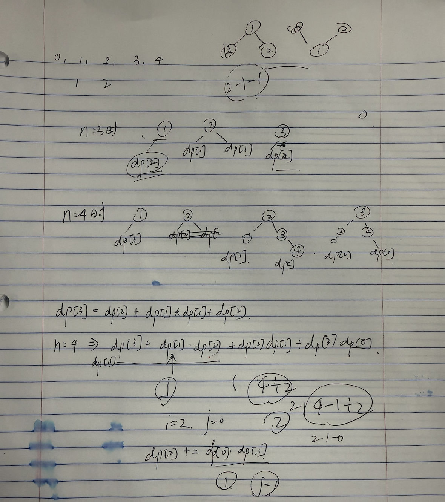

# DP是很难的，刷完一次立刻再复习一次

- [DP是很难的，刷完一次立刻再复习一次](#dp是很难的刷完一次立刻再复习一次)
  - [如何复习？](#如何复习)
  - [dp基础](#dp基础)
    - [509. 斐波那契数](#509-斐波那契数)
    - [70. 爬楼梯](#70-爬楼梯)
    - [746. 使用最小花费爬楼梯](#746-使用最小花费爬楼梯)
    - [62. 不同路径](#62-不同路径)
    - [63. 不同路径II](#63-不同路径ii)
    - [96. 不同的二叉搜索树](#96-不同的二叉搜索树)

## 如何复习？

分成四个部分：
- dp基础
- 背包
- 打家劫舍系列
- 股票系列
- 子序列问题

## dp基础

### 509. 斐波那契数

https://leetcode.cn/problems/fibonacci-number/

easy.

```cpp
class Solution {
public:
    int fib(int n) {
        if(n == 0) return 0;
        if(n == 1) return 1;
        auto dp = std::vector<int>(n + 1);
        dp[0] = 0; dp[1] = 1;
        for(int i = 2; i <= n; ++i) 
            dp[i] = dp[i-1] + dp[i-2];
        return dp[n];
    }
};
```

### 70. 爬楼梯

https://leetcode.cn/problems/climbing-stairs/description/

easy.

```cpp
class Solution {
public:
    int climbStairs(int n) {
        if(n == 1) return 1;
        auto dp = std::vector<int>(n + 1, 0);
        dp[0] = 1;
        dp[1] = 1;
        for(int i = 2; i <= n; ++i) 
            dp[i] = dp[i-1] + dp[i-2];
        return dp[n];
    }
};
```

### 746. 使用最小花费爬楼梯

https://leetcode.cn/problems/min-cost-climbing-stairs/description/

easy

```cpp
class Solution {
public:
    int minCostClimbingStairs(vector<int>& cost) {
        auto dp = std::vector<int>(cost.size() + 1, 0);
        // cost.size() >= 2
        dp[0] = 0; dp[1] = 0;
        for(int i = 2; i <= cost.size(); ++i)
            dp[i] = std::min(dp[i-1] + cost[i-1], dp[i-2] + cost[i-2]);
        return dp[cost.size()];
    }
};
```

### 62. 不同路径

https://leetcode.cn/problems/unique-paths/description/

easy

```cpp
class Solution {
public:
    int uniquePaths(int m, int n) {
        auto dp = std::vector<std::vector<int>>(m, std::vector<int>(n));
        // init
        for(int i = 0; i < m; ++i)
            dp[i][0] = 1;
        for(int j = 0; j < n; ++j)
            dp[0][j] = 1;
        // dp
        for(int i = 1; i < m; ++i)
            for(int j = 1; j < n; ++j)
                dp[i][j] = dp[i-1][j] + dp[i][j-1];
        return dp[m-1][n-1];
    }
};
```

### 63. 不同路径II

https://leetcode.cn/problems/unique-paths-ii/description/

easy

```cpp
class Solution {
public:
    int uniquePathsWithObstacles(vector<vector<int>>& obstacleGrid) {
        int m = obstacleGrid.size();
        int n = obstacleGrid[0].size();
        auto dp = std::vector<std::vector<int>>(m, std::vector<int>(n));
        // init
        for(int i = 0; i < m && !obstacleGrid[i][0]; ++i) dp[i][0] = 1;
        for(int j = 0; j < n && !obstacleGrid[0][j]; ++j) dp[0][j] = 1;
        // dp
        for(int i = 1; i < m; ++i)
            for(int j = 1; j < n; ++j)
                if(obstacleGrid[i][j] == 1) dp[i][j] = 0;
                else dp[i][j] = dp[i-1][j] + dp[i][j-1];
        return dp[m-1][n-1];
    }
};
```

### 96. 不同的二叉搜索树

https://leetcode.cn/problems/unique-binary-search-trees/description/



```cpp
class Solution {
public:
    int numTrees(int n) {
        if(n == 1) return 1;
        auto dp = std::vector<int>(n + 1, 0);
        dp[0] = 1;
        dp[1] = 1;
        for(int i = 2; i <= n; ++i) {
            for(int j = 0; j <= i-1; ++j) {
                dp[i] += dp[j] * dp[i-1-j];
            }
        }
        return dp[n];
    }
};
```

基础复习完毕，接下来就是背包问题。