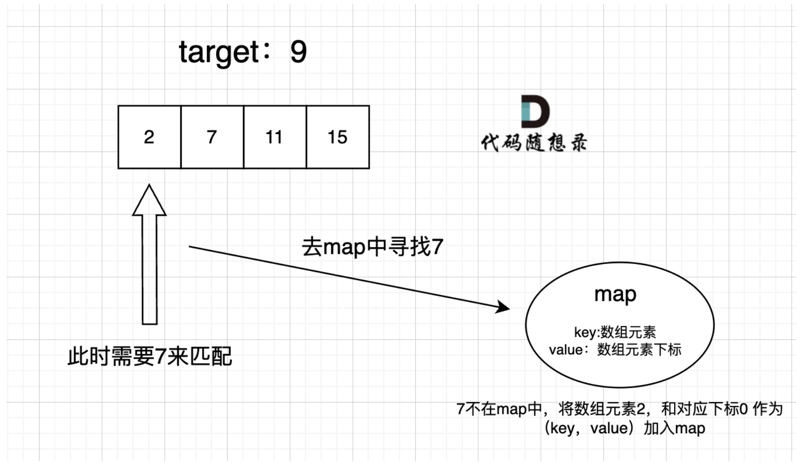
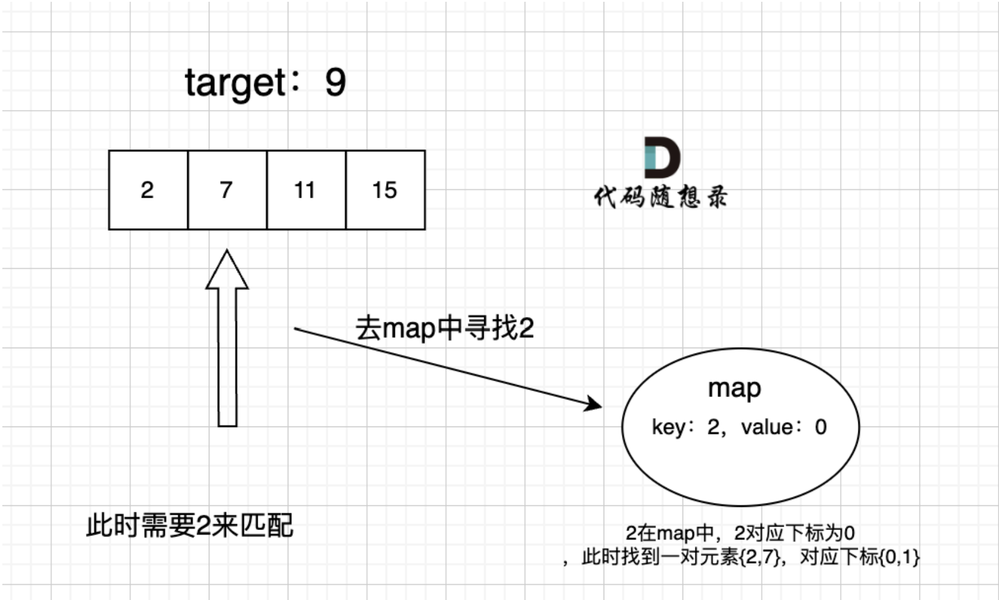

# 哈希表

- [哈希表](#哈希表)
  - [哈希表基础知识](#哈希表基础知识)
  - [有效的字⺟异位词](#有效的字异位词)
  - [两个数组的交集](#两个数组的交集)
    - [那所有哈希的题都用set就好了，还用什么数组？这是对的吗？](#那所有哈希的题都用set就好了还用什么数组这是对的吗)
  - [快乐数](#快乐数)
  - [两数之和（经典重要题目）](#两数之和经典重要题目)
  - [四数相加II（经典重要题目）](#四数相加ii经典重要题目)
  - [赎金信](#赎金信)
  - [三数之和（经典重要题目）](#三数之和经典重要题目)
    - [哈希法（比较复杂）](#哈希法比较复杂)
    - [双指针](#双指针)
  - [四数之和（经典重要题目）](#四数之和经典重要题目)


## 哈希表基础知识

个人比较熟悉，但是还是补充一些内容。

⼀些C++的经典书籍上 例如STL源码剖析，说到了`hash_map`和`hash_set`，这些是C++11标准之前民间高手自发造的轮子。

当我们遇到了要快速判断⼀个元素是否出现集合⾥的时候，就要考虑哈希法。但是哈希法也是牺牲了空间换取了时间，因为我们要使⽤额外的数组，set或者是map来存放数据，才能实现快速的查找。如果在做⾯试题⽬的时候遇到需要判断⼀个元素是否出现过的场景也应该第⼀时间想到哈希法！

## 有效的字⺟异位词

https://leetcode.cn/problems/valid-anagram/description/

一眼哈希就能解决。当然因为是字母，所以也可以弄个26长度的数组。

我这种方法是用了两个哈希表，空间上会多些。如果只用一个，遍历`t`的时候就`--`, 然后最后循环看看哈希表里有没有不为0的，有不为0说明对不上，`return false`;

```cpp
class Solution {
public:
    bool isAnagram(string s, string t) {
        if(s.size() != t.size()) return false;
        std::unordered_map<char, int> hash_map;
        std::unordered_map<char, int> hash_map2;
        for(const auto& e : s)
            hash_map[e]++;
        for(const auto& e : t)
            hash_map2[e]++;
        return hash_map == hash_map2;
    }
};
```

## 两个数组的交集

https://leetcode.cn/problems/intersection-of-two-arrays/

这题，除了常规的哈希法：

因为我之前是过了一两遍C++11的算法库的，里面有 `set_intersection` 这个方法是可以直接用的。**不过这个是会有重复元素的，题目要求还要去重，太折腾了。**

> [!CAUTION]
> 通过查阅文档发现，`std::set_intersection`只能处理两个**有序**列表。所以这道题如果要用，一定是要排序的！所以不要用了。\
> cplusplus.com的描述: Constructs a sorted range beginning in the location pointed by result with the set intersection of the two sorted ranges `[first1,last1)` and `[first2,last2)`.

直接用哈希就行。

```cpp
class Solution {
public:
    vector<int> intersection(vector<int>& nums1, vector<int>& nums2) {
        std::unordered_set<int> us;
        std::unordered_set<int> nums1_set;
        for(const auto& e : nums1)
            nums1_set.insert(e);
        for(const auto& e : nums2) {
            if(nums1_set.find(e) != nums1_set.end())
                us.insert(e);
        }
        return std::vector<int>(us.begin(), us.end());
    }
};
```

直接通过，Carl也是同样的思路。

不过这里有点冗余，可以改一下。
```cpp
std::unordered_set<int> nums1_set;
for(const auto& e : nums1)
    nums1_set.insert(e);
```
直接替换成：
```cpp
std::unordered_set<int> nums1_set(nums1.begin(), nums1.end());
```
直接这样构造就行了。

```cpp
class Solution {
public:
    vector<int> intersection(vector<int>& nums1, vector<int>& nums2) {
        std::unordered_set<int> us;
        std::unordered_set<int> nums1_set(nums1.begin(), nums1.end());
        for(const auto& e : nums2) {
            if(nums1_set.find(e) != nums1_set.end())
                us.insert(e);
        }
        return std::vector<int>(us.begin(), us.end());
    }
};
```

[350. 两个数组的交集 II](https://leetcode.cn/problems/intersection-of-two-arrays-ii/description/)

这个题我的思路是，`nums1 = [1,2,2,1], nums2 = [2,2]`。对于 `nums1` 来说，维护一个hash_table, 然后第二个元素是一个pair，用来记录nums1和nums2中出现的次数。

遍历 `nums1` 的时候，次数++到pair的第一个元素中。遍历 `nums2` 的时候，次数++到pair的第二个元素中。

**分析下复杂度：**

遍历 `nums1` 和 `nums2` 是 O(n), 然后最后再遍历一次map取最小，这一次是 O(n)，所以最后也是 O(n)。

```cpp
class Solution {
public:
    vector<int> intersect(vector<int>& nums1, vector<int>& nums2) {
        std::unordered_map<int, std::pair<int,int>> m;
        std::vector<int> res;
        for(const auto& e : nums1) // 遍历 nums1
            m[e].first++;
        for(const auto& e : nums2) // 遍历 nums2
            if(m.find(e)!=m.end())
                m[e].second++;
        for(const auto& e : m) {
            if(e.second.second == 0) continue;
            for(int i = 0; i < std::min(e.second.first, e.second.second); ++i)
                res.push_back(e.first);
        }
        return res;
    }
};
```
直接通过了。

看看题解：
> 由于同一个数字在两个数组中都可能出现多次，因此需要用哈希表存储每个数字出现的次数。对于一个数字，其在交集中出现的次数等于该数字在两个数组中出现次数的最小值。\
> 首先遍历第一个数组，并在哈希表中记录第一个数组中的每个数字以及对应出现的次数，然后遍历第二个数组，对于第二个数组中的每个数字，如果在哈希表中存在这个数字，则将该数字添加到答案，并减少哈希表中该数字出现的次数。\
> 为了降低空间复杂度，首先遍历较短的数组并在哈希表中记录每个数字以及对应出现的次数，然后遍历较长的数组得到交集。\
> 作者：力扣官方题解
链接：https://leetcode.cn/problems/intersection-of-two-arrays-ii/solutions/327356/liang-ge-shu-zu-de-jiao-ji-ii-by-leetcode-solution/
来源：力扣（LeetCode）
著作权归作者所有。商业转载请联系作者获得授权，非商业转载请注明出处。


这个动画(来自力扣题解)可以解释好。


### 那所有哈希的题都用set就好了，还用什么数组？这是对的吗？

不对。

直接使⽤`set`不仅占⽤空间⽐数组⼤，⽽且速度要⽐数组慢，`set`把数值映射到key上都要做hash计算的。不要⼩瞧这个耗时，在数据量⼤的情况，差距是很明显的。

如果题目是有限制数据范围的，都要想想看看要不要用数组即可。

## 快乐数

https://leetcode.cn/problems/happy-number/description/

这个题一眼看上去很难，其实不难的。**因为题目说了，会无限循环，所以表示，在求和过程中，sum会重复出现的。**

用哈希表来看看和会不会重复出现就行了。

没啥问题，直接通过了。


```cpp
class Solution {
private:
    // 先写一个函数，来计算每位数字上的平方和
    int getSum(int n) {
        int sum = 0;
        while(n) {
            sum += (n % 10) * (n % 10);
            n /= 10;
        }
        return sum;
    }
public:
    bool isHappy(int n) {
        std::unordered_set<int> s;
        while(1) {
            int sum = getSum(n);
            if(sum == 1) return true;
            if(s.find(sum) == s.end()) s.insert(sum);
            else return false; // 陷入循环
            n = sum;
        }
        assert(false);
    }
};
```

## 两数之和（经典重要题目）

https://leetcode.cn/problems/two-sum/description/

这道题的思路是很重要的，很经典的题目。两个图可以说的很清楚（来自Carl）。




**核心是：可以用哈希表来记录，哪些数字是被访问过的？访问过的这个元素在哪？所以用kv键值对的哈希表。**

开始写代码。

```cpp
class Solution {
public:
    vector<int> twoSum(vector<int>& nums, int target) {
        std::unordered_map<int,int> m;
        for(int i = 0; i < nums.size(); ++i) {
            auto it = m.find(target-nums[i]);
            if (it != m.end()) // 找到了
                return std::vector<int>{it->second, i};
            else
                m.insert({nums[i], i});
        }
        assert(false);
    }
};
```

**这份代码很重要，后面很多题目都会用到！**


## 四数相加II（经典重要题目）

https://leetcode.cn/problems/4sum-ii/description/

本题咋眼⼀看好像和**三数之和**，**四数之和**差不多，其实差很多。

本题是使⽤哈希法的经典题⽬，⽽**三数之和**，**四数之和**并不合适使⽤哈希法，因为三数之和和四数之和这两道题⽬使⽤哈希法在不超时的情况下做到对结果去重是很困难的，很有多细节需要处理。

⽽这道题⽬是四个独⽴的数组，只要找到`A[i] + B[j] + C[k] + D[l] = 0`就可以，不⽤考虑有重复的四个元素相加等于0的情况，所以相对于上面说这两题还是简单了不少！

如果本题想难度升级：就是给出⼀个数组（⽽不是四个数组），在这⾥找出四个元素相加等于0，答案中不可以包含重复的四元组，⼤家可以思考⼀下，后续Carl也会讲到。

**本题的解题步骤：**
1. ⾸先定义⼀个`unordered_map`，key放a和b两数之和，value放a和b两数之和出现的次数。
2. 遍历⼤A和⼤B数组，统计两个数组元素之和，和出现的次数，放到map中。
3. 定义int变量count, 用来统计符合条件的次数。
4. 在遍历⼤C和⼤D数组，找到如果 0-(c+d) 在map中出现过的话，就⽤count把map中key对应的value也就是出现次数统计出来。
5. 最后返回统计值 count。

写代码。

```cpp
class Solution {
public:
    int fourSumCount(vector<int>& nums1, vector<int>& nums2, vector<int>& nums3, vector<int>& nums4) {
        std::unordered_map<int, int> hash_table;
        int count = 0;
        // 遍历 nums1, nums2 的所有组合 O(n^2)
        for(int e : nums1)
            for (int ee : nums2)
                hash_table[e+ee]+=1;
        // 遍历 nums3, nums4 招组合
        for (int e : nums3) {
            for (int ee : nums4) {
                auto it = hash_table.find(0-e-ee);
                if (it != hash_table.end()) count+=it->second;
            }
        }
        return count;
    }
};
```
直接通过了。

## 赎金信

https://leetcode.cn/problems/ransom-note/description/

很简单，我直接通过了。

```cpp
class Solution {
public:
    bool canConstruct(string ransomNote, string magazine) {
        std::unordered_map<char, int> hash_table;
        for(const auto& e : magazine)
            hash_table[e]++;
        for(const auto& e : ransomNote) {
            auto it = hash_table.find(e);
            if(it == hash_table.end()) return false;
            if(it->second == 0) return false;
            it->second--;
        }                                            
        return true;
    }
};
```

>[!NOTE]
> 这题是要注意个数的。所以如果`hash_table`里面已经被减到0了，表示不够，也要返回false。

## 三数之和（经典重要题目）

https://leetcode.cn/problems/3sum/description/

### 哈希法（比较复杂）

为什么用哈希法会很复杂，因为题目说了：答案中不可以包含重复的三元组。

两层for循环就可以确定 `a` 和 `b` 的数值了，可以使⽤哈希法来确定 `0-(a+b)` 是否在 数组⾥出现过，其实这个思路是正确的，但是我们有⼀个⾮常棘⼿的问题，**就是题⽬中说的不可以包含重复的三元组。**
把符合条件的三元组放进vector中，然后再去重，这样是⾮常费时的，很容易超时，也是这道题⽬通过率如此之低的根源所在。去重的过程不好处理，有很多⼩细节，**在⾯试中很难想到位。**

时间复杂度可以做到 `O(n^2)`，但还是⽐较费时的，因为不好做剪枝操作。

### 双指针

这题用双指针是最好的。

拿这个 `nums` 数组来举例，⾸先将数组排序，然后有⼀层for循环，i从下标0的地⽅开始，同时定⼀个下标 `left` 定义在i+1的位置上，定义下标right在数组结尾的位置上。
依然还是在数组中找到abc使得a+b+c=0，我们这⾥相当于 `a = nums[i]，b = nums[left]，c = nums[right]`。

接下来如何移动 `left` 和 `right` 呢， 如果 `nums[i] + nums[left] + nums[right] > 0`就说明 此时三数之和⼤了，因为数
组是排序后了，所以right下标就应该向左移动，这样才能让三数之和⼩⼀些。
如果 `nums[i] + nums[left] + nums[right] < 0` 说明 此时 三数之和⼩了，left 就向右移动，才能让三数之和⼤⼀些，直到left与right相遇为⽌。

一共三个数, i, left, right

这个其实很好理解啊，因为数组已经有序了，所以完全可以使用双指针的。
暴力一层为O(n)，for里面双指针也是O(n)所以，一起是 O(n^2)，排序是O(nlogn)，所以最后也是O(n^2)。

直接写代码。

这题没这么简单的，需要处理好去重的逻辑。对三个数都要分别去重。

```cpp
class Solution {
public:
    vector<vector<int>> threeSum(vector<int>& nums) {
        std::vector<std::vector<int>>res;
        std::sort(nums.begin(), nums.end());
        for(int i = 0; i < nums.size(); ++i) {
            // 如果最左边的数字大于0，不用操作了，不可能有合适的结果的，很好理解
            if(nums[i] > 0) return res; // 说明后续也不会有合适结果
            if(i > 0 && nums[i] == nums[i-1]) continue; // 最左边的数字重复
            int left = i + 1;
            int right = nums.size()-1;
            while(left < right) { // i,j,k位置互不相同
                int sum = nums[i] + nums[left] + nums[right];
                // 去重复逻辑如果放在这⾥，0，0，0 的情况，可能直接导致 right<=left 了，从⽽漏掉了0,0,0 这种三元组
                /*
                while (right > left && nums[right] == nums[right - 1]) right--;
                while (right > left && nums[left] == nums[left + 1]) left++;
                */
                // 所以必须先找到一次(0,0,0), 再去重，不能在 res.push_back 之前就完成去重！
                if(sum == 0) {
                    res.push_back({nums[i], nums[left],nums[right]});
                    // 这里还要继续处理, 如果找到答案，双指针要同时收缩
                    // 这里要对b和c去重
                    while(left < right && nums[left] == nums[left+1]) left++;
                    while(left < right && nums[right] == nums[right-1]) right--;
                    left++;
                    right--;
                } else if(sum < 0) {
                    left++;
                } else if(sum > 0) {
                    right--;
                } else assert(false);
            }
        }
        return res;
    }
};
```

这道题非常重要。


## 四数之和（经典重要题目）

https://leetcode.cn/problems/4sum/description/

思路和三数之和是一样的。在三数之和的基础上叠加一层for循环。就行了。

但是因为题目设置，所以有些地方还是要注意。

> [!TIP]
> 因为三数之和题目里 target 是 0, 所以当 nums[i] > 0 的时候就已经可以直接跳过了。\
> 但是这里 target 是不定的。所以不能这么剪枝。
> 比如当 target == -10 的时候 nums[i] == -4, 但是显然是不能剪枝的。\
> 如果还是想写剪枝的话，可以用 `nums[i] > target && (nums[i] > 0 || target >= 0)`。

```cpp
class Solution {
public:
    vector<vector<int>> fourSum(vector<int>& nums, int target) {
        std::sort(nums.begin(), nums.end()); // 先排序
        std::vector<std::vector<int>>res;
        for(int i = 0; i < nums.size(); ++i) {
            if(nums[i] > target && (nums[i] > 0 || target >= 0)) return res; // 剪枝操作
            if(i > 0 && nums[i] == nums[i-1]) continue;
            for(int j = i+1; j < nums.size(); ++j) {
                if(nums[i] + nums[j] > target && (nums[i] + nums[j] > 0 || target >= 0)) break; // 注意，这里是要想加一下的
                if(j > i+1 && nums[j] == nums[j-1]) continue; // 注意，这里是 j > i + 1
                int left = j+1;
                int right = nums.size() - 1;
                while(left < right) {
                    if((long long)nums[i] + nums[j] + nums[left] + nums[right] == (long long)target) {
                        res.push_back({nums[i], nums[j], nums[left], nums[right]});
                        while(left < right && nums[left] == nums[left + 1]) left++;
                        while(left < right && nums[right] == nums[right - 1]) right--; 
                        left++;
                        right--;
                    } else if((long long)nums[i] + nums[j] + nums[left] + nums[right] < (long long)target) {
                        left++;
                    } else if((long long)nums[i] + nums[j] + nums[left] + nums[right] > (long long)target) {
                        right--;
                    }
                }
            }
        }
        return res;
    }
};
```

和三数之和那题对比，要注意的：
1. 两层for循环都要剪枝和去重！
2. 第二层for循环去重的时候，要用相加的数字和 target 去比。
3. 全部加起来会溢出（**这个也不算问题，就是要注意数据范围‼️**）


哈希表篇就到此结束了。