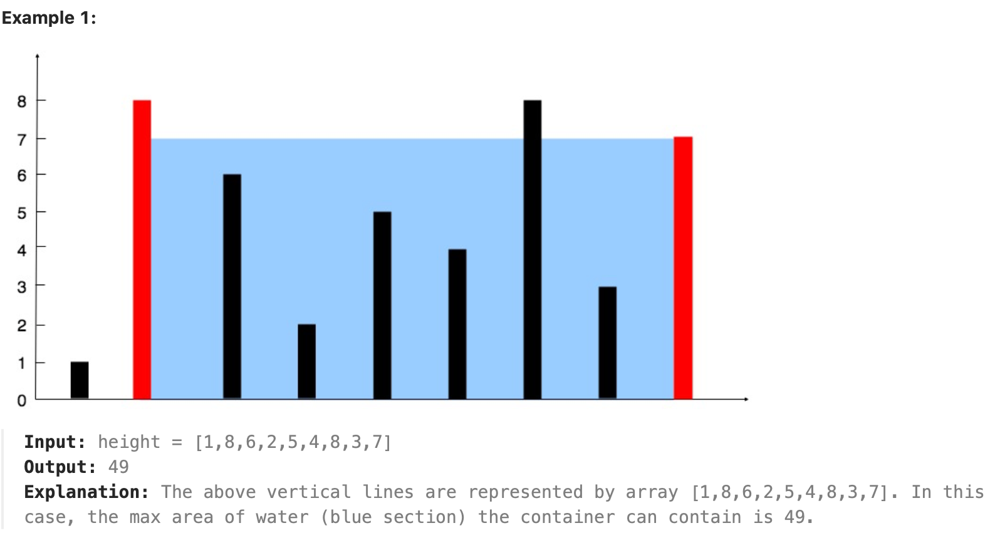
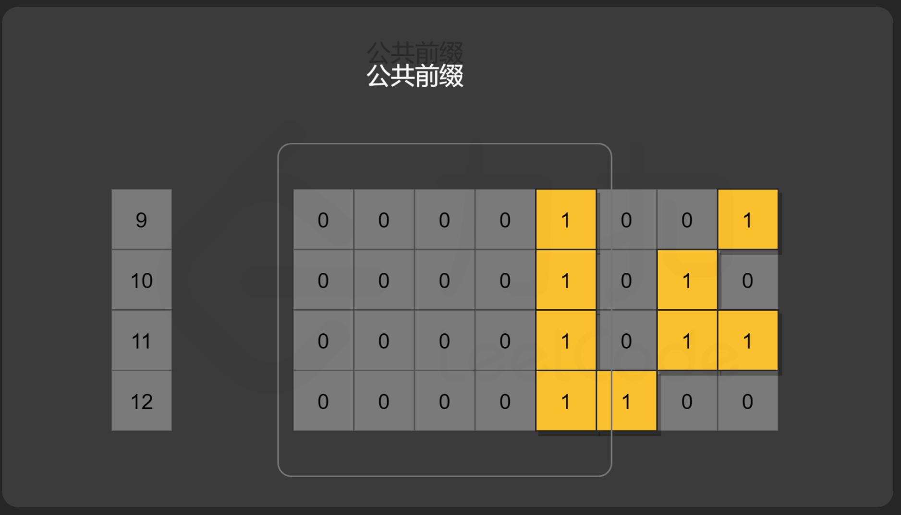

# Top interview 150

**Site:** [https://leetcode.com/studyplan/top-interview-150/](https://leetcode.com/studyplan/top-interview-150/)

- [Top interview 150](#top-interview-150)
  - [Array/String](#arraystring)
    - [88. Merge Sorted Array](#88-merge-sorted-array)
    - [27. Remove Element](#27-remove-element)
    - [26. Remove Duplicates from Sorted Array](#26-remove-duplicates-from-sorted-array)
    - [80. Remove Duplicates from Sorted Array II](#80-remove-duplicates-from-sorted-array-ii)
    - [169. Majority Element](#169-majority-element)
    - [189. Rotate Array](#189-rotate-array)
    - [121. Best Time to Buy and Sell Stock](#121-best-time-to-buy-and-sell-stock)
    - [122. Best Time to Buy and Sell Stock II](#122-best-time-to-buy-and-sell-stock-ii)
    - [\*\*\*55. Jump Game](#55-jump-game)
    - [\*\*\*45. Jump Game II](#45-jump-game-ii)
    - [\*\*\*274. H-Index](#274-h-index)
    - [380. Insert Delete GetRandom O(1)](#380-insert-delete-getrandom-o1)
    - [238. Product of Array Except Self](#238-product-of-array-except-self)
  - [Two Pointers](#two-pointers)
    - [125. Valid Palindrome](#125-valid-palindrome)
    - [392. Is Subsequence](#392-is-subsequence)
    - [167. Two Sum II - Input Array Is Sorted](#167-two-sum-ii---input-array-is-sorted)
    - [11. Container With Most Water](#11-container-with-most-water)
    - [\*\*\*15. 3Sum](#15-3sum)


## Array/String

### 88. Merge Sorted Array

https://leetcode.com/problems/merge-sorted-array/description/?envType=study-plan-v2&envId=top-interview-150

这题很简单，两个升序数组的合并

```cpp
class Solution {
public:
    void merge(vector<int>& nums1, int m, vector<int>& nums2, int n) {
        assert(nums1.size() == m + n);
        std::vector<int> res;
        int i1 = 0;
        int i2 = 0;
        while(i1 < m && i2 < n)
            if(nums1[i1] < nums2[i2])
                res.push_back(nums1[i1++]);
            else
                res.push_back(nums2[i2++]);
        while(i1 < m)
            res.push_back(nums1[i1++]);
        while(i2 < n)
            res.push_back(nums2[i2++]);
        res.swap(nums1);
    }
};
```

### 27. Remove Element

https://leetcode.com/problems/remove-element/?envType=study-plan-v2&envId=top-interview-150

删除指定元素，我用双指针替换即可。

中途有一些情况需要细细考虑到才行。

```cpp
class Solution {
public:
    int removeElement(vector<int>& nums, int val) {
        // use two pointers
        if(nums.size() == 0) return 0;
        int left = 0;
        int right = nums.size() - 1;
        while(left < right) {
            if(nums[left] != val) left++;
            else if(nums[left] == val) std::swap(nums[left], nums[right--]);
        }
        assert(left >= right);
        if(nums[left] == val) return left; // special case
        return left + 1;
    }
};
```

### 26. Remove Duplicates from Sorted Array

https://leetcode.com/problems/remove-duplicates-from-sorted-array/description/?envType=study-plan-v2&envId=top-interview-150

删除重复元素，留下一个

也是用双指针控制即可

```cpp
class Solution {
public:
    int removeDuplicates(vector<int>& nums) {
        if(nums.size() == 0) return 0;
        if(nums.size() == 1) return 1;
        // use two pointers
        int slow = 0;
        int fast = 0;
        while(fast < nums.size()) {
            if(nums[fast] == nums[slow]) fast++;
            if(fast >= nums.size()) break;
            if(nums[fast] != nums[slow]) {
                nums[++slow] = nums[fast++];
            }
        }
        return slow + 1;
    }
};
```

### 80. Remove Duplicates from Sorted Array II

https://leetcode.com/problems/remove-duplicates-from-sorted-array-ii/description/?envType=study-plan-v2&envId=top-interview-150


删除重复元素，至多有两个。

其实肯定是要用双指针，但是调不出来。damn

```cpp
// 我的版本，未通过
class Solution {
public:
    int removeDuplicates(vector<int>& nums) {
        if(nums.size() == 0) return 0;
        if(nums.size() == 1) return 1;
        if(nums.size() == 2) return 2;
        // use two pointers
        // can reuse the codes in the last question(#26)
        int slow = 0;
        int fast = 0;
        while(fast < nums.size()) {
            int fast_step = 0;
            while(fast < nums.size() && nums[fast] == nums[slow]) {
                fast++;
                fast_step++;
            }
            if(fast >= nums.size()) {
                if(fast_step >= 2) {
                    nums[slow + 1] = nums[slow];
                    return slow + 2;
                }
                else return slow + 1;
                break;
            }
            if(nums[fast] != nums[slow]) {
                if(fast_step >= 2) {
                    slow += 2;
                    nums[slow] = nums[fast];
                } else {
                    nums[++slow] = nums[fast];
                }
            }
        }
        return slow + 1; 
    }
};
```


题解:

因为给定数组是有序的，所以相同元素必然连续。我们可以使用双指针解决本题，遍历数组检查每一个元素是否应该被保留，如果应该被保留，就将其移动到指定位置。具体地，我们定义两个指针 `slow` 和 `fast` 分别为慢指针和快指针，其中慢指针表示处理出的数组的长度，快指针表示已经检查过的数组的长度，即 `nums[fast]` 表示待检查的第一个元素，`nums[slow−1]` 为上一个应该被保留的元素所移动到的指定位置。

因为本题要求相同元素最多出现两次而非一次，所以我们需要检查上上个应该被保留的元素 `nums[slow−2]` 是否和当前待检查元素 `nums[fast]` 相同。当且仅当 `nums[slow−2]=nums[fast]` 时，当前待检查元素 `nums[fast]` 不应该被保留（因为此时必然有 `nums[slow−2]=nums[slow−1]=nums[fast]`）。最后，`slow` 即为处理好的数组的长度。

特别地，数组的前两个数必然可以被保留，因此对于长度不超过 2 的数组，我们无需进行任何处理，对于长度超过 2 的数组，我们直接将双指针的初始值设为 2 即可。

> 作者：力扣官方题解
链接：https://leetcode.cn/problems/remove-duplicates-from-sorted-array-ii/solutions/702644/shan-chu-pai-xu-shu-zu-zhong-de-zhong-fu-yec2/
来源：力扣（LeetCode）
著作权归作者所有。商业转载请联系作者获得授权，非商业转载请注明出处。

```cpp
class Solution {
public:
    int removeDuplicates(vector<int>& nums) {
        int n = nums.size();
        if (n <= 2) {
            return n;
        }
        int slow = 2, fast = 2;
        while (fast < n) {
            if (nums[slow - 2] != nums[fast]) {
                nums[slow] = nums[fast];
                ++slow;
            }
            ++fast;
        }
        return slow;
    }
};
```

### 169. Majority Element

https://leetcode.com/problems/majority-element/description/?envType=study-plan-v2&envId=top-interview-150

这题就是找到数组中出现次数大于 n/2 的数字。

**Follow-up:** Could you solve the problem in linear time and in O(1) space?

难点其实是他这个 Follow-up 的要求。

如果用哈希，是很简单的，不赘述，时间复杂度是 $O(n)$，空间是 $O(n)$

如果是排序，也很简单：排序之后，数组最中间的位置，就一定是要找的数字，因为他数量超过 n/2。时间是 $O(n\log n)$, 空间是 $O(1)$。

这里介绍题解里面比较特别的一种方法，可以做到 Follow-up 的要求。

```cpp
class Solution {
public:
    int majorityElement(vector<int>& nums) {
        while (true) {
            int candidate = nums[rand() % nums.size()];
            int count = 0;
            for (int num : nums)
                if (num == candidate)
                    ++count;
            if (count > nums.size() / 2)
                return candidate;
        }
        return -1;
    }
};
```

复杂度分析

时间复杂度：理论上最坏情况下的时间复杂度为 O(∞)，因为如果我们的运气很差，这个算法会一直找不到众数，随机挑选无穷多次，所以最坏时间复杂度是没有上限的。然而，运行的期望时间是线性的。为了更简单地分析，先说服你自己：由于众数占据 超过 数组一半的位置，期望的随机次数会小于众数占据数组恰好一半的情况。因此，我们可以计算随机的期望次数（下标为 prob 为原问题，mod 为众数恰好占据数组一半数目的问题）：

$$
\begin{aligned}
E\left(\text { iters }_{\text {prob }}\right) & \leq E\left(\text { iters }_{\text {mod }}\right) \\
& =\lim _{n \rightarrow \infty} \sum_{i=1}^{n} i \cdot \frac{1}{2^{i}} \\
& =2
\end{aligned}
$$

 
计算方法为：当众数恰好占据数组的一半时，第一次随机我们有 $1/2$ 的概率找到众数，如果没有找到，则第二次随机时，包含上一次我们有 $1/4$ 的概率找到众数，以此类推。因此期望的次数为 $i \cdot 1/2^i$的和，可以计算出这个和为 2，说明期望的随机次数是常数。每一次随机后，我们需要 $O(n)$ 的时间判断这个数是否为众数，因此期望的时间复杂度为 $O(n)$。

空间复杂度：$O(1)$。随机方法只需要常数级别的额外空间。

> 作者：力扣官方题解
链接：https://leetcode.cn/problems/majority-element/solutions/146074/duo-shu-yuan-su-by-leetcode-solution/
来源：力扣（LeetCode）
著作权归作者所有。商业转载请联系作者获得授权，非商业转载请注明出处。

然后中文版官网的题解还有两种很有意思的算法，分治法和Boyer-Moore投票算法：[https://leetcode.cn/problems/majority-element/solutions/146074/duo-shu-yuan-su-by-leetcode-solution/](https://leetcode.cn/problems/majority-element/solutions/146074/duo-shu-yuan-su-by-leetcode-solution/)


### 189. Rotate Array

https://leetcode.com/problems/rotate-array/description/?envType=study-plan-v2&envId=top-interview-150

Given an integer array nums, rotate the array to the right by k steps, where k is non-negative.

这个题目还是用之前学的，三次反转的方法。

```cpp
class Solution {
public:
    void reverse(std::vector<int>::iterator begin, std::vector<int>::iterator end) {
        // end is set out of range
        end--;
        while(begin < end)
            std::swap(*begin++, *end--);
    }
    void rotate(vector<int>& nums, int k) {
        if(k > nums.size()) k = k % nums.size();
        reverse(nums.begin(), nums.end() - k);
        reverse(nums.end() - k, nums.end());
        reverse(nums.begin(), nums.end());
    }
};
```

顺利通过。

### 121. Best Time to Buy and Sell Stock

经典股票问题。

还记得 Carl 教的，股票问题：把状态处理好即可！

You are given an array prices where prices[i] is the price of a given stock on the ith day.

You want to maximize your profit by choosing a single day to buy one stock and choosing a different day in the future to sell that stock.

Return the maximum profit you can achieve from this transaction. If you cannot achieve any profit, return 0.

这个是一买一卖的。

```cpp
class Solution {
public:
    int maxProfit(vector<int>& prices) {
        auto dp = std::vector<std::vector<int>>(2, std::vector<int>(prices.size(), 0));
        // first row: have stock
        // second row: donot have stock
        // dp[][]: the cash i have
        dp[0][0] = -prices[0];
        dp[1][0] = 0;
        for(int j = 1; j < prices.size(); ++j) {
            dp[0][j] = std::max(dp[0][j-1], -prices[j]);
            dp[1][j] = std::max(dp[1][j-1], dp[0][j-1] + prices[j]);
        }
        return dp[1][prices.size() - 1];
    }
};
```

顺利通过。

### 122. Best Time to Buy and Sell Stock II

https://leetcode.com/problems/best-time-to-buy-and-sell-stock-ii/description/?envType=study-plan-v2&envId=top-interview-150

You are given an integer array prices where prices[i] is the price of a given stock on the ith day.

On each day, you may decide to buy and/or sell the stock. You can only hold at most one share of the stock at any time. However, you can sell and buy the stock multiple times on the same day, ensuring you never hold more than one share of the stock.

Find and return the maximum profit you can achieve.

```cpp
class Solution {
public:
    int maxProfit(vector<int>& prices) {
        auto dp = std::vector<std::vector<int>>(2, std::vector<int>(prices.size(), 0));
        // first row: have stock
        // second row: donot have stock
        // dp[][]: the cash i have
        dp[0][0] = -prices[0];
        dp[1][0] = 0;
        for(int j = 1; j < prices.size(); ++j) {
            dp[0][j] = std::max(dp[0][j-1], dp[1][j-1] - prices[j]); // modify here
            dp[1][j] = std::max(dp[1][j-1], dp[0][j-1] + prices[j]);
        }
        return dp[1][prices.size() - 1];
    }
};
```
很简单，改这里即可。

### ***55. Jump Game

https://leetcode.com/problems/jump-game/description/?envType=study-plan-v2&envId=top-interview-150

You are given an integer array nums. You are initially positioned at the array's first index, and each element in the array represents your maximum jump length at that position.

Return true if you can reach the last index, or false otherwise.

这题还挺有意思的：

用大白话来翻译你的解释，其实就是把数组看成一串断掉的独木桥，你从终点往回修路：
- Valid Spot（有效点）：就是已经被证明“只要站在这里，就一定能走到终点”的位置。
- loop_cnt（索命距离）：就是当前位置距离最近的那个“有效点”有多远。
- 判定逻辑：如果当前的跳力 nums[i] 够得着最近的“有效点”，那当前位置 i 也就变成了一个新的“有效点”，后面的路就不用愁了，loop_cnt 重置为 1（看前一个点能不能跳到 i）。

```cpp
class Solution {
public:
    bool canJump(vector<int>& nums) {
        if(nums.size() == 1) return true;
        int loop_cnt = 1;
        for(int i = nums.size() - 2; i >= 0; i--) {
            // nums.size() - 2 is the index to make a last jump
            // can nums.size() - 2 reach the dest? see if nums[i] > loop_cnt
            // loop_cnt refers to the distance to the closest valid spot
            // valid spot: a spot that can find a way to dest
            if(nums[i] >= loop_cnt) {
                loop_cnt = 1; // continue to 1
                continue;
            }
            loop_cnt++;
        }
        return nums[0] >= loop_cnt;
    }
};
```

这题本质是一个贪心。


### ***45. Jump Game II

https://leetcode.com/problems/jump-game-ii/description/

这题难啊，一时没想到，之前第一次做的时候也是卡在这题。

```cpp
class Solution {
public:
    int jump(vector<int>& nums) {
        if(nums.size() == 1) return 0; // no need to jump
        int maxCurrentCover = nums[0]; 
        int maxNextCover = 0;
        int step = 1;
        for(int i = 0; i < nums.size(); ++i) {
            if(i <= maxCurrentCover)
                maxNextCover = std::max(maxCurrentCover, std::max(maxNextCover, nums[i] + i)); 
                // 这里不断更新 nextcover 的最大值，也就是如果在当前情况下，走多一步，可以最多走到哪里
            else {
                maxCurrentCover = maxNextCover; // 更新
                step++;
                maxNextCover = std::max(maxCurrentCover, std::max(maxNextCover, nums[i] + i));
            }
            if(maxCurrentCover >= nums.size() - 1) return step;
        }
        return step;
    }
};
```

### ***274. H-Index

https://leetcode.com/problems/h-index/description/?envType=study-plan-v2&envId=top-interview-150

```cpp
class Solution {
public:
    int hIndex(vector<int>& citations) {
        sort(citations.begin(), citations.end());
        int h = 0, i = citations.size() - 1;
        while (i >= 0 && citations[i] > h) {
            h++;
            i--;
        }
        return h;
    }
};
```

根据 H 指数的定义，如果当前 H 指数为 h 并且在遍历过程中找到当前值 `citations[i]>h`，则说明我们找到了一篇被引用了至少 h+1 次的论文，所以将现有的 h 值加 1。继续遍历直到 h 无法继续增大。最后返回 h 作为最终答案。


### 380. Insert Delete GetRandom O(1)

https://leetcode.com/problems/insert-delete-getrandom-o1/description/?envType=study-plan-v2&envId=top-interview-150

```cpp
class RandomizedSet {
    vector<int> nums;
    unordered_map<int, int> idx;
    mt19937 rng;

public:
    RandomizedSet() : rng(random_device{}()) {}

    bool insert(int val) {
        if (idx.count(val)) return false;
        idx[val] = (int)nums.size();
        nums.push_back(val);
        return true;
    }

    bool remove(int val) {
        auto it = idx.find(val);
        if (it == idx.end()) return false;

        int i = it->second;
        int last = nums.back();

        nums[i] = last;
        idx[last] = i;

        nums.pop_back();
        idx.erase(it);
        return true;
    }

    int getRandom() {
        uniform_int_distribution<int> dist(0, (int)nums.size() - 1);
        return nums[dist(rng)];
    }
};
```


**思路**
- 用 **数组 nums** 存元素
- 用 **哈希表 idx** 记录：值 → 数组下标

**删除的关键**
- 数组中间删是 O(n)
- 做法：**把要删的元素和最后一个元素交换，再 pop_back**
- 同时更新被换元素在 idx 里的下标

→ 删除仍然是 O(1)

**getRandom 为什么是等概率**
- 在 `[0, nums.size()-1]` 里 **等概率随机一个下标**
- 数组里每个元素只占一个下标
- ⇒ 每个元素被返回的概率都是 `1 / size`

**本质**
- random 不在 set 上做，在 **数组下标上做**
- 交换末尾只是为了保证数组连续，不影响随机概率


### 238. Product of Array Except Self

https://leetcode.com/problems/product-of-array-except-self/description/?envType=study-plan-v2&envId=top-interview-150

```cpp
class Solution {
public:
    vector<int> productExceptSelf(vector<int>& nums) {
        int sz = nums.size();
        // calculate prefix and suffix
        std::vector<int> prefix;
        std::vector<int> suffix;
        prefix.push_back(nums[0]);
        suffix.push_back(nums[sz-1]);
        for(int i = 1; i < sz; ++i)
            prefix.push_back(prefix[i-1] * nums[i]);
        for(int i = sz-2; i>=0; --i) 
            suffix.push_back(suffix[suffix.size()-1] * nums[i]);
        // for debug
        // for(int a : prefix)
        //     std::cout << a << " ";
        // std::cout << std::endl;
        // for(int b : suffix)
        //     std::cout << b << " ";
        // std::cout << std::endl;
        // return {};
        //
        std::vector<int> ans;
        for(int i = 0; i < sz; ++i)
            if(i == 0)  // 处理下边界情况
                ans.push_back(suffix[sz-2]);
            else if(i == sz-1)
                ans.push_back(prefix[sz-2]);
            else
                ans.push_back(prefix[i-1] * suffix[sz-1-i-1]);
        return ans;
    }
};
```

这题没什么问题，用前缀和后缀分别合成结果就行。

...

## Two Pointers 

### 125. Valid Palindrome

https://leetcode.com/problems/valid-palindrome/?envType=study-plan-v2&envId=top-interview-150

A phrase is a palindrome if, after converting all uppercase letters into lowercase letters and removing all non-alphanumeric characters, it reads the same forward and backward. Alphanumeric characters include letters and numbers.

Given a string s, return true if it is a palindrome, or false otherwise.

```cpp
class Solution {
public:
    bool isPalindrome(string s) {
        // 遍历一次就行，不用去除和转换后再用双指针，这样更快
        int left = 0;
        int right = s.size() - 1;
        while(left < right) {
            while(left < right && !isalpha(s[left]) && !isdigit(s[left])) left++;
            while(left < right && !isalpha(s[right]) && !isdigit(s[right])) right--;
            char a = s[left++], b = s[right--];
            if(isalpha(a)) a = tolower(a);
            if(isalpha(b)) b = tolower(b);
            if(a == b) continue;
            else return false;
        }
        return true;
    }
};
```

简单题。


### 392. Is Subsequence

https://leetcode.com/problems/is-subsequence/description/?envType=study-plan-v2&envId=top-interview-150

Given two strings s and t, return true if s is a subsequence of t, or false otherwise.

A subsequence of a string is a new string that is formed from the original string by deleting some (can be none) of the characters without disturbing the relative positions of the remaining characters. (i.e., "ace" is a subsequence of "abcde" while "aec" is not).

这题用dp好点。


```cpp
class Solution {
public:
    bool isSubsequence(string s, string t) {
        if(s.size() == 0) return true;
        std::vector<std::vector<bool>> dp(t.size() + 1, std::vector<bool>(s.size() + 1, false));
        // 在草稿纸上推导一下就知道，第一列需要初始化，第一列都应该是true。因为空可以是任何字符串的子串
        for(int i = 0; i <= t.size(); ++i) dp[i][0] = true;
        for(int i = 1; i <= t.size(); ++i) {
            for(int j = 1; j <= s.size(); ++j) {
                if(s[j-1] == t[i-1]) dp[i][j] = (dp[i-1][j] | dp[i-1][j-1]);
                else dp[i][j] = dp[i-1][j];
            }
        }
        return dp[t.size()][s.size()];
    }
};
```

顺便也复习了一次dp，不错。


### 167. Two Sum II - Input Array Is Sorted

https://leetcode.com/problems/two-sum-ii-input-array-is-sorted/?envType=study-plan-v2&envId=top-interview-150

https://leetcode.com/problems/two-sum-ii-input-array-is-sorted/description/?envType=study-plan-v2&envId=top-interview-150

Given a 1-indexed array of integers numbers that is already sorted in non-decreasing order, find two numbers such that they add up to a specific target number. Let these two numbers be numbers[index1] and numbers[index2] where 1 <= index1 < index2 <= numbers.length.

Return the indices of the two numbers, index1 and index2, added by one as an integer array [index1, index2] of length 2.

The tests are generated such that there is exactly one solution. You may not use the same element twice.

**Your solution must use only constant extra space.**

这题说了只能用 O(1) 的空间，所以只能双指针了。而且已经排好序了，很适合双指针。

```cpp
class Solution {
public:
    vector<int> twoSum(vector<int>& numbers, int target) {
        int left = 0;
        int right = numbers.size()-1;
        while(left < right) {
            if(numbers[left] + numbers[right] < target) left++;
            else if(numbers[left] + numbers[right] > target) right--;
            else return {left+1, right+1}; // 题目说下标从1开始
        }
        assert(false);
        return {};
    }
};
```

### 11. Container With Most Water

https://leetcode.com/problems/container-with-most-water/description/?envType=study-plan-v2&envId=top-interview-150

You are given an integer array height of length n. There are n vertical lines drawn such that the two endpoints of the ith line are (i, 0) and (i, height[i]).

Find two lines that together with the x-axis form a container, such that the container contains the most water.

Return the maximum amount of water a container can store.

Notice that you may not slant the container.



**这题的关键点在于：每次移动数字较小的指针即可，不需要两个指针一起动！**

如果我们移动数字较大的那个指针，那么前者「两个指针指向的数字中较小值」不会增加，后者「指针之间的距离」会减小，那么这个乘积会减小。因此，我们移动数字较大的那个指针是不合理的。因此，我们移动 数字较小的那个指针。

```cpp
class Solution {
public:
    int maxArea(vector<int>& height) {
        int maxArea = -1;
        int left = 0;
        int right = height.size() - 1;
        while(left < right) {
            int area = (std::min(height[left], height[right])) * (right - left);
            maxArea = std::max(area, maxArea);
            if(height[left] <= height[right]) left++;
            else right--;
        }
        return maxArea;
    }
};
```

### ***15. 3Sum

https://leetcode.com/problems/3sum/?envType=study-plan-v2&envId=top-interview-150

Given an integer array nums, return all the triplets [nums[i], nums[j], nums[k]] such that i != j, i != k, and j != k, and nums[i] + nums[j] + nums[k] == 0.

Notice that the solution set must not contain duplicate triplets.

这题挺难的。这里还用更详细的讲解：https://github.com/ffengc/LeetsGoAgain/blob/main/docs/hash_tables.md#三数之和经典重要题目

```cpp
class Solution {
public:
    vector<vector<int>> threeSum(vector<int>& nums) {
        std::vector<std::vector<int>>res;
        std::sort(nums.begin(), nums.end());
        for(int i = 0; i < nums.size(); ++i) {
            // 如果最左边的数字大于0，不用操作了，不可能有合适的结果的，很好理解
            if(nums[i] > 0) return res; // 说明后续也不会有合适结果
            if(i > 0 && nums[i] == nums[i-1]) continue; // 最左边的数字重复
            int left = i + 1;
            int right = nums.size()-1;
            while(left < right) { // i,j,k位置互不相同
                int sum = nums[i] + nums[left] + nums[right];
                // 去重复逻辑如果放在这⾥，0，0，0 的情况，可能直接导致 right<=left 了，从⽽漏掉了0,0,0 这种三元组
                /*
                while (right > left && nums[right] == nums[right - 1]) right--;
                while (right > left && nums[left] == nums[left + 1]) left++;
                */
                // 所以必须先找到一次(0,0,0), 再去重，不能在 res.push_back 之前就完成去重！
                if(sum == 0) {
                    res.push_back({nums[i], nums[left],nums[right]});
                    // 这里还要继续处理, 如果找到答案，双指针要同时收缩
                    // 这里要对b和c去重
                    while(left < right && nums[left] == nums[left+1]) left++;
                    while(left < right && nums[right] == nums[right-1]) right--;
                    left++;
                    right--;
                } else if(sum < 0) {
                    left++;
                } else if(sum > 0) {
                    right--;
                } else assert(false);
            }
        }
        return res;
    }
};
```


## Sliding Window


## Matrix

## Hashmap

## Intervals

## Stack

## Linked List

### 141. Linked List Cycle

https://leetcode.com/problems/linked-list-cycle/description/?envType=study-plan-v2&envId=top-interview-150

判断有没有环。经典题目，快慢指针即可。

```cpp
class Solution {
public:
    bool hasCycle(ListNode *head) {
        // 快慢指针即可
        if(!head || !head->next) return false;
        ListNode* fast = head;
        ListNode* slow = head;
        while(fast && fast->next && slow) {
            fast = fast->next->next;
            slow = slow->next;
            if(fast == slow) return true;
        }
        return false;
    }
};
```


### 2. Add Two Numbers

https://leetcode.com/problems/add-two-numbers/description/?envType=study-plan-v2&envId=top-interview-150

You are given two non-empty linked lists representing two non-negative integers. The digits are stored in reverse order, and each of their nodes contains a single digit. Add the two numbers and return the sum as a linked list.

You may assume the two numbers do not contain any leading zero, except the number 0 itself.

```cpp
/**
 * Definition for singly-linked list.
 * struct ListNode {
 *     int val;
 *     ListNode *next;
 *     ListNode() : val(0), next(nullptr) {}
 *     ListNode(int x) : val(x), next(nullptr) {}
 *     ListNode(int x, ListNode *next) : val(x), next(next) {}
 * };
 */
class Solution {
public:
    bool plus_flag = false;
    ListNode* addTwoNumbers(ListNode* l1, ListNode* l2) {
        ListNode* dummy_head = new ListNode(-1);
        ListNode* tail = dummy_head;
        ListNode* ptr1 = l1;
        ListNode* ptr2 = l2;
        plus_flag = false;
        while(ptr1 && ptr2) {
            int res = ptr1->val + ptr2->val;
            if(plus_flag == true) res += 1; // 进位
            if(res >= 10) {
                res = res % 10;
                plus_flag = true;
            } else plus_flag = false; // set false
            ListNode* newnode = new ListNode(res);
            tail->next = newnode;
            newnode->next = nullptr;
            tail = newnode;
            ptr1 = ptr1->next;
            ptr2 = ptr2->next;
        }
        while(ptr1) {
            int res = ptr1->val;
            if(plus_flag == true) res += 1; // 进位
            if(res >= 10) {
                res %= 10;
                plus_flag = true;
            } else plus_flag = false;
            ListNode* newnode = new ListNode(res);
            tail->next = newnode;
            newnode->next = nullptr;
            tail = newnode;
            ptr1 = ptr1->next;
        }
        while(ptr2) {
            int res = ptr2->val;
            if(plus_flag == true) res += 1; // 进位
            if(res >= 10) {
                res %= 10;
                plus_flag = true;
            } else plus_flag = false;
            ListNode* newnode = new ListNode(res);
            tail->next = newnode;
            newnode->next = nullptr;
            tail = newnode;
            ptr2 = ptr2->next;
        }
        if(plus_flag == true) { // 处理最后一次进位
            ListNode* newnode = new ListNode(1);
            tail->next = newnode;
            newnode->next = nullptr;
            tail = newnode;
        }
        return dummy_head->next;
    }
};
```

如果先从链表转数字，相加后重新转链表，肯定是很简单的，而且速度也快。但是我还是选择了一次遍历的方法，直接在链表上进行操作。

### 21. Merge Two Sorted Lists

https://leetcode.com/problems/merge-two-sorted-lists/description/?envType=study-plan-v2&envId=top-interview-150

这题也是简单题来的了。

```cpp
class Solution {
public:
    ListNode* mergeTwoLists(ListNode* list1, ListNode* list2) {
        ListNode* dummy_head_list1 = new ListNode(-1);
        ListNode* dummy_head_list2 = new ListNode(-1);
        dummy_head_list1->next = list1;
        dummy_head_list2->next = list2;
        ListNode* dummy_head = new ListNode(-1);
        ListNode* tail = dummy_head;
        while(dummy_head_list1->next && dummy_head_list2->next) {
            ListNode* newnode = nullptr;
            if(dummy_head_list1->next->val <= dummy_head_list2->next->val) {
                tail->next = dummy_head_list1->next;
                dummy_head_list1->next = dummy_head_list1->next->next;
                tail = tail->next;
                tail->next = nullptr;
            } else {
                tail->next = dummy_head_list2->next;
                dummy_head_list2->next = dummy_head_list2->next->next;
                tail = tail->next;  
                tail->next = nullptr;       
            }
        }
        while(dummy_head_list1->next) {
            tail->next = dummy_head_list1->next;
            dummy_head_list1->next = dummy_head_list1->next->next;
            tail = tail->next;
        }
        while(dummy_head_list2->next) {
            tail->next = dummy_head_list2->next;
            dummy_head_list2->next = dummy_head_list2->next->next;
            tail = tail->next;
        }
        return dummy_head->next;
    }
};
```

直接用指针操作就行了。

### ***138. Copy List with Random Pointer

https://leetcode.com/problems/copy-list-with-random-pointer/?envType=study-plan-v2&envId=top-interview-150

复制带有随机指针的链表。

这个题是有点难的。看看题解：

本题要求我们对一个特殊的链表进行深拷贝。如果是普通链表，我们可以直接按照遍历的顺序创建链表节点。而本题中因为随机指针的存在，当我们拷贝节点时，「当前节点的随机指针指向的节点」可能还没创建，因此我们需要变换思路。一个可行方案是，我们利用回溯的方式，让每个节点的拷贝操作相互独立。对于当前节点，我们首先要进行拷贝，然后我们进行「当前节点的后继节点」和「当前节点的随机指针指向的节点」拷贝，拷贝完成后将创建的新节点的指针返回，即可完成当前节点的两指针的赋值。

具体地，我们用哈希表记录每一个节点对应新节点的创建情况。遍历该链表的过程中，我们检查「当前节点的后继节点」和「当前节点的随机指针指向的节点」的创建情况。如果这两个节点中的任何一个节点的新节点没有被创建，我们都立刻递归地进行创建。当我们拷贝完成，回溯到当前层时，我们即可完成当前节点的指针赋值。注意一个节点可能被多个其他节点指向，因此我们可能递归地多次尝试拷贝某个节点，为了防止重复拷贝，我们需要首先检查当前节点是否被拷贝过，如果已经拷贝过，我们可以直接从哈希表中取出拷贝后的节点的指针并返回即可。

> 作者：力扣官方题解
链接：https://leetcode.cn/problems/copy-list-with-random-pointer/solutions/889166/fu-zhi-dai-sui-ji-zhi-zhen-de-lian-biao-rblsf/
来源：力扣（LeetCode）
著作权归作者所有。商业转载请联系作者获得授权，非商业转载请注明出处。

```cpp
class Solution {
public:
    unordered_map<Node*, Node*> cachedNode;
    Node* copyRandomList(Node* head) {
        if (head == nullptr) {
            return nullptr;
        }
        if (!cachedNode.count(head)) {
            Node* headNew = new Node(head->val);
            cachedNode[head] = headNew;
            headNew->next = copyRandomList(head->next);
            headNew->random = copyRandomList(head->random);
        }
        return cachedNode[head];
    }
};
```

...


## Binary Tree General

## Binary Tree BFS


## Binary Search Tree

## Graph General


## Graph BFS

## Trie

## Backtracking


## Divide & Conquer


## Kadane's Algorithm


## Binary Search


## Heap

## ***Bit Manipulation

### 136. Single Number

只出现一次的数字

https://leetcode.com/problems/single-number/description/?envType=study-plan-v2&envId=top-interview-150

Given a non-empty array of integers nums, every element appears twice except for one. Find that single one.

You must implement a solution with a linear runtime complexity and use only constant extra space.

每个元素都出现两次，只有一个元素只出现了一次。

答案是使用位运算。对于这道题，可使用异或运算 ⊕。异或运算有以下三个性质。

- 任何数和 0 做异或运算，结果仍然是原来的数，即 `a⊕0=a`
- 任何数和其自身做异或运算，结果是 0，即 `a⊕a=0`
- 异或运算满足交换律和结合律，即 `a⊕b⊕a = b⊕a⊕a = b⊕(a⊕a) = b⊕0 = b`

所以只出现一次的数字，全部异或在一起即可。

```cpp
class Solution {
public:
    int singleNumber(vector<int>& nums) {
        int single = 0;
        for(int i : nums)
            single ^= i;
        return single;
    }
};
```

### 137. Single Number II

https://leetcode.com/problems/single-number-ii/description/?envType=study-plan-v2&envId=top-interview-150

给你一个整数数组 nums ，除某个元素仅出现 一次 外，其余每个元素都恰出现 三次 。请你找出并返回那个只出现了一次的元素。

你必须设计并实现线性时间复杂度的算法且使用常数级空间来解决此问题。

**方法：依次确定每一个二进制位**

由于数组中的元素都在 int（即 32 位整数）范围内，因此我们可以依次计算答案的每一个二进制位是 0 还是 1。

具体地，考虑答案的第 i 个二进制位（i 从 0 开始编号），它可能为 0 或 1。对于数组中非答案的元素，每一个元素都出现了 3 次，对应着第 i 个二进制位的 3 个 0 或 3 个 1，无论是哪一种情况，它们的和都是 3 的倍数（即和为 0 或 3）。因此：

**答案的第 i 个二进制位就是数组中所有元素的第 i 个二进制位之和除以 3 的余数。**

这样一来，对于数组中的每一个元素 x，我们使用位运算 `(x >> i) & 1` 得到 x 的第 i 个二进制位，并将它们相加再对 3 取余，得到的结果一定为 0 或 1，即为答案的第 i 个二进制位。

**细节：**

需要注意的是，如果使用的语言对「有符号整数类型」和「无符号整数类型」没有区分，那么可能会得到错误的答案。这是因为「有符号整数类型」（即 int 类型）的第 31 个二进制位（即最高位）是补码意义下的符号位，对应着 −2^31 ，而「无符号整数类型」由于没有符号，第 31 个二进制位对应着 2^31。因此在某些语言（例如 Python）中需要对最高位进行特殊判断。

> 作者：力扣官方题解
链接：https://leetcode.cn/problems/single-number-ii/solutions/746993/zhi-chu-xian-yi-ci-de-shu-zi-ii-by-leetc-23t6/
来源：力扣（LeetCode）
著作权归作者所有。商业转载请联系作者获得授权，非商业转载请注明出处。

```cpp
class Solution {
public:
    int singleNumber(vector<int>& nums) {
        int ans = 0;
        // 先拿到每一位
        for(int i = 0; i < 32; ++i) {
            int total = 0;
            for(int num : nums)
                total += (num >> i) & 1; // 取每一位
            if (total % 3 == 1)
                // 说明 ans 的第 i 位1， 否则是0
                ans |= (1 << i); // (1 << i) 把这个1放到第i位上
        }
        return ans;
    }
};
```


### 67. Add Binary

https://leetcode.com/problems/add-binary/description/?envType=study-plan-v2&envId=top-interview-150

Given two binary strings a and b, return their sum as a binary string.
 
Example 1:

Input: a = "11", b = "1"
Output: "100"
Example 2:

Input: a = "1010", b = "1011"
Output: "10101"


这个题目涉及到了两个很重要的结论：

- `^` 等于 不算进位的加法
- `&` 配合 `<<1` 等于 只算进位

第一个很好理解，比如1+1=10, 但是我们只保留0，所以 ^ 就是一个不算进位的加法。其他三种情况也一样。

第二个，只有当 1+1 的时候才有进位，也就是必须要求两个数在这一位都是1，所以当且仅当 &=1 的时候，才能满足。然后 <<1 把这个1向左挪动一个位置，就去到了他应该在的地方。

```cpp
class Solution {
public:
    string addBinary(string a, string b) {
        string result = "";
        int i = a.length() - 1, j = b.length() - 1;
        int carry = 0;
        
        while (i >= 0 || j >= 0 || carry) {
            int sum = carry;
            if (i >= 0) {
                sum += a[i--] - '0';
            }
            if (j >= 0) {
                sum += b[j--] - '0';
            }
            result = char(sum % 2 + '0') + result;
            carry = sum / 2;
        }
        
        return result;
    }
};
```

代码没看懂，这个是答案的代码。

**核心逻辑：从后往前加**

```cpp
int i = a.length() - 1, j = b.length() - 1;

```

这就好比两个数字对齐：

```text
  1 0 1 1  (a字符串)
      1 1  (b字符串)
  ^     ^
  头    尾(i, j在这里开始)
```

因为加法是从低位（最右边）开始算的，所以 `i` 和 `j` 初始化在字符串的末尾。

1. **a 的当前位**（如果 a 还没走完）
2. **b 的当前位**（如果 b 还没走完）
3. **上一轮的进位 (`carry`)**

```cpp
int sum = carry; // 先加上进位
if (i >= 0) sum += a[i--] - '0'; // 加上 a 的这一位
if (j >= 0) sum += b[j--] - '0'; // 加上 b 的这一位
```

**这里有个细节：为什么要 `- '0'`？**
因为在计算机里，字符 `'1'` 和数字 `1` 是不一样的。

* 字符 `'0'` 的 ASCII 码是 48
* 字符 `'1'` 的 ASCII 码是 49
* 所以 `'1' - '0'` 就等于 `49 - 48 = 1`（变成了真正的整数 1）。

算完 `sum` 后，比如二进制里 `1 + 1 = 2` (也就是二进制的 10)，或者 `1 + 1 + 1 = 3` (也就是二进制的 11)。

* **当前位留什么？** 用取余数 `%`。
* `sum % 2`：如果是 2，余 0（当前位写 0）；如果是 3，余 1（当前位写 1）。


* **进位是多少？** 用除法 `/`。
* `sum / 2`：如果是 2，得 1（进位 1）；如果是 1，得 0（不进位）。


```cpp
result = char(sum % 2 + '0') + result; // 把算出来的 0 或 1 变成字符，拼到结果的前面
carry = sum / 2;                       // 算出进位，留给下一轮用
```


### 190. Reverse Bits

Reverse bits of a given 32 bits signed integer.

https://leetcode.com/problems/reverse-bits/description/?envType=study-plan-v2&envId=top-interview-150

```cpp
class Solution {
public:
    uint32_t reverseBits(uint32_t n) {
        uint32_t rev = 0;
        for (int i = 0; i < 32 && n > 0; ++i) {
            rev |= (n & 1) << (31 - i);
            n >>= 1;
        }
        return rev;
    }
};
```

这题的思路不是原地交换。

思路：rev是一个全新的，全0。然后n每次取最右边的一位，然后丢到rev的左边去。

### 191. Number of 1 Bits

https://leetcode.com/problems/number-of-1-bits/?envType=study-plan-v2&envId=top-interview-150

Given a positive integer n, write a function that returns the number of set bits in its binary representation (also known as the Hamming weight).

这题自己想了一个办法，每一位加起来即可。

```cpp
class Solution {
public:
    int hammingWeight(int n) {
        // 先试试自己的方法，一个一个加起来即可
        int sum = 0;
        while(n) {
            sum += (n & 1);
            n >>= 1;
        }
        return sum;
    }
};
```

还有一种方法：

观察这个运算：`n & (n−1)`，其运算结果恰为把 n 的二进制位中的最低位的 1 变为 0 之后的结果。

如：`6 & (6−1)=4`, 6=(110), 4=(100), 运算结果 4 即为把 6 的二进制位中的最低位的 1 变为 0 之后的结果。

**这样我们可以利用这个位运算的性质加速我们的检查过程，在实际代码中，我们不断让当前的 n 与 n−1 做与运算，直到 n 变为 0 即可。因为每次运算会使得 n 的最低位的 1 被翻转，因此运算次数就等于 n 的二进制位中 1 的个数。**

也就是记录这个操作的次数即可，直到 n 为 0。

这样操作的次数会比上面的方法少，只需要操作k次，k为位中1的个数，而上面的方法恒定需要遍历32次。

```cpp
class Solution {
public:
    int hammingWeight(int n) {
        int sum = 0;
        while(n) {
            n = n & (n-1);
            sum++;
        }
        return sum;
    }
};
```

### 201. Bitwise AND of Numbers Range

https://leetcode.com/problems/bitwise-and-of-numbers-range/description/?envType=study-plan-v2&envId=top-interview-150

Given two integers left and right that represent the range [left, right], return the bitwise AND of all numbers in this range, inclusive.

这题很巧妙，题目的意思是，left -> right 中间的全部 AND 在一起。

重要结论：全部AND一起就是在找公共前缀而已。其他都不用管。



后面因为是连续的数字，所以一定最后就是0。

所以这题用位移来解就行了，从右向左，找到第一个一样的前缀即可。

```cpp
class Solution {
public:
    int rangeBitwiseAnd(int m, int n) {
        int shift = 0;
        // 找到公共前缀
        while (m < n) {
            m >>= 1;
            n >>= 1;
            ++shift;
        }
        return m << shift;
    }
};
```

当m和n都为0的时候就会跳出来了。

```cpp
class Solution {
public:
    int rangeBitwiseAnd(int m, int n) {
        int shift = 0;
        while(m != n) {
            // 当 m n 相等，说明我们找到了公共前缀
            m >>= 1;
            n >>= 1;
            shift++;
        }
        return m << shift;
    }
};
```

第二种方法更加的巧妙：上一题提到的 `n & (n-1)` 可以去掉最右边的0。

也就是，一直对较大的数n进行这个操作，当他比m小的时候（这里不能用!=），就表示找到了结果，而且这种方法最后都不用 << 了。

不能用!=，因为可能会直接略过去的。

```
m: 1 1 0 0 1 0
n: 1 1 0 1 0 1
```

step1:
```
m: 1 1 0 0 1 0
n: 1 1 0 1 0 0
```
还是比m大，继续

step2:
```
m: 1 1 0 0 1 0
n: 1 1 0 0 0 0
```
此时比m小了，n就是答案。


```cpp
class Solution {
public:
    int rangeBitwiseAnd(int m, int n) {
        while(m < n)
            n &= (n-1);
        return n;
    }
};
```

## Math


## 1D DP


## Multidimensional DP


