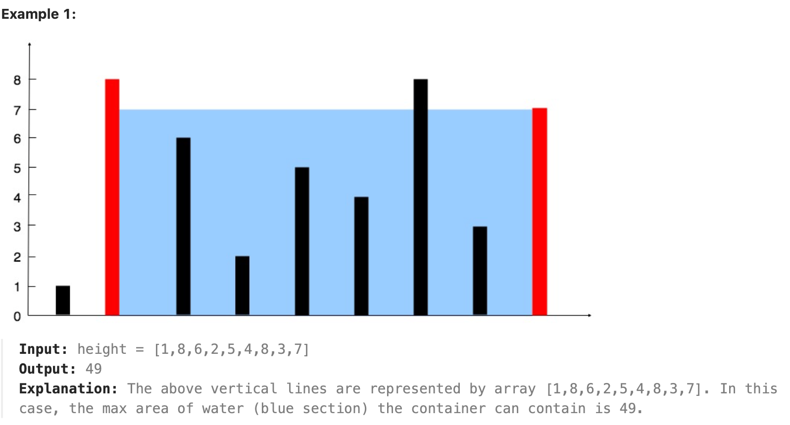
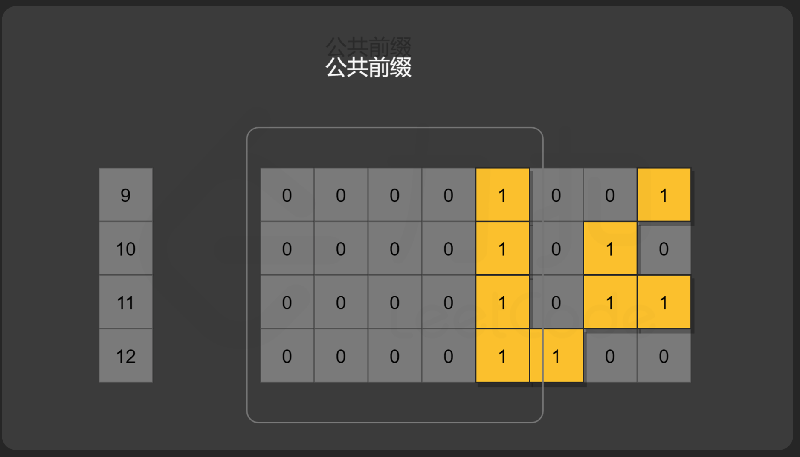

# Top interview 150

**Site:** [https://leetcode.com/studyplan/top-interview-150/](https://leetcode.com/studyplan/top-interview-150/)

## Review List (`***`)

| # | Problem | Chapter |
|---|---------|---------|
| 55 | [55. Jump Game](#55-jump-game) | Array/String |
| 45 | [45. Jump Game II](#45-jump-game-ii) | Array/String |
| 274 | [274. H-Index](#274-h-index) | Array/String |
| 15 | [15. 3Sum](#15-3sum) | Two Pointers |
| 138 | [138. Copy List with Random Pointer](#138-copy-list-with-random-pointer) | Linked List |
| 14 | [14. Flatten Binary Tree to Linked List](#14-flatten-binary-tree-to-linked-list) | Binary Tree General |
| 124 | [124. Binary Tree Maximum Path Sum](#124-binary-tree-maximum-path-sum) | Binary Tree General |
| 173 | [173. Binary Search Tree Iterator](#173-binary-search-tree-iterator) | Binary Tree General |
| 222 | [222. Count Complete Tree Nodes](#222-count-complete-tree-nodes) | Binary Tree General |
| 236 | [236. Lowest Common Ancestor of a Binary Tree](#236-lowest-common-ancestor-of-a-binary-tree) | Binary Tree General |
| 162 | [162. Find Peak Element](#162-find-peak-element) | Binary Search |
| 33 | [33. Search in Rotated Sorted Array](#33-search-in-rotated-sorted-array) | Binary Search |
| 34 | [34. Find First and Last Position of Element in Sorted Array](#34-find-first-and-last-position-of-element-in-sorted-array) | Binary Search |
| 4 | [4. Median of Two Sorted Arrays](#4-median-of-two-sorted-arrays) | Binary Search |
| - | [Bit Manipulation](#bit-manipulation) | Chapter |
| 50 | [50. Pow(x, n)](#50-powx-n) | Math |
| 149 | [149. Max Points on a Line](#149-max-points-on-a-line) | Math |
| 97 | [97. Interleaving String](#97-interleaving-string) | Multidimensional DP |
| 56 | [56. Merge Intervals](#56-merge-intervals) | Intervals |
| 57 | [57. Insert Interval](#57-insert-interval) | Intervals |
| 452 | [452. Minimum Number of Arrows to Burst Balloons](#452-minimum-number-of-arrows-to-burst-balloons) | Intervals |
| 373 | [373. Find K Pairs with Smallest Sums](#373-find-k-pairs-with-smallest-sums) | Heap |

- [Top interview 150](#top-interview-150)
  - [Review List (`***`)](#review-list-)
  - [Array/String](#arraystring)
    - [88. Merge Sorted Array](#88-merge-sorted-array)
    - [27. Remove Element](#27-remove-element)
    - [26. Remove Duplicates from Sorted Array](#26-remove-duplicates-from-sorted-array)
    - [80. Remove Duplicates from Sorted Array II](#80-remove-duplicates-from-sorted-array-ii)
    - [169. Majority Element](#169-majority-element)
    - [189. Rotate Array](#189-rotate-array)
    - [121. Best Time to Buy and Sell Stock](#121-best-time-to-buy-and-sell-stock)
    - [122. Best Time to Buy and Sell Stock II](#122-best-time-to-buy-and-sell-stock-ii)
    - [\*\*\*55. Jump Game](#55-jump-game)
    - [\*\*\*45. Jump Game II](#45-jump-game-ii)
    - [\*\*\*274. H-Index](#274-h-index)
    - [380. Insert Delete GetRandom O(1)](#380-insert-delete-getrandom-o1)
    - [238. Product of Array Except Self](#238-product-of-array-except-self)
  - [Two Pointers](#two-pointers)
    - [125. Valid Palindrome](#125-valid-palindrome)
    - [392. Is Subsequence](#392-is-subsequence)
    - [167. Two Sum II - Input Array Is Sorted](#167-two-sum-ii---input-array-is-sorted)
    - [11. Container With Most Water](#11-container-with-most-water)
    - [\*\*\*15. 3Sum](#15-3sum)
  - [Sliding Window](#sliding-window)
  - [Matrix](#matrix)
  - [Hashmap](#hashmap)
    - [383. Ransom Note](#383-ransom-note)
    - [205. Isomorphic Strings](#205-isomorphic-strings)
    - [290. Word Pattern](#290-word-pattern)
    - [242. Valid Anagram](#242-valid-anagram)
    - [49. Group Anagrams](#49-group-anagrams)
    - [1. Two Sum](#1-two-sum)
    - [202. Happy Number](#202-happy-number)
    - [219. Contains Duplicate II](#219-contains-duplicate-ii)
    - [128. Longest Consecutive Sequence](#128-longest-consecutive-sequence)
  - [Intervals](#intervals)
    - [228. Summary Ranges](#228-summary-ranges)
    - [\*\*\*56. Merge Intervals](#56-merge-intervals)
    - [\*\*\*57. Insert Interval](#57-insert-interval)
    - [\*\*\*452. Minimum Number of Arrows to Burst Balloons](#452-minimum-number-of-arrows-to-burst-balloons)
  - [Stack](#stack)
  - [Linked List](#linked-list)
    - [141. Linked List Cycle](#141-linked-list-cycle)
    - [2. Add Two Numbers](#2-add-two-numbers)
    - [21. Merge Two Sorted Lists](#21-merge-two-sorted-lists)
    - [\*\*\*138. Copy List with Random Pointer](#138-copy-list-with-random-pointer)
    - [92. Reverse Linked List II](#92-reverse-linked-list-ii)
    - [25. Reverse Nodes in k-Group](#25-reverse-nodes-in-k-group)
    - [19. Remove Nth Node From End of List](#19-remove-nth-node-from-end-of-list)
    - [82. Remove Duplicates from Sorted List II](#82-remove-duplicates-from-sorted-list-ii)
    - [61. Rotate List](#61-rotate-list)
    - [86. Partition List](#86-partition-list)
    - [146. LRU Cache](#146-lru-cache)
  - [Binary Tree General](#binary-tree-general)
    - [104. Maximum Depth of Binary Tree](#104-maximum-depth-of-binary-tree)
    - [100. Same Tree](#100-same-tree)
    - [226. Invert Binary Tree](#226-invert-binary-tree)
    - [101. Symmetric Tree](#101-symmetric-tree)
    - [105. Construct Binary Tree from Preorder and Inorder Traversal](#105-construct-binary-tree-from-preorder-and-inorder-traversal)
    - [106. Construct Binary Tree from Inorder and Postorder Traversal](#106-construct-binary-tree-from-inorder-and-postorder-traversal)
    - [117. Populating Next Right Pointers in Each Node II](#117-populating-next-right-pointers-in-each-node-ii)
    - [\*\*\*14. Flatten Binary Tree to Linked List](#14-flatten-binary-tree-to-linked-list)
      - [思路一](#思路一)
      - [思路二](#思路二)
    - [112. Path Sum](#112-path-sum)
    - [129. Sum Root to Leaf Numbers](#129-sum-root-to-leaf-numbers)
    - [\*\*\*124. Binary Tree Maximum Path Sum](#124-binary-tree-maximum-path-sum)
    - [\*\*\*173. Binary Search Tree Iterator](#173-binary-search-tree-iterator)
    - [\*\*\*222. Count Complete Tree Nodes](#222-count-complete-tree-nodes)
    - [\*\*\*236. Lowest Common Ancestor of a Binary Tree](#236-lowest-common-ancestor-of-a-binary-tree)
  - [Binary Tree BFS](#binary-tree-bfs)
    - [199. Binary Tree Right Side View](#199-binary-tree-right-side-view)
    - [637. Average of Levels in Binary Tree](#637-average-of-levels-in-binary-tree)
    - [102. Binary Tree Level Order Traversal](#102-binary-tree-level-order-traversal)
    - [103. Binary Tree Zigzag Level Order Traversal](#103-binary-tree-zigzag-level-order-traversal)
  - [Binary Search Tree](#binary-search-tree)
    - [530. Minimum Absolute Difference in BST](#530-minimum-absolute-difference-in-bst)
    - [230. Kth Smallest Element in a BST](#230-kth-smallest-element-in-a-bst)
    - [98. Validate Binary Search Tree](#98-validate-binary-search-tree)
  - [Graph General](#graph-general)
  - [Graph BFS](#graph-bfs)
  - [Trie](#trie)
  - [Backtracking](#backtracking)
  - [Divide \& Conquer](#divide--conquer)
  - [Kadane's Algorithm](#kadanes-algorithm)
  - [Binary Search](#binary-search)
    - [35. Search Insert Position](#35-search-insert-position)
    - [74. Search a 2D Matrix](#74-search-a-2d-matrix)
    - [\*\*\*162. Find Peak Element](#162-find-peak-element)
    - [\*\*\*33. Search in Rotated Sorted Array](#33-search-in-rotated-sorted-array)
    - [\*\*\*34. Find First and Last Position of Element in Sorted Array](#34-find-first-and-last-position-of-element-in-sorted-array)
    - [153. Find Minimum in Rotated Sorted Array](#153-find-minimum-in-rotated-sorted-array)
    - [\*\*\*4. Median of Two Sorted Arrays](#4-median-of-two-sorted-arrays)
  - [Heap](#heap)
    - [215. Kth Largest Element in an Array](#215-kth-largest-element-in-an-array)
    - [502. IPO](#502-ipo)
    - [\*\*\*373. Find K Pairs with Smallest Sums](#373-find-k-pairs-with-smallest-sums)
    - [295. Find Median from Data Stream](#295-find-median-from-data-stream)
  - [\*\*\*Bit Manipulation](#bit-manipulation)
    - [136. Single Number](#136-single-number)
    - [137. Single Number II](#137-single-number-ii)
    - [67. Add Binary](#67-add-binary)
    - [190. Reverse Bits](#190-reverse-bits)
    - [191. Number of 1 Bits](#191-number-of-1-bits)
    - [201. Bitwise AND of Numbers Range](#201-bitwise-and-of-numbers-range)
  - [Math](#math)
    - [9. Palindrome Number](#9-palindrome-number)
    - [66. Plus One](#66-plus-one)
    - [172. Factorial Trailing Zeroes](#172-factorial-trailing-zeroes)
    - [69. Sqrt(x)](#69-sqrtx)
    - [\*\*\*50. Pow(x, n)](#50-powx-n)
    - [\*\*\*149. Max Points on a Line](#149-max-points-on-a-line)
  - [1D DP](#1d-dp)
    - [70. Climbing Stairs](#70-climbing-stairs)
    - [198. House Robber](#198-house-robber)
    - [139. Word Break](#139-word-break)
    - [322. Coin Change](#322-coin-change)
    - [300. Longest Increasing Subsequence](#300-longest-increasing-subsequence)
  - [Multidimensional DP](#multidimensional-dp)
    - [120. Triangle](#120-triangle)
    - [64. Minimum Path Sum](#64-minimum-path-sum)
    - [63. Unique Paths II](#63-unique-paths-ii)
    - [5. Longest Palindromic Substring](#5-longest-palindromic-substring)
    - [221. Maximal Square](#221-maximal-square)
    - [123. Best Time to Buy and Sell Stock III](#123-best-time-to-buy-and-sell-stock-iii)
    - [188. Best Time to Buy and Sell Stock IV](#188-best-time-to-buy-and-sell-stock-iv)
    - [72. Edit Distance](#72-edit-distance)
    - [\*\*\*97. Interleaving String](#97-interleaving-string)


## Array/String

### 88. Merge Sorted Array

https://leetcode.com/problems/merge-sorted-array/description/?envType=study-plan-v2&envId=top-interview-150

这题很简单，两个升序数组的合并

```cpp
class Solution {
public:
    void merge(vector<int>& nums1, int m, vector<int>& nums2, int n) {
        assert(nums1.size() == m + n);
        std::vector<int> res;
        int i1 = 0;
        int i2 = 0;
        while(i1 < m && i2 < n)
            if(nums1[i1] < nums2[i2])
                res.push_back(nums1[i1++]);
            else
                res.push_back(nums2[i2++]);
        while(i1 < m)
            res.push_back(nums1[i1++]);
        while(i2 < n)
            res.push_back(nums2[i2++]);
        res.swap(nums1);
    }
};
```

### 27. Remove Element

https://leetcode.com/problems/remove-element/?envType=study-plan-v2&envId=top-interview-150

删除指定元素，我用双指针替换即可。

中途有一些情况需要细细考虑到才行。

```cpp
class Solution {
public:
    int removeElement(vector<int>& nums, int val) {
        // use two pointers
        if(nums.size() == 0) return 0;
        int left = 0;
        int right = nums.size() - 1;
        while(left < right) {
            if(nums[left] != val) left++;
            else if(nums[left] == val) std::swap(nums[left], nums[right--]);
        }
        assert(left >= right);
        if(nums[left] == val) return left; // special case
        return left + 1;
    }
};
```

### 26. Remove Duplicates from Sorted Array

https://leetcode.com/problems/remove-duplicates-from-sorted-array/description/?envType=study-plan-v2&envId=top-interview-150

删除重复元素，留下一个

也是用双指针控制即可

```cpp
class Solution {
public:
    int removeDuplicates(vector<int>& nums) {
        if(nums.size() == 0) return 0;
        if(nums.size() == 1) return 1;
        // use two pointers
        int slow = 0;
        int fast = 0;
        while(fast < nums.size()) {
            if(nums[fast] == nums[slow]) fast++;
            if(fast >= nums.size()) break;
            if(nums[fast] != nums[slow]) {
                nums[++slow] = nums[fast++];
            }
        }
        return slow + 1;
    }
};
```

### 80. Remove Duplicates from Sorted Array II

https://leetcode.com/problems/remove-duplicates-from-sorted-array-ii/description/?envType=study-plan-v2&envId=top-interview-150


删除重复元素，至多有两个。

其实肯定是要用双指针，但是调不出来。damn

```cpp
// 我的版本，未通过
class Solution {
public:
    int removeDuplicates(vector<int>& nums) {
        if(nums.size() == 0) return 0;
        if(nums.size() == 1) return 1;
        if(nums.size() == 2) return 2;
        // use two pointers
        // can reuse the codes in the last question(#26)
        int slow = 0;
        int fast = 0;
        while(fast < nums.size()) {
            int fast_step = 0;
            while(fast < nums.size() && nums[fast] == nums[slow]) {
                fast++;
                fast_step++;
            }
            if(fast >= nums.size()) {
                if(fast_step >= 2) {
                    nums[slow + 1] = nums[slow];
                    return slow + 2;
                }
                else return slow + 1;
                break;
            }
            if(nums[fast] != nums[slow]) {
                if(fast_step >= 2) {
                    slow += 2;
                    nums[slow] = nums[fast];
                } else {
                    nums[++slow] = nums[fast];
                }
            }
        }
        return slow + 1; 
    }
};
```


题解:

因为给定数组是有序的，所以相同元素必然连续。我们可以使用双指针解决本题，遍历数组检查每一个元素是否应该被保留，如果应该被保留，就将其移动到指定位置。具体地，我们定义两个指针 `slow` 和 `fast` 分别为慢指针和快指针，其中慢指针表示处理出的数组的长度，快指针表示已经检查过的数组的长度，即 `nums[fast]` 表示待检查的第一个元素，`nums[slow−1]` 为上一个应该被保留的元素所移动到的指定位置。

因为本题要求相同元素最多出现两次而非一次，所以我们需要检查上上个应该被保留的元素 `nums[slow−2]` 是否和当前待检查元素 `nums[fast]` 相同。当且仅当 `nums[slow−2]=nums[fast]` 时，当前待检查元素 `nums[fast]` 不应该被保留（因为此时必然有 `nums[slow−2]=nums[slow−1]=nums[fast]`）。最后，`slow` 即为处理好的数组的长度。

特别地，数组的前两个数必然可以被保留，因此对于长度不超过 2 的数组，我们无需进行任何处理，对于长度超过 2 的数组，我们直接将双指针的初始值设为 2 即可。

> 作者：力扣官方题解
链接：https://leetcode.cn/problems/remove-duplicates-from-sorted-array-ii/solutions/702644/shan-chu-pai-xu-shu-zu-zhong-de-zhong-fu-yec2/
来源：力扣（LeetCode）
著作权归作者所有。商业转载请联系作者获得授权，非商业转载请注明出处。

```cpp
class Solution {
public:
    int removeDuplicates(vector<int>& nums) {
        int n = nums.size();
        if (n <= 2) {
            return n;
        }
        int slow = 2, fast = 2;
        while (fast < n) {
            if (nums[slow - 2] != nums[fast]) {
                nums[slow] = nums[fast];
                ++slow;
            }
            ++fast;
        }
        return slow;
    }
};
```

### 169. Majority Element

https://leetcode.com/problems/majority-element/description/?envType=study-plan-v2&envId=top-interview-150

这题就是找到数组中出现次数大于 n/2 的数字。

**Follow-up:** Could you solve the problem in linear time and in O(1) space?

难点其实是他这个 Follow-up 的要求。

如果用哈希，是很简单的，不赘述，时间复杂度是 $O(n)$，空间是 $O(n)$

如果是排序，也很简单：排序之后，数组最中间的位置，就一定是要找的数字，因为他数量超过 n/2。时间是 $O(n\log n)$, 空间是 $O(1)$。

这里介绍题解里面比较特别的一种方法，可以做到 Follow-up 的要求。

```cpp
class Solution {
public:
    int majorityElement(vector<int>& nums) {
        while (true) {
            int candidate = nums[rand() % nums.size()];
            int count = 0;
            for (int num : nums)
                if (num == candidate)
                    ++count;
            if (count > nums.size() / 2)
                return candidate;
        }
        return -1;
    }
};
```

复杂度分析

时间复杂度：理论上最坏情况下的时间复杂度为 O(∞)，因为如果我们的运气很差，这个算法会一直找不到众数，随机挑选无穷多次，所以最坏时间复杂度是没有上限的。然而，运行的期望时间是线性的。为了更简单地分析，先说服你自己：由于众数占据 超过 数组一半的位置，期望的随机次数会小于众数占据数组恰好一半的情况。因此，我们可以计算随机的期望次数（下标为 prob 为原问题，mod 为众数恰好占据数组一半数目的问题）：

$$
\begin{aligned}
E\left(\text { iters }_{\text {prob }}\right) & \leq E\left(\text { iters }_{\text {mod }}\right) \\
& =\lim _{n \rightarrow \infty} \sum_{i=1}^{n} i \cdot \frac{1}{2^{i}} \\
& =2
\end{aligned}
$$

 
计算方法为：当众数恰好占据数组的一半时，第一次随机我们有 $1/2$ 的概率找到众数，如果没有找到，则第二次随机时，包含上一次我们有 $1/4$ 的概率找到众数，以此类推。因此期望的次数为 $i \cdot 1/2^i$的和，可以计算出这个和为 2，说明期望的随机次数是常数。每一次随机后，我们需要 $O(n)$ 的时间判断这个数是否为众数，因此期望的时间复杂度为 $O(n)$。

空间复杂度：$O(1)$。随机方法只需要常数级别的额外空间。

> 作者：力扣官方题解
链接：https://leetcode.cn/problems/majority-element/solutions/146074/duo-shu-yuan-su-by-leetcode-solution/
来源：力扣（LeetCode）
著作权归作者所有。商业转载请联系作者获得授权，非商业转载请注明出处。

然后中文版官网的题解还有两种很有意思的算法，分治法和Boyer-Moore投票算法：[https://leetcode.cn/problems/majority-element/solutions/146074/duo-shu-yuan-su-by-leetcode-solution/](https://leetcode.cn/problems/majority-element/solutions/146074/duo-shu-yuan-su-by-leetcode-solution/)


### 189. Rotate Array

https://leetcode.com/problems/rotate-array/description/?envType=study-plan-v2&envId=top-interview-150

Given an integer array nums, rotate the array to the right by k steps, where k is non-negative.

这个题目还是用之前学的，三次反转的方法。

```cpp
class Solution {
public:
    void reverse(std::vector<int>::iterator begin, std::vector<int>::iterator end) {
        // end is set out of range
        end--;
        while(begin < end)
            std::swap(*begin++, *end--);
    }
    void rotate(vector<int>& nums, int k) {
        if(k > nums.size()) k = k % nums.size();
        reverse(nums.begin(), nums.end() - k);
        reverse(nums.end() - k, nums.end());
        reverse(nums.begin(), nums.end());
    }
};
```

顺利通过。

### 121. Best Time to Buy and Sell Stock

经典股票问题。

还记得 Carl 教的，股票问题：把状态处理好即可！

You are given an array prices where prices[i] is the price of a given stock on the ith day.

You want to maximize your profit by choosing a single day to buy one stock and choosing a different day in the future to sell that stock.

Return the maximum profit you can achieve from this transaction. If you cannot achieve any profit, return 0.

这个是一买一卖的。

```cpp
class Solution {
public:
    int maxProfit(vector<int>& prices) {
        auto dp = std::vector<std::vector<int>>(2, std::vector<int>(prices.size(), 0));
        // first row: have stock
        // second row: donot have stock
        // dp[][]: the cash i have
        dp[0][0] = -prices[0];
        dp[1][0] = 0;
        for(int j = 1; j < prices.size(); ++j) {
            dp[0][j] = std::max(dp[0][j-1], -prices[j]);
            dp[1][j] = std::max(dp[1][j-1], dp[0][j-1] + prices[j]);
        }
        return dp[1][prices.size() - 1];
    }
};
```

顺利通过。

### 122. Best Time to Buy and Sell Stock II

https://leetcode.com/problems/best-time-to-buy-and-sell-stock-ii/description/?envType=study-plan-v2&envId=top-interview-150

You are given an integer array prices where prices[i] is the price of a given stock on the ith day.

On each day, you may decide to buy and/or sell the stock. You can only hold at most one share of the stock at any time. However, you can sell and buy the stock multiple times on the same day, ensuring you never hold more than one share of the stock.

Find and return the maximum profit you can achieve.

```cpp
class Solution {
public:
    int maxProfit(vector<int>& prices) {
        auto dp = std::vector<std::vector<int>>(2, std::vector<int>(prices.size(), 0));
        // first row: have stock
        // second row: donot have stock
        // dp[][]: the cash i have
        dp[0][0] = -prices[0];
        dp[1][0] = 0;
        for(int j = 1; j < prices.size(); ++j) {
            dp[0][j] = std::max(dp[0][j-1], dp[1][j-1] - prices[j]); // modify here
            dp[1][j] = std::max(dp[1][j-1], dp[0][j-1] + prices[j]);
        }
        return dp[1][prices.size() - 1];
    }
};
```
很简单，改这里即可。

### ***55. Jump Game

https://leetcode.com/problems/jump-game/description/?envType=study-plan-v2&envId=top-interview-150

You are given an integer array nums. You are initially positioned at the array's first index, and each element in the array represents your maximum jump length at that position.

Return true if you can reach the last index, or false otherwise.

这题还挺有意思的：

用大白话来翻译你的解释，其实就是把数组看成一串断掉的独木桥，你从终点往回修路：
- Valid Spot（有效点）：就是已经被证明“只要站在这里，就一定能走到终点”的位置。
- loop_cnt（索命距离）：就是当前位置距离最近的那个“有效点”有多远。
- 判定逻辑：如果当前的跳力 nums[i] 够得着最近的“有效点”，那当前位置 i 也就变成了一个新的“有效点”，后面的路就不用愁了，loop_cnt 重置为 1（看前一个点能不能跳到 i）。

```cpp
class Solution {
public:
    bool canJump(vector<int>& nums) {
        if(nums.size() == 1) return true;
        int loop_cnt = 1;
        for(int i = nums.size() - 2; i >= 0; i--) {
            // nums.size() - 2 is the index to make a last jump
            // can nums.size() - 2 reach the dest? see if nums[i] > loop_cnt
            // loop_cnt refers to the distance to the closest valid spot
            // valid spot: a spot that can find a way to dest
            if(nums[i] >= loop_cnt) {
                loop_cnt = 1; // continue to 1
                continue;
            }
            loop_cnt++;
        }
        return nums[0] >= loop_cnt;
    }
};
```

这题本质是一个贪心。


### ***45. Jump Game II

https://leetcode.com/problems/jump-game-ii/description/

这题难啊，一时没想到，之前第一次做的时候也是卡在这题。

```cpp
class Solution {
public:
    int jump(vector<int>& nums) {
        if(nums.size() == 1) return 0; // no need to jump
        int maxCurrentCover = nums[0]; 
        int maxNextCover = 0;
        int step = 1;
        for(int i = 0; i < nums.size(); ++i) {
            if(i <= maxCurrentCover)
                maxNextCover = std::max(maxCurrentCover, std::max(maxNextCover, nums[i] + i)); 
                // 这里不断更新 nextcover 的最大值，也就是如果在当前情况下，走多一步，可以最多走到哪里
            else {
                maxCurrentCover = maxNextCover; // 更新
                step++;
                maxNextCover = std::max(maxCurrentCover, std::max(maxNextCover, nums[i] + i));
            }
            if(maxCurrentCover >= nums.size() - 1) return step;
        }
        return step;
    }
};
```

### ***274. H-Index

https://leetcode.com/problems/h-index/description/?envType=study-plan-v2&envId=top-interview-150

```cpp
class Solution {
public:
    int hIndex(vector<int>& citations) {
        sort(citations.begin(), citations.end());
        int h = 0, i = citations.size() - 1;
        while (i >= 0 && citations[i] > h) {
            h++;
            i--;
        }
        return h;
    }
};
```

根据 H 指数的定义，如果当前 H 指数为 h 并且在遍历过程中找到当前值 `citations[i]>h`，则说明我们找到了一篇被引用了至少 h+1 次的论文，所以将现有的 h 值加 1。继续遍历直到 h 无法继续增大。最后返回 h 作为最终答案。


### 380. Insert Delete GetRandom O(1)

https://leetcode.com/problems/insert-delete-getrandom-o1/description/?envType=study-plan-v2&envId=top-interview-150

```cpp
class RandomizedSet {
    vector<int> nums;
    unordered_map<int, int> idx;
    mt19937 rng;

public:
    RandomizedSet() : rng(random_device{}()) {}

    bool insert(int val) {
        if (idx.count(val)) return false;
        idx[val] = (int)nums.size();
        nums.push_back(val);
        return true;
    }

    bool remove(int val) {
        auto it = idx.find(val);
        if (it == idx.end()) return false;

        int i = it->second;
        int last = nums.back();

        nums[i] = last;
        idx[last] = i;

        nums.pop_back();
        idx.erase(it);
        return true;
    }

    int getRandom() {
        uniform_int_distribution<int> dist(0, (int)nums.size() - 1);
        return nums[dist(rng)];
    }
};
```


**思路**
- 用 **数组 nums** 存元素
- 用 **哈希表 idx** 记录：值 → 数组下标

**删除的关键**
- 数组中间删是 O(n)
- 做法：**把要删的元素和最后一个元素交换，再 pop_back**
- 同时更新被换元素在 idx 里的下标

→ 删除仍然是 O(1)

**getRandom 为什么是等概率**
- 在 `[0, nums.size()-1]` 里 **等概率随机一个下标**
- 数组里每个元素只占一个下标
- ⇒ 每个元素被返回的概率都是 `1 / size`

**本质**
- random 不在 set 上做，在 **数组下标上做**
- 交换末尾只是为了保证数组连续，不影响随机概率


### 238. Product of Array Except Self

https://leetcode.com/problems/product-of-array-except-self/description/?envType=study-plan-v2&envId=top-interview-150

```cpp
class Solution {
public:
    vector<int> productExceptSelf(vector<int>& nums) {
        int sz = nums.size();
        // calculate prefix and suffix
        std::vector<int> prefix;
        std::vector<int> suffix;
        prefix.push_back(nums[0]);
        suffix.push_back(nums[sz-1]);
        for(int i = 1; i < sz; ++i)
            prefix.push_back(prefix[i-1] * nums[i]);
        for(int i = sz-2; i>=0; --i) 
            suffix.push_back(suffix[suffix.size()-1] * nums[i]);
        // for debug
        // for(int a : prefix)
        //     std::cout << a << " ";
        // std::cout << std::endl;
        // for(int b : suffix)
        //     std::cout << b << " ";
        // std::cout << std::endl;
        // return {};
        //
        std::vector<int> ans;
        for(int i = 0; i < sz; ++i)
            if(i == 0)  // 处理下边界情况
                ans.push_back(suffix[sz-2]);
            else if(i == sz-1)
                ans.push_back(prefix[sz-2]);
            else
                ans.push_back(prefix[i-1] * suffix[sz-1-i-1]);
        return ans;
    }
};
```

这题没什么问题，用前缀和后缀分别合成结果就行。

...

## Two Pointers 

### 125. Valid Palindrome

https://leetcode.com/problems/valid-palindrome/?envType=study-plan-v2&envId=top-interview-150

A phrase is a palindrome if, after converting all uppercase letters into lowercase letters and removing all non-alphanumeric characters, it reads the same forward and backward. Alphanumeric characters include letters and numbers.

Given a string s, return true if it is a palindrome, or false otherwise.

```cpp
class Solution {
public:
    bool isPalindrome(string s) {
        // 遍历一次就行，不用去除和转换后再用双指针，这样更快
        int left = 0;
        int right = s.size() - 1;
        while(left < right) {
            while(left < right && !isalpha(s[left]) && !isdigit(s[left])) left++;
            while(left < right && !isalpha(s[right]) && !isdigit(s[right])) right--;
            char a = s[left++], b = s[right--];
            if(isalpha(a)) a = tolower(a);
            if(isalpha(b)) b = tolower(b);
            if(a == b) continue;
            else return false;
        }
        return true;
    }
};
```

简单题。


### 392. Is Subsequence

https://leetcode.com/problems/is-subsequence/description/?envType=study-plan-v2&envId=top-interview-150

Given two strings s and t, return true if s is a subsequence of t, or false otherwise.

A subsequence of a string is a new string that is formed from the original string by deleting some (can be none) of the characters without disturbing the relative positions of the remaining characters. (i.e., "ace" is a subsequence of "abcde" while "aec" is not).

这题用dp好点。


```cpp
class Solution {
public:
    bool isSubsequence(string s, string t) {
        if(s.size() == 0) return true;
        std::vector<std::vector<bool>> dp(t.size() + 1, std::vector<bool>(s.size() + 1, false));
        // 在草稿纸上推导一下就知道，第一列需要初始化，第一列都应该是true。因为空可以是任何字符串的子串
        for(int i = 0; i <= t.size(); ++i) dp[i][0] = true;
        for(int i = 1; i <= t.size(); ++i) {
            for(int j = 1; j <= s.size(); ++j) {
                if(s[j-1] == t[i-1]) dp[i][j] = (dp[i-1][j] | dp[i-1][j-1]);
                else dp[i][j] = dp[i-1][j];
            }
        }
        return dp[t.size()][s.size()];
    }
};
```

顺便也复习了一次dp，不错。


### 167. Two Sum II - Input Array Is Sorted

https://leetcode.com/problems/two-sum-ii-input-array-is-sorted/?envType=study-plan-v2&envId=top-interview-150

https://leetcode.com/problems/two-sum-ii-input-array-is-sorted/description/?envType=study-plan-v2&envId=top-interview-150

Given a 1-indexed array of integers numbers that is already sorted in non-decreasing order, find two numbers such that they add up to a specific target number. Let these two numbers be numbers[index1] and numbers[index2] where 1 <= index1 < index2 <= numbers.length.

Return the indices of the two numbers, index1 and index2, added by one as an integer array [index1, index2] of length 2.

The tests are generated such that there is exactly one solution. You may not use the same element twice.

**Your solution must use only constant extra space.**

这题说了只能用 O(1) 的空间，所以只能双指针了。而且已经排好序了，很适合双指针。

```cpp
class Solution {
public:
    vector<int> twoSum(vector<int>& numbers, int target) {
        int left = 0;
        int right = numbers.size()-1;
        while(left < right) {
            if(numbers[left] + numbers[right] < target) left++;
            else if(numbers[left] + numbers[right] > target) right--;
            else return {left+1, right+1}; // 题目说下标从1开始
        }
        assert(false);
        return {};
    }
};
```

### 11. Container With Most Water

https://leetcode.com/problems/container-with-most-water/description/?envType=study-plan-v2&envId=top-interview-150

You are given an integer array height of length n. There are n vertical lines drawn such that the two endpoints of the ith line are (i, 0) and (i, height[i]).

Find two lines that together with the x-axis form a container, such that the container contains the most water.

Return the maximum amount of water a container can store.

Notice that you may not slant the container.



**这题的关键点在于：每次移动数字较小的指针即可，不需要两个指针一起动！**

如果我们移动数字较大的那个指针，那么前者「两个指针指向的数字中较小值」不会增加，后者「指针之间的距离」会减小，那么这个乘积会减小。因此，我们移动数字较大的那个指针是不合理的。因此，我们移动 数字较小的那个指针。

```cpp
class Solution {
public:
    int maxArea(vector<int>& height) {
        int maxArea = -1;
        int left = 0;
        int right = height.size() - 1;
        while(left < right) {
            int area = (std::min(height[left], height[right])) * (right - left);
            maxArea = std::max(area, maxArea);
            if(height[left] <= height[right]) left++;
            else right--;
        }
        return maxArea;
    }
};
```

### ***15. 3Sum

https://leetcode.com/problems/3sum/?envType=study-plan-v2&envId=top-interview-150

Given an integer array nums, return all the triplets [nums[i], nums[j], nums[k]] such that i != j, i != k, and j != k, and nums[i] + nums[j] + nums[k] == 0.

Notice that the solution set must not contain duplicate triplets.

这题挺难的。这里还用更详细的讲解：https://github.com/ffengc/LeetsGoAgain/blob/main/docs/hash_tables.md#三数之和经典重要题目

```cpp
class Solution {
public:
    vector<vector<int>> threeSum(vector<int>& nums) {
        std::vector<std::vector<int>>res;
        std::sort(nums.begin(), nums.end());
        for(int i = 0; i < nums.size(); ++i) {
            // 如果最左边的数字大于0，不用操作了，不可能有合适的结果的，很好理解
            if(nums[i] > 0) return res; // 说明后续也不会有合适结果
            if(i > 0 && nums[i] == nums[i-1]) continue; // 最左边的数字重复
            int left = i + 1;
            int right = nums.size()-1;
            while(left < right) { // i,j,k位置互不相同
                int sum = nums[i] + nums[left] + nums[right];
                // 去重复逻辑如果放在这⾥，0，0，0 的情况，可能直接导致 right<=left 了，从⽽漏掉了0,0,0 这种三元组
                /*
                while (right > left && nums[right] == nums[right - 1]) right--;
                while (right > left && nums[left] == nums[left + 1]) left++;
                */
                // 所以必须先找到一次(0,0,0), 再去重，不能在 res.push_back 之前就完成去重！
                if(sum == 0) {
                    res.push_back({nums[i], nums[left],nums[right]});
                    // 这里还要继续处理, 如果找到答案，双指针要同时收缩
                    // 这里要对b和c去重
                    while(left < right && nums[left] == nums[left+1]) left++;
                    while(left < right && nums[right] == nums[right-1]) right--;
                    left++;
                    right--;
                } else if(sum < 0) {
                    left++;
                } else if(sum > 0) {
                    right--;
                } else assert(false);
            }
        }
        return res;
    }
};
```


## Sliding Window

### 209. Minimum Size Subarray Sum

https://leetcode.com/problems/minimum-size-subarray-sum/?envType=study-plan-v2&envId=top-interview-150

```cpp
class Solution {
public:
    int minSubArrayLen(int target, vector<int>& nums) {
        if(nums.size() == 0) return 0;
        int slow = 0;
        int fast = 0;
        int current_sum = nums[0];
        int min_length = INT_MAX;
        while(fast < nums.size()) {
            if(current_sum < target) {
                if(fast == nums.size() - 1) return min_length == INT_MAX ? 0 : min_length;
                current_sum += nums[++fast];
            } else if(current_sum > target) {
                min_length = std::min(min_length, fast - slow + 1);
                if(slow < fast) {
                    current_sum -= nums[slow++];
                } else if(slow == fast) {
                    if(fast == nums.size() - 1) return min_length == INT_MAX ? 0 : min_length;
                    slow++;
                    fast++;
                    current_sum = nums[fast];
                }
            } else if (current_sum == target) {
                min_length = std::min(min_length, fast - slow + 1);
                current_sum -= nums[slow++];
                current_sum += nums[++fast];
                continue;
            }
        }
        return min_length == INT_MAX ? 0 : min_length;
    }
};
```

滑动窗口思想顺利通过。

### 3. Longest Substring Without Repeating Characters

https://leetcode.com/problems/longest-substring-without-repeating-characters/description/?envType=study-plan-v2&envId=top-interview-150

```cpp
class Solution {
public:
    int lengthOfLongestSubstring(string s) {
        if(s.size() == 0) return 0;
        if(s.size() == 1) return 1;
        //
        std::unordered_map<char,int> mmap;
        int max_length = INT_MIN;
        int slow = 0;
        int fast = 1;
        mmap.insert({s[slow], 1});
        while(fast < s.size()) {
            auto it = mmap.find(s[fast]);
            if(it == mmap.end() || it->second == 0) {
                // first time char
                max_length = std::max(max_length, fast - slow + 1);
                mmap[s[fast]]++;
                fast++;
                continue;
            } else if(it != mmap.end()) {
                // already have this char
                char current_char = s[fast];
                while(slow < fast) {
                    mmap[s[slow]]--;
                    slow++;
                    if(mmap[current_char] == 0) break; // already remove this char
                }
                max_length = std::max(max_length, fast - slow + 1);
                mmap[s[fast]]++;
                fast++;
            }
        }
        return max_length;
    }
};
```

利用一个哈希表顺利通过。

### 76. Minimum Window Substring

https://leetcode.com/problems/minimum-window-substring/description/?envType=study-plan-v2&envId=top-interview-150

#### init try

这题其实我是可以想出来的，但是为了极致的优化最后放弃了，没弄出来。

我弄的最后的版本：

```cpp
class Solution {
public:
    bool check_map(const std::unordered_map<char,int>& m) {
        if(m.size() == 0) return true;
        for(const auto& e : m)
            if(e.second > 0) return false;
        return true;
    }
    string minWindow(string s, string t) {
        if(t.size() > s.size()) return "";
        std::unordered_map<char,int> t_map;
        std::unordered_set<char> t_set;
        for(char e : t) { t_map[e]++; t_set.insert(e); }
        //
        int ptr_begin = 0;
        int ptr_end = 0;
        std::string ans;
        // tips: 
        // a. 后续如果删到0了，直接erase，然后用 t_map.size() 来判断，会更快，不用遍历 t_map 的元素是不是都为0
        // b. 准备多一个模版 t_set
        // c. 删到0之后，做一次跳跃，直接把指针跳跃到第二个合法字符的位置上

        // 1. begin 和 end 一起找第一个合法字符
        while(ptr_begin < s.size()) {
            auto it = t_map.find(s[ptr_begin]);
            if(it == t_map.end()) ptr_begin++;
            else break;
        }
        ptr_end = ptr_begin; // 对齐两个指针
        if(ptr_begin == s.size()) return ""; // 一个合法字符都没有
        // 先把第一个合法字符加进去
        t_map[s[ptr_begin]]--;
        if(t_map[s[ptr_begin]] == 0) t_map.erase(s[ptr_begin]);
        ptr_end++;
        

        int ptr_jump = -1;
        bool mark_jump_pos = false; // 第一次才需要这两行
        // 2. 开始找跳跃位置
        while(ptr_end < s.size()) {
            int ptr_next_jump = -1;
            while(ptr_end < s.size()) {
                auto it = t_set.find(s[ptr_end]); // 这里用 t_set 查找，比较好
                if(it == t_set.end()) {
                    // 无关字符
                    ptr_end++;
                    continue;
                }
                else if(it != t_set.end()) {
                    // 如果此时这个字符，在t_set中有，但在 t_map 中没有，此时他是合法字符，因为 map 中已经是0了
                    // 但是这个字符是要用来作为jump！所以要记录下来
                    if(t_map[*it] <= 0) {
                        // 没有这玩意
                        ptr_next_jump = ptr_end;
                        t_map[*it]--;
                        ptr_end++; // 这里要额外++
                        continue;
                    }
                    // 命中相关字符
                    if(mark_jump_pos == false) {
                        // 记录跳跃位置
                        ptr_jump = ptr_end;
                        mark_jump_pos = true;
                    }
                    assert(*it == s[ptr_end]);
                    char ch = s[ptr_end];
                    t_map[ch]--;
                    if(t_map[ch] == 0) t_map.erase(ch);

                    // 如果删除完发现 t_map.size() == 0, 说明已经找到一个子串了
                    if(check_map(t_map)) {
                        std::string str = s.substr(ptr_begin, ptr_end - ptr_begin + 1);
                        if(ans.size() != 0 && str.size() <= ans.size()) ans = str;
                        else if(ans.size() == 0) ans = str;
                        // t_map.insert({s[ptr_begin], 1}); // 给他加一个
                        t_map[s[ptr_begin]]++;
                        ptr_begin = ptr_jump;
                        // 这里还需要check map，因为此时可能还是合法的
                        // bug
                        if(check_map(t_map)) continue;
                        break;
                    }
                }
                ptr_end++;
            }
            ptr_jump = ptr_next_jump == -1 ? ptr_end : ptr_next_jump; 
            // 如果有 ptr_next_jump，说明 end 和 next jump 不是同一个地方了
            ptr_end++; // 对应break出来的++
        }
        return ans;
    }
};
```
这个没通过。

#### What wrong with the init solution

**心路历程：**

我的原始想法

这题标准解法一般是滑动窗口：右指针扩，满足条件后左指针一点点缩。
但我一开始不太想写那种“begin 一个一个往前挪”的版本，因为我觉得那样虽然也是线性，但执行过程中会有很多“无意义移动”。

所以我的思路是：
	•	先把 t 的字符需求存进 t_map
	•	再准备一个 t_set，专门用来快速判断某个字符是否和 t 有关
	•	右指针 ptr_end 扩张时：
	•	如果当前字符根本不在 t 里，直接跳过
	•	只有遇到 t 里的字符才处理
	•	左指针 ptr_begin 收缩时：
	•	不想一格一格试
	•	希望预先记录一个“下一个可以跳到的位置” ptr_jump
	•	这样当当前窗口已经合法后，左边界可以直接跳过去，而不是慢慢试

换句话说，我的目标不是单纯把题做出来，而是想把“跳过无关字符”和“快速定位下一个有效 begin”都做进去，让窗口移动更激进一点。

所以这份代码的本质不是普通滑窗，而是：
	•	用 t_set 加速过滤无关字符
	•	用 ptr_jump 试图加速左边界收缩
	•	用 t_map 同时维护“还缺多少字符”和“当前窗口多出来多少字符”

这个出发点本身是合理的，说明我当时是在主动思考“怎样减少无效操作”，而不是只套模板。

⸻

为什么后来会出问题

问题不在于“想跳”这个方向错了，而在于我把状态维护写复杂了，而且几种逻辑混在了一起，最后很难保证一致性。

1. 扩窗口和缩窗口耦合得太紧

我原来的代码把下面几件事塞进了同一套流程里：
	•	ptr_end 找下一个相关字符
	•	更新 t_map
	•	发现窗口合法后更新答案
	•	再立刻让 ptr_begin 跳到 ptr_jump
	•	还希望在不重新扩张右边界的情况下，继续判断窗口是否仍然合法

问题就在这里：

当窗口已经合法后，我其实进入的是“继续缩左边界”的阶段；
但我的代码结构仍然停留在“右边界继续扫”的语境里。

于是就出现了那个关键 bug：
我想继续缩左边界，所以写了 continue，但这个 continue 实际上会回到“重新处理同一个 ptr_end”的逻辑中，导致右边那个字符被重复消费一次，状态直接乱掉。

也就是说，根本原因不是某一行判断错了，而是：

代码结构没有把“扩窗口”和“缩窗口”分成两个稳定阶段。

⸻

2. t_map 承担了太多职责

我当时想让 t_map 既表示：
	•	还缺哪些字符
	•	某些字符是否已经满足
	•	某些字符是不是多出来了

于是会出现这些操作混在一起：
	•	对某个字符 --
	•	到 0 就 erase
	•	后面又可能对这个字符继续 --，变成负数
	•	然后还通过 check_map() 或者 size() 来判断是否合法

这就让 t_map 的语义不再单一了。

本来一个计数结构最好只有一种稳定含义，比如：
	•	> 0 表示还缺
	•	== 0 表示刚好
	•	< 0 表示多余

但我又引入了 erase，于是“0”这个状态有时不存在，有时又会因为 operator[] 被重新插回来。
这样一来，map 里的内容已经不再是一个干净的状态机，而是“部分字符被删掉，部分字符是负数，部分字符又会被访问时自动插入”。

所以后面越写越难判断“当前窗口到底是不是合法”。

⸻

3. ptr_jump 是局部记录，但窗口状态是全局变化的

我原来希望 ptr_jump 表示“begin 下一次可以直接跳去的地方”。
这个想法表面上很好，但实际上 ptr_jump 的正确性依赖于当前整个窗口的状态。

问题是：
	•	窗口右边界在变
	•	左边界在变
	•	t_map 在变
	•	哪个字符是“多余的”、哪个字符是“必须保留的”也在变

但 ptr_jump 却是我在扫描过程中临时记下来的一个位置。
它不是一个在所有后续状态下都仍然有效的“真 jump 点”。

所以只要窗口一变，这个 jump 很可能就陈旧了。
而我原来的代码还想复用这个 jump，这就很容易出错。

本质上说：

jump 不是不能做，而是不能靠“提前记一个位置，然后后面反复相信它”来做。


#### how to get it done

**应该保留的思想**

这些其实是对的：
	•	只关心 t 里的字符
	•	无关字符应该尽量快速跳过
	•	左边界收缩时，应该尽量跳过“多余字符”和“无关字符”，不要做没必要的检查

**应该放弃的部分**

这些是后来证明不太稳的：
	•	用一个 ptr_jump 预存未来的跳跃位置
	•	用 erase + operator[] + 负数 混合维护 t_map
	•	在同一个循环里同时做扩张、合法性判断、跳跃收缩，并试图复用同一个 ptr_end

#### fixed code

这题最好的思路其实还是标准滑窗，但可以写得很干净：
	•	need[c] 表示当前还需要多少个字符 c
	•	右指针不断扩张窗口
	•	当某个字符是需要的，就减少 missing
	•	一旦 missing == 0，说明当前窗口已经覆盖了 t
	•	然后左指针开始收缩：
	•	能删的就删
	•	每次收缩前更新最短答案
	•	直到窗口重新不合法为止

这个版本虽然看起来是“左指针一个个移动”，但实际上每个字符最多被左右指针各访问一次，总体就是 O(m+n)。

```cpp
class Solution {
public:
    string minWindow(string s, string t) {
        if (t.size() > s.size()) return "";

        std::unordered_map<char, int> need;
        for (char c : t) {
            need[c]++;
        }

        int missing = t.size();   // 还缺多少个字符（包含重复）
        int left = 0;
        int best_start = 0;
        int best_len = INT_MAX;

        for (int right = 0; right < (int)s.size(); right++) {
            char c = s[right];

            // 如果 need[c] > 0，说明这个字符正是当前还缺的
            if (need[c] > 0) {
                missing--;
            }
            // 不管是不是缺的，都先减掉，表示它进入窗口了
            need[c]--;

            // 当前窗口已经覆盖了 t
            while (missing == 0) {
                int window_len = right - left + 1;
                if (window_len < best_len) {
                    best_len = window_len;
                    best_start = left;
                }

                char d = s[left];
                need[d]++;  // 左边字符准备移出窗口

                // 如果加完后 need[d] > 0，说明这个字符本来是刚好够的
                // 现在移走一个，窗口就不合法了
                if (need[d] > 0) {
                    missing++;
                }

                left++;
            }
        }

        return best_len == INT_MAX ? "" : s.substr(best_start, best_len);
    }
};
```

## Matrix

### 36. Valid Sudoku

https://leetcode.com/problems/valid-sudoku/description/?envType=study-plan-v2&envId=top-interview-150

对于数组的第 $i$ 行第 $j$ 列的单元格，其中 $0 \le i, j < 9$，该单元格所在的九宫格的行数和列数分别为：

- 行：$\left\lfloor \frac{i}{3} \right\rfloor$
- 列：$\left\lfloor \frac{j}{3} \right\rfloor$

其中 $0 \le \left\lfloor \frac{i}{3} \right\rfloor, \left\lfloor \frac{j}{3} \right\rfloor < 3$。

---

具体做法是：

创建三个数组：

- $rows[9][10]$
- $columns[9][10]$
- $subboxes[3][3][10]$

分别用来记录：

- 每一行
- 每一列
- 每一个九宫格中

每个数字出现的次数。

对于单元格 $(i, j)$ 中的数字 $d$：

- 行：$rows[i][d]$
- 列：$columns[j][d]$
- 九宫格：$subboxes\left[\left\lfloor \frac{i}{3} \right\rfloor\right]\left[\left\lfloor \frac{j}{3} \right\rfloor\right][d]$

需要满足：

$$
1 \le d \le 9
$$

如果某个位置填入数字 $d$，则：

rows[i][d]++;  \
columns[j][d]++; \
$subboxes\left[\left\lfloor \frac{i}{3} \right\rfloor\right]\left[\left\lfloor \frac{j}{3} \right\rfloor\right][d]$++;

如果更新后某个值大于 $1$，则说明不合法。

```cpp
class Solution {
public:
    bool isValidSudoku(vector<vector<char>>& board) {
        int rows[9][9];
        int columns[9][9];
        int subboxes[3][3][9];
        
        memset(rows,0,sizeof(rows));
        memset(columns,0,sizeof(columns));
        memset(subboxes,0,sizeof(subboxes));
        for (int i = 0; i < 9; i++) {
            for (int j = 0; j < 9; j++) {
                char c = board[i][j];
                if (c != '.') {
                    int index = c - '0' - 1;
                    rows[i][index]++;
                    columns[j][index]++;
                    subboxes[i / 3][j / 3][index]++;
                    if (rows[i][index] > 1 || columns[j][index] > 1 || subboxes[i / 3][j / 3][index] > 1) {
                        return false;
                    }
                }
            }
        }
        return true;
    }
};
```

### 54. Spiral Matrix

https://leetcode.com/problems/spiral-matrix/description/?envType=study-plan-v2&envId=top-interview-150

```cpp
class Solution {
public:
    enum DIRECTION {
        UP,
        DOWN,
        LEFT,
        RIGHT
    };

    DIRECTION get_direction(
        DIRECTION current_direction,
        int i,
        int j,
        const std::vector<std::vector<bool>>& ob)
    {
        if (current_direction == DIRECTION::RIGHT) {
            if (ob[i][j + 1]) return DIRECTION::DOWN;
            return DIRECTION::RIGHT;
        }

        if (current_direction == DIRECTION::DOWN) {
            if (ob[i + 1][j]) return DIRECTION::LEFT;
            return DIRECTION::DOWN;
        }

        if (current_direction == DIRECTION::LEFT) {
            if (ob[i][j - 1]) return DIRECTION::UP;
            return DIRECTION::LEFT;
        }

        // current_direction == DIRECTION::UP
        if (ob[i - 1][j]) return DIRECTION::RIGHT;
        return DIRECTION::UP;
    }

    std::vector<int> spiralOrder(std::vector<std::vector<int>>& matrix) {
        if (matrix.empty() || matrix[0].empty()) return {};

        int m = matrix.size();
        int n = matrix[0].size();

        std::vector<int> ans;
        ans.reserve(m * n);

        // ob: true 表示不能走（边界 or 已访问）
        std::vector<std::vector<bool>> ob(
            m + 2, std::vector<bool>(n + 2, false));

        // 初始化外围边界
        for (int i = 0; i < m + 2; ++i) {
            ob[i][0] = true;
            ob[i][n + 1] = true;
        }
        for (int j = 0; j < n + 2; ++j) {
            ob[0][j] = true;
            ob[m + 1][j] = true;
        }

        // 这里的 (cur_i, cur_j) 是 ob 里的坐标
        int cur_i = 1;
        int cur_j = 1;
        DIRECTION dir = DIRECTION::RIGHT;

        for (int step = 0; step < m * n; ++step) {
            // 取值时映射回原 matrix
            ans.push_back(matrix[cur_i - 1][cur_j - 1]);

            // 标记当前格子已访问
            ob[cur_i][cur_j] = true;

            // 决定下一步方向
            dir = get_direction(dir, cur_i, cur_j, ob);

            // 按方向移动
            if (dir == DIRECTION::RIGHT) {
                cur_j++;
            } else if (dir == DIRECTION::DOWN) {
                cur_i++;
            } else if (dir == DIRECTION::LEFT) {
                cur_j--;
            } else { // UP
                cur_i--;
            }
        }

        return ans;
    }
};
```

顺利通过。

`get_direction` 这个函数，如果发现需要转弯，就返回转弯后的方向，否则返回原来的方向。

### 48. Rotate Image

https://leetcode.com/problems/rotate-image/description/?envType=study-plan-v2&envId=top-interview-150

#### Solution #1: use a new matrix

$$
\left[\begin{array}{cccc}
5 & 1 & 9 & 11 \\
\circ & \circ & \circ & \circ \\
\circ & \circ & \circ & \circ \\
\circ & \circ & \circ & \circ
\end{array}\right] \xlongequal{\text { 旋转后 }}\left[\begin{array}{cccc}
\circ & \circ & \circ & 5 \\
\circ & \circ & \circ & 1 \\
\circ & \circ & \circ & 9 \\
\circ & \circ & \circ & 11
\end{array}\right]
$$

很容易可以得到 `matrix[row][col]` 旋转后的位置为 `newMatrix[col][n-row-1]`

这个代码很容易写。

```cpp
class Solution {
public:
    void rotate(vector<vector<int>>& matrix) {
        int n = matrix.size();
        auto newMatrix = matrix; // deepcopy
        for(int i = 0; i < n; ++i)
            for(int j = 0; j < n; ++j)
                newMatrix[j][n-i-1] = matrix[i][j];
        matrix = newMatrix;
    }
};
```

#### Solution #2: rotate directly

题目中要求我们尝试在不使用额外内存空间的情况下进行矩阵的旋转，也就是说，我们需要「原地旋转」这个矩阵。那么我们如何在方法一的基础上完成原地旋转呢？

我们观察方法一中的关键等式：

`newMatrix[col][n-row-1] = matrix[row][col]`

但是当然不能直接赋值，因为这样的话原来的位置 `[col][n-row-1]` 就被覆盖了。所以这里用一个 `temp` 暂时存放一下。

```cpp
temp = matrix[col][n-row-1]
matrix[col][n-row-1] = matrix[row][col]
```

那么现在看看 `matrix[col][n-row-1]` 经过旋转之后会到哪里呢？代入公式：

`matrix[n-row-1][n-col-1] = matrix[col][n-row-1]`

同样地，直接赋值会覆盖掉 `[n-row-1][n-col-1]` 这里原来的值，所以加一个 `temp`.

```cpp
temp = matrix[n-row-1][n-col-1]
matrix[n-row-1][n-col-1] = matrix[col][n-row-1]
matrix[col][n-row-1] = matrix[row][col]
```

继续重复刚才的操作：

`matrix[n-col-1][row] = matrix[n-row-1][n-col-1]`

此时：

```cpp
temp = matrix[n-col-1][row]
matrix[n-col-1][row] = matrix[n-row-1][n-col-1]
matrix[n-row-1][n-col-1] = matrix[col][n-row-1]
matrix[col][n-row-1] = matrix[row][col]
```

继续：

`matrix[row][col] = matrix[n-col-1][row]`

所以此时绕了一圈了。

```cpp
temp = matrix[row][col]
matrix[row][col] = matrix[n-col-1][row]
matrix[n-col-1][row] = matrix[n-row-1][n-col-1]
matrix[n-row-1][n-col-1] = matrix[col][n-row-1]
matrix[col][n-row-1] = temp
```

然后如果n是奇数，这个也是可以正确运行的，举个例子就可以了。

- 当 n 为偶数时，我们需要枚举 $n^2/4 = (n/2) \times (n/2)$ 个位置，可以将该图形分为四块，以 $4×4$ 的矩阵为例子: 
- 当 n 为奇数时，由于中心的位置经过旋转后位置不变，我们需要枚举 $(n^2-1)/4=((n-1)/2)\times ((n+1)/2)$ 个位置，需要换一种划分的方式，以 5×5 的矩阵为例：

```cpp
class Solution {
public:
    void rotate(vector<vector<int>>& matrix) {
        int n = matrix.size();
        for(int i = 0; i < n / 2; ++i) {
            for(int j = 0; j < (n+1)/2; ++j) {
                // use the formula directly
                int temp = matrix[i][j];
                matrix[i][j] = matrix[n - j - 1][i];
                matrix[n - j - 1][i] = matrix[n - i - 1][n - j - 1];
                matrix[n - i - 1][n - j - 1] = matrix[j][n - i - 1];
                matrix[j][n - i - 1] = temp;
            }
        }
    }
};
```

#### Solution #3: use flip instead of rotate

我们还可以另辟蹊径，用翻转操作代替旋转操作。

作为例子，先将其通过水平轴翻转得到：

$$
\left[\begin{array}{cccc}
5 & 1 & 9 & 11 \\
2 & 4 & 8 & 10 \\
13 & 3 & 6 & 7 \\
15 & 14 & 12 & 16
\end{array}\right] \xlongequal{\text { 水平翻转 }}\left[\begin{array}{cccc}
15 & 14 & 12 & 16 \\
13 & 3 & 6 & 7 \\
2 & 4 & 8 & 10 \\
5 & 1 & 9 & 11
\end{array}\right]
$$

再根据主对角线翻转得到：

$$
\left[\begin{array}{cccc}
15 & 14 & 12 & 16 \\
13 & 3 & 6 & 7 \\
2 & 4 & 8 & 10 \\
5 & 1 & 9 & 11
\end{array}\right] \xlongequal{\text { 主对角线翻转 }}\left[\begin{array}{cccc}
15 & 13 & 2 & 5 \\
14 & 3 & 4 & 1 \\
12 & 6 & 8 & 9 \\
16 & 7 & 10 & 11
\end{array}\right]
$$

这里就不写这种方法的代码了。

### 73. Set Matrix Zeroes

https://leetcode.com/problems/set-matrix-zeroes/?envType=study-plan-v2&envId=top-interview-150

用哈希表顺利通过。这样虽然空间不是 O(1), 但可读性好。

```cpp
class Solution {
public:
    void setRowZeros(vector<vector<int>>& matrix, int row_num) {
        for(int j = 0; j < matrix[0].size(); ++j) matrix[row_num][j] = 0;
    }
    void setColZeros(vector<vector<int>>& matrix, int col_num) {
        for(int i = 0; i < matrix.size(); ++i) matrix[i][col_num] = 0;
    }
    void setZeroes(vector<vector<int>>& matrix) {
        int m = matrix.size();
        int n = matrix[0].size();
        std::unordered_set<int> zero_rows;
        std::unordered_set<int> zero_cols;
        //
        for(int i = 0; i < m; ++i)
            for(int j = 0; j < n; ++j)
                if(matrix[i][j]==0) { zero_rows.insert(i); zero_cols.insert(j); }
        // set zeros
        for(const auto& e : zero_rows) setRowZeros(matrix, e);
        for(const auto& e : zero_cols) setColZeros(matrix, e);
    }
};
```

## Hashmap

### 383. Ransom Note

https://leetcode.com/problems/ransom-note/description/?envType=study-plan-v2&envId=top-interview-150

这是我的方法，顺利通过。

```cpp
class Solution {
public:
    bool canConstruct(string ransomNote, string magazine) {
        std::unordered_map<char, int> mmap;
        for(const auto& e : ransomNote) mmap[e]++;
        for(const auto& e : magazine) mmap[e]--;
        for(const auto& e : mmap) if (e.second > 0) return false;
        return true;
    }
};
```

其实这不是最快的，因为最后要遍历一下有没有仍然 > 0 的。反过来想一下，如果遍历到一半，发现变成 < 0 了，直接return fasle，可以省掉一次遍历。

反过来写：

```cpp
class Solution {
public:
    bool canConstruct(string ransomNote, string magazine) {
        std::unordered_map<char, int> mmap;
        for(const auto& e : magazine) mmap[e]++;
        for(const auto& e : ransomNote) {
            mmap[e]--;
            if(mmap[e] < 0) return false;
        }
        return true;
    }
};
```
省略了一次遍历。

### 205. Isomorphic Strings

https://leetcode.com/problems/isomorphic-strings/description/?envType=study-plan-v2&envId=top-interview-150

顺利通过，通过编码的方式。同样格式的单词会有同样的编码。

效率很高，击败100%。

```cpp
class Solution {
private:
    std::string encoder(const std::string& s) {
        std::unordered_map<char, int> mmap;
        std::string res;
        int count = 1;
        for(const auto& e : s) {
            auto it = mmap.find(e);
            if(it == mmap.end()) {
                // new char
                mmap.insert({e, count});
                res.push_back((count++) + '0');
            } else {
                res.push_back(it->second + '0');
            }
        }
        return res;
    }
public:
    bool isIsomorphic(string s, string t) {
        return encoder(s) == encoder(t);
    }
};
```

### 290. Word Pattern

https://leetcode.com/problems/word-pattern/?envType=study-plan-v2&envId=top-interview-150

```cpp
class Solution {
private:
    template<class it_type>
    std::string encoder(it_type begin, it_type end) {
        using T = typename std::iterator_traits<it_type>::value_type;
        std::unordered_map<T, int> mmap; // it_type must be char or string, both of them can be keys
        std::string res;
        int count = 1;
        while(begin < end) {
            auto it = mmap.find(*begin);
            if(it == mmap.end()) {
                // new char
                mmap.insert({*begin, count});
                res.push_back((count++) + '0');
            } else {
                res.push_back(it->second + '0');
            }
            begin++;
        }
        return res;
    }
    std::vector<std::string> split(const std::string& s) {
        std::stringstream ss(s);
        std::vector<std::string> res;
        std::string word;
        while (ss >> word)
            res.push_back(word);
        return res;
    }
public:
    bool wordPattern(string pattern, string s) {
        std::vector<std::string> words = split(s);
        return encoder(pattern.begin(), pattern.end()) == encoder(words.begin(), words.end());
    }
};
```

很优雅的一个写法。`using T = typename std::iterator_traits<it_type>::value_type;` 这要注意下。

> [!caution]
> 虽然这题可以顺利通过，但是encoder里面要注意一点。1和11可能会粘在一起。所以，加一个 "#" 分隔符在encode的结果里面会更好。


其他一些方法的思路：
- 模拟
  ```
    For each char in ransomNote:
        Find that letter in magazine.
        If it is in magazine:
            Remove it from magazine.
        Else:
            Return False
    Return True
  ```
  效率很低
- 哈希表（就是我上面这个方法）
- 排序后用stack也可以，很好理解的方法


### 242. Valid Anagram

https://leetcode.com/problems/valid-anagram/description/?envType=study-plan-v2&envId=top-interview-150

```cpp
class Solution {
public:
    bool isAnagram(string s, string t) {
        std::unordered_map<char,int> mmap;
        for(const auto& e : s)
            mmap[e]++;
        for(const auto& e : t) {
            mmap[e]--;
            if(mmap[e] < 0) return false;
        }
        for(const auto& e : mmap)
            if(e.second != 0) return false;
        return true;
    }
};
```

顺利通过。

其实去掉最后一次遍历，前面加上长度判断也能通过。


```cpp
class Solution {
public:
    bool isAnagram(string s, string t) {
        if(s.size() != t.size()) return false;
        std::unordered_map<char,int> mmap;
        for(const auto& e : s)
            mmap[e]++;
        for(const auto& e : t) {
            mmap[e]--;
            if(mmap[e] < 0) return false;
        }
        // for(const auto& e : mmap)
        //     if(e.second != 0) return false;
        return true;
    }
};
```

我认为需要最后一次遍历的原因是：如果一个字符，在s中用得多，在t中用得少，那 <0 就不能判断了。但是，当s,t长度一定的时候，如果一个字符用得多，那另外的对应就少了，所以理论还是可以判断出来的。

### 49. Group Anagrams

https://leetcode.com/problems/group-anagrams/description/?envType=study-plan-v2&envId=top-interview-150

Given an array of strings strs, group the anagrams together. You can return the answer in any order.

做肯定是可以做出来的，就是怎么做比较快。

排序这种方法就不用说了，肯定是可以做出来的，但是会多一个 log 的复杂度。

题解学到的方法是：对每一个字符串进行编码就行，编成一个(26+)+25个字符的字符串。如果题目给的字符串有某个字符，就用数字字符++表示，如果没有就用0，中间用#隔开。

```cpp
class Solution {
public:
    vector<vector<string>> groupAnagrams(vector<string>& strs) {
        if (strs.size() == 0) return vector<vector<string>>();
        unordered_map<string, vector<string>> ans;
        int count[26];
        for (string s : strs) {
            fill(begin(count), end(count), 0);
            for (char c : s) count[c - 'a']++;
            string key = "";
            for (int i = 0; i < 26; i++) {
                key += "#";
                key += to_string(count[i]);
            }
            if (ans.find(key) == ans.end()) ans[key] = vector<string>();
            ans[key].push_back(s);
        }
        vector<vector<string>> result;
        for (auto itr = ans.begin(); itr != ans.end(); ++itr)
            result.push_back(itr->second);
        return result;
    }
};
```


### 1. Two Sum

https://leetcode.com/problems/two-sum/description/?envType=study-plan-v2&envId=top-interview-150

哈希表做法。

```cpp
class Solution {
public:
    vector<int> twoSum(vector<int>& nums, int target) {
        std::unordered_map<int, int> mmap;
        for(int i = 0; i < nums.size(); ++i) {
            auto it = mmap.find(target - nums[i]);
            if(it == mmap.end())
                mmap.insert({nums[i], i});
            else return {i, it->second};
        }
        return {-1, -1};
    }
};
```

### 202. Happy Number

https://leetcode.com/problems/happy-number/description/?envType=study-plan-v2&envId=top-interview-150

顺利通过。

```cpp
class Solution {
private:
    int calculate(int n) {
        int ans = 0;
        while(n) {
            ans += (n % 10) * (n % 10);
            n /= 10;
        }
        return ans;
    }
public: 
    bool isHappy(int n) {
        std::unordered_set<int> sset;
        while(1) {
            int num = calculate(n);
            if(num == 1) return true;
            if(sset.find(num) != sset.end()) return false;
            else sset.insert(num);
            n = num;
        }
        assert(false);
        return true;
    }
};
```

### 219. Contains Duplicate II

https://leetcode.com/problems/contains-duplicate-ii/description/?envType=study-plan-v2&envId=top-interview-150

```cpp
class Solution {
public:
    bool containsNearbyDuplicate(vector<int>& nums, int k) {
        std::unordered_map<int, int> mmap;
        for(int i = 0; i < nums.size(); ++i) {
            auto it = mmap.find(nums[i]);
            if(it == mmap.end()) mmap.insert({nums[i], i});
            else {
                if(std::abs(it->second - i) <= k) return true;
                else mmap[nums[i]] = i; // 直接替换
            }
        }
        return false;
    }
};
```

顺利通过。

### 128. Longest Consecutive Sequence

https://leetcode.com/problems/longest-consecutive-sequence/description/?envType=study-plan-v2&envId=top-interview-150

- 用 hash set 存所有数
- 遍历每个数，只从没有前驱的数开始
- 向后扩展统计长度
- 取最大值
- 时间复杂度 O(n)

```cpp
class Solution {
public:
    int longestConsecutive(vector<int>& nums) {
        unordered_set<int> num_set(nums.begin(), nums.end());
        int longestStreak = 0;
        for (int num : num_set) {
            if (!num_set.count(num - 1)) {
                int currentNum = num;
                int currentStreak = 1;
                while (num_set.count(currentNum + 1)) {
                    currentNum += 1;
                    currentStreak += 1;
                }
                longestStreak = max(longestStreak, currentStreak);
            }
        }
        return longestStreak;
    }
};
```

## Intervals

### 228. Summary Ranges

https://leetcode.com/problems/summary-ranges/description/?envType=study-plan-v2&envId=top-interview-150

```cpp
class Solution {
private:
    std::string rangeToString(int a, int b) {
        if(a == b) return std::to_string(a);
        std::string res;
        res.append(std::to_string(a) + "->" + std::to_string(b));
        return res;
    }
public:
    vector<string> summaryRanges(vector<int>& nums) {
        // if(nums.size() == 1) return {};
        std::vector<std::string> res;
        int fast = 0;
        int slow = 0;
        while(fast < nums.size()) {
            while(fast + 1 < nums.size() && (long long)nums[fast + 1] - (long long)nums[fast] == (long long)1) fast++;
            // 0, 1, 2, 4, 5, 7
            // ^     ^
            res.push_back(rangeToString(nums[slow], nums[fast]));
            fast++;
            slow = fast;
        }
        return res;
    }
};
```

顺利通过，O(n)，应该是没问题的。

### ***56. Merge Intervals

https://leetcode.com/problems/merge-intervals/?envType=study-plan-v2&envId=top-interview-150

这题调了好一会儿没弄出来。

我写的是这样的。

```cpp
class Solution {
public:
    vector<vector<int>> merge(vector<vector<int>>& intervals) {
        if(intervals.size() == 1) return intervals;
        // sort the intervals with the first number; that's O(nlogn)
        std::sort(intervals.begin(), intervals.end(), [](auto e1, auto e2){ return e1[0] < e2[0]; } );
        std::vector<std::vector<int>> res;
        int fast = 0;
        while(fast < intervals.size()) {
            int _min = intervals[fast][0];
            int _max = intervals[fast][1];
            while(fast + 1 < intervals.size() && (intervals[fast+1][0] >= _min || intervals[fast+1][1] <= _max)) {
                fast++;
                _min = std::min(_min, intervals[fast][0]);
                _max = std::max(_max, intervals[fast][1]);
            }
            res.push_back({_min, _max});
            fast++;
        }
        return res;
    }
};
```
这样是错误的，其实我的思路是差不多的。

正确写法：
```cpp
class Solution {
public:
    vector<vector<int>> merge(vector<vector<int>>& intervals) {
        sort(intervals.begin(), intervals.end());

        vector<vector<int>> merged;
        for (auto interval : intervals) {
            // if the list of merged intervals is empty or if the current
            // interval does not overlap with the previous, simply append it.
            if (merged.empty() || merged.back()[1] < interval[0]) {
                merged.push_back(interval);
            }
            // otherwise, there is overlap, so we merge the current and previous
            // intervals.
            else {
                merged.back()[1] = max(merged.back()[1], interval[1]);
            }
        }
        return merged;
    }
};
```

### ***57. Insert Interval

https://leetcode.com/problems/insert-interval/?envType=study-plan-v2&envId=top-interview-150

```cpp
class Solution {
public:
    vector<vector<int>> insert(vector<vector<int>>& intervals, vector<int>& newInterval) {
        if(intervals.size() == 0) {
            return {newInterval};
        }
        std::vector<std::vector<int>> res;
        int ptr = 0;
        // find begin point
        while(ptr < intervals.size()) {
            if(intervals[ptr][1] < newInterval[0])
                res.push_back(intervals[ptr++]);
            else break;
        }
        int _min = -1;
        int _max = -1;
        if(ptr == intervals.size() || (ptr == 0 && newInterval[1] < intervals[ptr][0])){
            res.push_back(newInterval);
            goto append_rest;
        }
        // return res;
        // it's time to insert
        // now: intervals[ptr][1]
        // find new interval min
        if(newInterval[0] < intervals[ptr][0]) _min = newInterval[0];
        else if (newInterval[0] >= intervals[ptr][0] && newInterval[0] <= intervals[ptr][1]) _min = intervals[ptr][0];
        else if(newInterval[0] > intervals[ptr][1]) assert(false);
    
        if(newInterval[1] <= intervals[ptr][1] && newInterval[1] >= intervals[ptr][0]) {
            _max = intervals[ptr][1];
            res.push_back({_min, _max});
            ptr++;
            goto append_rest;
        }

        // newInterval[1]
        // ptr++;
        // if(ptr == intervals.size()) {
        //     // already the last one
        //     _max = std::max(newInterval[1], intervals[ptr-1][1]);
        //     res.push_back({_min, _max});
        //     return res;
        // }

        _max = newInterval[1];
        while(ptr < intervals.size()) {
            if(intervals[ptr][0] > newInterval[1]) {
                _max = newInterval[1];
                res.push_back({_min, _max});
                break;
            }
            else if(intervals[ptr][0] <= newInterval[1] && intervals[ptr][1] >= newInterval[1]) {
                _max = intervals[ptr][1];
                res.push_back({_min, _max});
                break;
            }
            ptr++;
        }
        // push the rest intervals
        if(ptr == intervals.size()) {
            res.push_back({_min, _max});
            return res;
        }
        if(intervals[ptr][0] <= newInterval[1] && intervals[ptr][1] >= newInterval[1]) ptr++;
append_rest:        
        while(ptr < intervals.size())
            res.push_back(intervals[ptr++]);
        return res;
    }
};
```

千辛万苦终于调试出来了，调了很长时间。

我这样写很明显是不够清晰的。

```cpp
class Solution {
public:
    vector<vector<int>> insert(vector<vector<int>>& intervals,
                               vector<int>& newInterval) {
        int n = intervals.size(), i = 0;
        vector<vector<int>> res;

        // Case 1: no overlapping case before the merge intervals
        // Compare ending point of intervals to starting point of newInterval
        while (i < n && intervals[i][1] < newInterval[0]) {
            res.push_back(intervals[i]);
            i++;
        }

        // Case 2: overlapping case and merging of intervals
        while (i < n && newInterval[1] >= intervals[i][0]) {
            newInterval[0] = min(newInterval[0], intervals[i][0]);
            newInterval[1] = max(newInterval[1], intervals[i][1]);
            i++;
        }
        res.push_back(newInterval);

        // Case 3: no overlapping of intervals after newinterval being merged
        while (i < n) {
            res.push_back(intervals[i]);
            i++;
        }
        return res;
    }
};
```

> [!important]
> 题解的做法，清晰分成：前中后三种情况。min和max可以同时记录同时处理，不要搞这么麻烦，分开搞太麻烦了。


### ***452. Minimum Number of Arrows to Burst Balloons

https://leetcode.com/problems/minimum-number-of-arrows-to-burst-balloons/description/?envType=study-plan-v2&envId=top-interview-150

这题是很有意思的一个题目，这题的思路非常重要。

之前学习贪心算法的时候有整理过: [here](https://github.com/ffengc/LeetsGoAgain/blob/main/docs/greedy.md#%E7%94%A8%E6%9C%80%E5%B0%91%E6%95%B0%E9%87%8F%E7%9A%84%E7%AE%AD%E5%BC%95%E7%88%86%E6%B0%94%E7%90%83%E9%9C%80%E8%A6%81%E5%A4%8D%E4%B9%A0)

```cpp
class Solution {
public:
    int findMinArrowShots(vector<vector<int>>& points) {
        if(points.size() == 0) return 0;
        std::sort(points.begin(), points.end(), [](const auto& e1, const auto& e2){ return e1[0] < e2[0]; });
        int result = 1; // points 不为空至少需要一支箭
        for(int i = 1; i < points.size(); ++i) {
            if(points[i][0] > points[i-1][1]) result++; // 没有挨着
            else points[i][1] = std::min(points[i][1], points[i-1][1]);
        }
        return result;
    }
};
```

其实排序是好理解的。

然后 else 这里的更新重叠气球的最小右边界是因为：

只有在 `points[i][0] > points[i - 1][1]` 的时候才会 `result++`

假设第一次进入了 else 这里，射穿了两个气球，遍历到了第三个气球之后，我怎么只知道第三个气球是否一起背前两个一起处理掉了？

所以就要更新最右边界，如果第三个气球还是可以包含这个边界，则 result 不用++，继续更新最右边界。


## Stack

### 20. Valid Parentheses

https://leetcode.com/problems/valid-parentheses/description/?envType=study-plan-v2&envId=top-interview-150

括号匹配，一个很经典的题目了。

```cpp
class Solution {
public:
    bool isValid(string s) {
        std::stack<char>st;
        for(int i = 0; i < s.size(); ++i) {
            if(s[i] == '(' || s[i] == '{' || s[i] == '[')
                st.push(s[i]);
            else if(s[i] == ')' || s[i] == ']' || s[i] == '}') {
                if(st.empty()) return false;
                char top = st.top();
                if((s[i] == ')' && top == '(') || 
                    (s[i] == ']' && top == '[') || 
                    (s[i] == '}' && top == '{')) {
                    st.pop();
                    continue;
                } else return false;
            }
        }
        return st.empty();
    }
};
```
顺利通过。

### 71. Simplify Path

https://leetcode.com/problems/simplify-path/?envType=study-plan-v2&envId=top-interview-150

```cpp
class Solution {
private:
    std::pair<std::string, int> getSubstr(const std::string& str, int ptr) {
        assert(ptr != 0); // no way the first char of the str
        assert(str[ptr-1] == '/');
        int ptr_end = ptr;
        while(ptr_end < str.size() && str[ptr_end] != '/')
            ptr_end++;
        std::string sub = str.substr(ptr, ptr_end - ptr);
        return {sub, ptr_end};
    }
public:
    string simplifyPath(string path) {
        // // 
        // while(path[path.size()-1] == '/') path.pop_back();
        // //
        std::stack<char> st;
        int ptr = 0;
        while(ptr < path.size()) {
            if(path[ptr] == '/') {
                if(st.empty() || st.top() != '/') st.push('/'); 
                ptr++;
            }
            else {
                std::pair<std::string, int> p = getSubstr(path, ptr);
                if(p.first == ".") {
                } else if(p.first == "..") {
                    // backtracking
                    assert(st.top() == '/');
                    st.pop(); // pop the '/'
                    while(!st.empty()) {
                        if(st.top() == '/') break;
                        st.pop();
                    }
                    if(st.empty()) st.push('/');
                    assert(st.top() == '/');
                } else {
                    std::string sub = path.substr(ptr, p.second - ptr);
                    for(int i = 0; i < sub.size(); ++i) st.push(sub[i]);
                }
                ptr = p.second;
            }
        }
        while(!st.empty() && st.top() == '/' && st.size() != 1) st.pop();
        std::string res;
        res.reserve(st.size());  // 提前分配，避免多次扩容
        while (!st.empty()) {
            res.push_back(st.top());
            st.pop();
        }
        std::reverse(res.begin(), res.end());
        return res;
    }
};
```

顺利通过。

## Linked List

### 141. Linked List Cycle

https://leetcode.com/problems/linked-list-cycle/description/?envType=study-plan-v2&envId=top-interview-150

判断有没有环。经典题目，快慢指针即可。

```cpp
class Solution {
public:
    bool hasCycle(ListNode *head) {
        // 快慢指针即可
        if(!head || !head->next) return false;
        ListNode* fast = head;
        ListNode* slow = head;
        while(fast && fast->next && slow) {
            fast = fast->next->next;
            slow = slow->next;
            if(fast == slow) return true;
        }
        return false;
    }
};
```


### 2. Add Two Numbers

https://leetcode.com/problems/add-two-numbers/description/?envType=study-plan-v2&envId=top-interview-150

You are given two non-empty linked lists representing two non-negative integers. The digits are stored in reverse order, and each of their nodes contains a single digit. Add the two numbers and return the sum as a linked list.

You may assume the two numbers do not contain any leading zero, except the number 0 itself.

```cpp
/**
 * Definition for singly-linked list.
 * struct ListNode {
 *     int val;
 *     ListNode *next;
 *     ListNode() : val(0), next(nullptr) {}
 *     ListNode(int x) : val(x), next(nullptr) {}
 *     ListNode(int x, ListNode *next) : val(x), next(next) {}
 * };
 */
class Solution {
public:
    bool plus_flag = false;
    ListNode* addTwoNumbers(ListNode* l1, ListNode* l2) {
        ListNode* dummy_head = new ListNode(-1);
        ListNode* tail = dummy_head;
        ListNode* ptr1 = l1;
        ListNode* ptr2 = l2;
        plus_flag = false;
        while(ptr1 && ptr2) {
            int res = ptr1->val + ptr2->val;
            if(plus_flag == true) res += 1; // 进位
            if(res >= 10) {
                res = res % 10;
                plus_flag = true;
            } else plus_flag = false; // set false
            ListNode* newnode = new ListNode(res);
            tail->next = newnode;
            newnode->next = nullptr;
            tail = newnode;
            ptr1 = ptr1->next;
            ptr2 = ptr2->next;
        }
        while(ptr1) {
            int res = ptr1->val;
            if(plus_flag == true) res += 1; // 进位
            if(res >= 10) {
                res %= 10;
                plus_flag = true;
            } else plus_flag = false;
            ListNode* newnode = new ListNode(res);
            tail->next = newnode;
            newnode->next = nullptr;
            tail = newnode;
            ptr1 = ptr1->next;
        }
        while(ptr2) {
            int res = ptr2->val;
            if(plus_flag == true) res += 1; // 进位
            if(res >= 10) {
                res %= 10;
                plus_flag = true;
            } else plus_flag = false;
            ListNode* newnode = new ListNode(res);
            tail->next = newnode;
            newnode->next = nullptr;
            tail = newnode;
            ptr2 = ptr2->next;
        }
        if(plus_flag == true) { // 处理最后一次进位
            ListNode* newnode = new ListNode(1);
            tail->next = newnode;
            newnode->next = nullptr;
            tail = newnode;
        }
        return dummy_head->next;
    }
};
```

如果先从链表转数字，相加后重新转链表，肯定是很简单的，而且速度也快。但是我还是选择了一次遍历的方法，直接在链表上进行操作。

### 21. Merge Two Sorted Lists

https://leetcode.com/problems/merge-two-sorted-lists/description/?envType=study-plan-v2&envId=top-interview-150

这题也是简单题来的了。

```cpp
class Solution {
public:
    ListNode* mergeTwoLists(ListNode* list1, ListNode* list2) {
        ListNode* dummy_head_list1 = new ListNode(-1);
        ListNode* dummy_head_list2 = new ListNode(-1);
        dummy_head_list1->next = list1;
        dummy_head_list2->next = list2;
        ListNode* dummy_head = new ListNode(-1);
        ListNode* tail = dummy_head;
        while(dummy_head_list1->next && dummy_head_list2->next) {
            ListNode* newnode = nullptr;
            if(dummy_head_list1->next->val <= dummy_head_list2->next->val) {
                tail->next = dummy_head_list1->next;
                dummy_head_list1->next = dummy_head_list1->next->next;
                tail = tail->next;
                tail->next = nullptr;
            } else {
                tail->next = dummy_head_list2->next;
                dummy_head_list2->next = dummy_head_list2->next->next;
                tail = tail->next;  
                tail->next = nullptr;       
            }
        }
        while(dummy_head_list1->next) {
            tail->next = dummy_head_list1->next;
            dummy_head_list1->next = dummy_head_list1->next->next;
            tail = tail->next;
        }
        while(dummy_head_list2->next) {
            tail->next = dummy_head_list2->next;
            dummy_head_list2->next = dummy_head_list2->next->next;
            tail = tail->next;
        }
        return dummy_head->next;
    }
};
```

直接用指针操作就行了。

### ***138. Copy List with Random Pointer

https://leetcode.com/problems/copy-list-with-random-pointer/?envType=study-plan-v2&envId=top-interview-150

复制带有随机指针的链表。

这个题是有点难的。看看题解：

本题要求我们对一个特殊的链表进行深拷贝。如果是普通链表，我们可以直接按照遍历的顺序创建链表节点。而本题中因为随机指针的存在，当我们拷贝节点时，「当前节点的随机指针指向的节点」可能还没创建，因此我们需要变换思路。一个可行方案是，我们利用回溯的方式，让每个节点的拷贝操作相互独立。对于当前节点，我们首先要进行拷贝，然后我们进行「当前节点的后继节点」和「当前节点的随机指针指向的节点」拷贝，拷贝完成后将创建的新节点的指针返回，即可完成当前节点的两指针的赋值。

具体地，我们用哈希表记录每一个节点对应新节点的创建情况。遍历该链表的过程中，我们检查「当前节点的后继节点」和「当前节点的随机指针指向的节点」的创建情况。如果这两个节点中的任何一个节点的新节点没有被创建，我们都立刻递归地进行创建。当我们拷贝完成，回溯到当前层时，我们即可完成当前节点的指针赋值。注意一个节点可能被多个其他节点指向，因此我们可能递归地多次尝试拷贝某个节点，为了防止重复拷贝，我们需要首先检查当前节点是否被拷贝过，如果已经拷贝过，我们可以直接从哈希表中取出拷贝后的节点的指针并返回即可。

> 作者：力扣官方题解
链接：https://leetcode.cn/problems/copy-list-with-random-pointer/solutions/889166/fu-zhi-dai-sui-ji-zhi-zhen-de-lian-biao-rblsf/
来源：力扣（LeetCode）
著作权归作者所有。商业转载请联系作者获得授权，非商业转载请注明出处。

```cpp
class Solution {
public:
    unordered_map<Node*, Node*> cachedNode;
    Node* copyRandomList(Node* head) {
        if (head == nullptr) {
            return nullptr;
        }
        if (!cachedNode.count(head)) {
            Node* headNew = new Node(head->val);
            cachedNode[head] = headNew;
            headNew->next = copyRandomList(head->next);
            headNew->random = copyRandomList(head->random);
        }
        return cachedNode[head];
    }
};
```

### 92. Reverse Linked List II

https://leetcode.com/problems/reverse-linked-list-ii/description/?envType=study-plan-v2&envId=top-interview-150

交换两个下标之间的链表。

这题因为我想只遍历一次，所以是不简单的。一次通过，good！

```cpp
/**
 * Definition for singly-linked list.
 * struct ListNode {
 *     int val;
 *     ListNode *next;
 *     ListNode() : val(0), next(nullptr) {}
 *     ListNode(int x) : val(x), next(nullptr) {}
 *     ListNode(int x, ListNode *next) : val(x), next(next) {}
 * };
 */
class Solution {
public:
    ListNode* reverseBetween(ListNode* head, int left, int right) {
        if(left == right) return head;
        ListNode* dummy_head = new ListNode(-1); // 哨兵头
        dummy_head->next = head;
        ListNode* cur = head;
        ListNode* prev = dummy_head;
        ListNode* next = nullptr;
        bool start_reversing = false;
        ListNode* dummy_head_for_reverse = new ListNode(-1);
        ListNode* store_prev = nullptr;
        ListNode* store_left_node = nullptr; // 将来这个node直接连接右边
        for(int i = 1; ; ++i) {
            next = cur->next;
            if(i == left) {
                start_reversing = true; // set flag
                store_prev = prev;
                cur->next = dummy_head_for_reverse->next;
                dummy_head_for_reverse->next = cur;
                store_left_node = cur;
                cur = next;
                prev = nullptr;
            } else {
                if(start_reversing == true) {
                    if(i == right) start_reversing = false;
                    cur->next = dummy_head_for_reverse->next;
                    dummy_head_for_reverse->next = cur;
                    cur = next;
                    if (start_reversing == false) {
                        // 把所有东西连接起来，然后break
                        store_prev->next = dummy_head_for_reverse->next;
                        store_left_node->next = next;
                        break;
                    }
                } else {
                    prev = cur;
                    cur = cur->next;
                }
            }
        }
        return dummy_head->next;
    }
};
```

思路：
- 给原来链表增加一个 dummy_head, 防止 left 是 1 要特殊处理。
- 创建一个 dummy_head_for_reverse 用来存储reverse后的链表部分
- 当遍历到 left 的时候，把这个prev记录下来(store_prev)，这个 store_prev 后面的 next 直接连接到 reverse 好之后的链表：`store_prev->next = dummy_head_for_reverse->next`
- 然后 `start_reversing` 标志在遇到 left 后为 true，然后一直对 dummy_head_for_reverse 头插即可。
- 遇到 right 后停止，然后把东西连接起来即可

只需要遍历一次链表。

### 25. Reverse Nodes in k-Group

https://leetcode.com/problems/reverse-nodes-in-k-group/description/?envType=study-plan-v2&envId=top-interview-150

Given the head of a linked list, reverse the nodes of the list k at a time, and return the modified list.

k is a positive integer and is less than or equal to the length of the linked list. If the number of nodes is not a multiple of k then left-out nodes, in the end, should remain as it is.

You may not alter the values in the list's nodes, only nodes themselves may be changed.


Input: head = [1,2,3,4,5], k = 2
Output: [2,1,4,3,5]

我也是争取只遍历一次。

设计一个函数，reverse两个指针之间的链表，返回头指针和尾指针，这个应该很好用。

用这个函数可以很简单的做粗来，同样也是只遍历一次即可。

```cpp
/**
 * Definition for singly-linked list.
 * struct ListNode {
 *     int val;
 *     ListNode *next;
 *     ListNode() : val(0), next(nullptr) {}
 *     ListNode(int x) : val(x), next(nullptr) {}
 *     ListNode(int x, ListNode *next) : val(x), next(next) {}
 * };
 */
class Solution {
private:
    std::pair<ListNode*, ListNode*> reverseByPointer(ListNode* start, ListNode* end) {
        ListNode* dummy_head = new ListNode(-1);
        dummy_head->next = nullptr;
        ListNode* store_start = start;
        // 头插入
        while(start != end) {
            ListNode* next = start->next;
            start->next = dummy_head->next;
            dummy_head->next = start;
            start = next;
        }
        // start == end 的时候，还要再处理一次！
        end->next = dummy_head->next;
        dummy_head->next = end;
        // end->next = nullptr;
        return {end, store_start};
    }
public:
    ListNode* reverseKGroup(ListNode* head, int k) {
        ListNode* dummy_head = new ListNode(-1);
        dummy_head->next = head;
        ListNode* prev = dummy_head;
        ListNode* slow = head;
        ListNode* fast = head;
        while(fast) {
            // 让 fast 走 k-1 步
            for(int i = 0; i < k-1 && fast; ++i)
                fast = fast->next;
            // 如果 fast 已经是 null 了，表示已经走出去了，最后这些不需要reverse
            if(!fast) break;
            // 此时 fast 不是空
            ListNode* next = fast->next; // 可以为 null, prev已经处理好了
            auto p = reverseByPointer(slow, fast); // 此时 slow 和 fast 之间已经被reverse
            prev->next = p.first;
            p.second->next = next;
            // 更新 slow 和 fast 和 prev
            slow = next;
            fast = next;
            prev = p.second;
        }
        return dummy_head->next;
    }
};
```

### 19. Remove Nth Node From End of List

https://leetcode.com/problems/remove-nth-node-from-end-of-list/?envType=study-plan-v2&envId=top-interview-150

Given the head of a linked list, remove the nth node from the end of the list and return its head.

一下子想到的思路：

- 思路一：先计算长度，然后删倒数第k个，遍历两次，O(n)
- 思路二：reverse一下，删除第二个，reverse一下，遍历两次+遍历一个k次，O(n)
- 思路三：快慢指针，快指针走到null的时候，慢指针刚好是要删除的节点的前一个


用思路三，写起来也是很简单的。

```cpp
class Solution {
public:
    ListNode* removeNthFromEnd(ListNode* head, int n) {
        ListNode* dummy_head = new ListNode(-1);
        dummy_head->next = head;
        ListNode* fast = dummy_head;
        ListNode* slow = dummy_head;
        for(int i = 0; i < n + 1; ++i) 
            fast = fast->next; // 题目会保证这个不会到空
        while(fast) {
            fast = fast->next;
            slow = slow->next;
        }
        slow->next = slow->next->next;
        return dummy_head->next;
    }
};
```
### 82. Remove Duplicates from Sorted List II

https://leetcode.com/problems/remove-duplicates-from-sorted-list-ii/description/?envType=study-plan-v2&envId=top-interview-150

很熟练了，顺利通过。

```cpp
class Solution {
public:
    ListNode* deleteDuplicates(ListNode* head) {
        ListNode* dummy = new ListNode(-1);
        dummy->next = head;
        ListNode* slow = head; ListNode* fast = head;
        ListNode* prev = dummy;
        while(fast) {
            int step = 0;
            while(fast && fast->val == slow->val) {
                fast = fast->next;
                step++;
            }
            if(fast == nullptr) {
                if(step > 1)
                    prev->next = nullptr;
                break;
            }
            if(step > 1) {
                prev->next = fast;
                slow = fast;
            } else {
                assert(slow->next == fast); // 只走了一步
                prev = slow;
                slow = fast;
            }
        }
        return dummy->next;
    }
};
```

### 61. Rotate List

https://leetcode.com/problems/rotate-list/description/?envType=study-plan-v2&envId=top-interview-150

Given the head of a linked list, rotate the list to the right by k places.

这题和数组的旋转不同，这题的思路：
- 连成环后重新断开
- 这种方法是效率很高的

然后这种方法又可以衍生出两种想法：
1. 先遍历一次练成环之后，然后再去找断开的地方
2. 更好的办法是，连成环的同时，就找到断开的地方，这样效率最高
   - 但是这样会遇到问题：k可能很大。在数组的题目中，可以直接用size模一下，但是这里不行，这里没有size。
   - 所以答案用的也是第一种方法

没必要做了，很简单，不浪费时间了。

### 86. Partition List

https://leetcode.com/problems/partition-list/?envType=study-plan-v2&envId=top-interview-150


Given the head of a linked list and a value x, partition it such that all nodes less than x come before nodes greater than or equal to x.

You should preserve the original relative order of the nodes in each of the two partitions.


这题也没啥说的，分开尾插就行了，最后合并一下即可。

快速写一下：


```cpp
class Solution {
public:
    ListNode* partition(ListNode* head, int x) {
        ListNode* dummy_less = new ListNode(-1);
        ListNode* less_tail = dummy_less;
        ListNode* dummy_more = new ListNode(-1);
        ListNode* more_tail = dummy_more;
        ListNode* cur = head;
        ListNode* next = nullptr;
        while(cur) {
            next = cur->next;
            if(cur->val < x) {
                less_tail->next = cur;
                cur->next = nullptr;
                less_tail = cur;
                cur = next;
            } else {
                more_tail->next = cur;
                cur->next = nullptr;
                more_tail = cur;
                cur = next;
            }
        }  
        //
        assert(!cur); // 此时 cur 应该为空
        less_tail->next = dummy_more->next;
        return dummy_less->next;
    }
};
```

顺利通过。

### 146. LRU Cache

https://leetcode.com/problems/lru-cache/description/?envType=study-plan-v2&envId=top-interview-150

经典题目。

结构肯定是忘记不了的：一个哈希表+双向链表。

我们可以用一个链表，我们认为尾巴是最不常用的，如果数据被用了，就弄到头上去，所以尾巴就一定是要被淘汰的数据。

```cpp
std::unordered_map<int, int> __hash_map;
std::list<std::pair<int, int>> __lru_list;
```

此时这种设计：

- get是O(1)
- 新增是O(1)
- 但是更新是O(n)

为什么？因为我们要更新数据，就要找到这个数据，就要遍历链表。

那怎么办？

哈希表里面存链表节点的指针就行了。

```cpp
std::unordered_map<int, std::list<std::pair<int, int>>::iterator> __hash_map;
std::list<std::pair<int, int>> __lru_list;
```

想更新一个值x, 则通过hashmap直接找到list中的位置修改即可。

```cpp
class LRUCache {
private:
    std::unordered_map<int, std::list<std::pair<int, int>>::iterator> __hash_map;
    std::list<std::pair<int, int>> __lru_list;
    size_t __capacity;
public:
    LRUCache(int capacity):__capacity(capacity) {}

    int get(int key) {
        auto res = __hash_map.find(key); // O(1)
        if(res == __hash_map.end()) return -1; // 没找到这个值
        // 更新链表的位置
        auto it = res->second;
        __lru_list.splice(__lru_list.begin(), __lru_list, it);
        return it->second;
    }
    
    void put(int key, int value) {
        auto res = __hash_map.find(key);
        if(res == __hash_map.end()) {
            // 新增，如果满了，先删除数字
            /*
                这里用哈希表求size比较细节，这里一定是O(1)
                但是list有些版本下入过没有维护size这个字段，求一次size()就是O(n)了
            */
            if(__capacity == __hash_map.size()) {
                std::pair<int, int> back = __lru_list.back();
                __hash_map.erase(back.first); // 通过key删除
                __lru_list.pop_back();
            }
            // 新增数据
            __lru_list.push_front({key, value});
            __hash_map[key] = __lru_list.begin();
        } else {
            // 插入已经存在的数字，表示使用了一次，放到链表头去
            auto it = res->second;
            it->second = value;
            __lru_list.splice(__lru_list.begin(), __lru_list, it);
        }
    }
};

/**
 * Your LRUCache object will be instantiated and called as such:
 * LRUCache* obj = new LRUCache(capacity);
 * int param_1 = obj->get(key);
 * obj->put(key,value);
 */
```

## Binary Tree General

### 104. Maximum Depth of Binary Tree

https://leetcode.com/problems/maximum-depth-of-binary-tree/description/?envType=study-plan-v2&envId=top-interview-150

简单题

```cpp
class Solution {
public:
    int maxDepth(TreeNode* root) {
        if(root == nullptr) return 0;
        int leftDepth = maxDepth(root->left);
        int rightDepth = maxDepth(root->right);
        return std::max(leftDepth, rightDepth) + 1;
    }
};
```

### 100. Same Tree

https://leetcode.com/problems/same-tree/description/?envType=study-plan-v2&envId=top-interview-150

简单题

```cpp
class Solution {
public:
    bool isSameTree(TreeNode* p, TreeNode* q) {
        if(p == nullptr && q == nullptr) return true;
        if(p == nullptr && q != nullptr) return false;
        if(p != nullptr && q == nullptr) return false;
        if(p->val != q->val ) return false;
        return isSameTree(p->left, q->left) && isSameTree(p->right, q->right);
    }
};
```

### 226. Invert Binary Tree

https://leetcode.com/problems/invert-binary-tree/?envType=study-plan-v2&envId=top-interview-150

简单题。


```cpp
class Solution {
public:
    TreeNode* invertTree(TreeNode* root) {
        if(!root) return nullptr;
        if(!root->left && !root->right) return root;
        TreeNode* tmp = root->left;
        root->left = root->right;
        root->right = tmp;
        invertTree(root->left);
        invertTree(root->right);
        return root;
    }
};
```

### 101. Symmetric Tree

https://leetcode.com/problems/symmetric-tree/description/?envType=study-plan-v2&envId=top-interview-150

简单题。

```cpp
class Solution {
private:
    bool isSameTree(TreeNode* p, TreeNode* q) {
        if(p == nullptr && q == nullptr) return true;
        if(p == nullptr && q != nullptr) return false;
        if(p != nullptr && q == nullptr) return false;
        if(p->val != q->val ) return false;
        return isSameTree(p->left, q->right) && isSameTree(p->right, q->left);
    }
public:
    bool isSymmetric(TreeNode* root) {
        if(!root || (!root->left && !root->right)) return true;
        return isSameTree(root->left, root->right); 
    }
};
```

### 105. Construct Binary Tree from Preorder and Inorder Traversal

https://leetcode.com/problems/construct-binary-tree-from-preorder-and-inorder-traversal/description/?envType=study-plan-v2&envId=top-interview-150

顺利通过。

```cpp
class Solution {
public:
    TreeNode* buildTree(vector<int>& preorder, vector<int>& inorder) {
        assert(preorder.size() == inorder.size());
        if(preorder.size() == 0) return nullptr;
        TreeNode* root = new TreeNode(preorder[0]);
        int rootVal = root->val;
        // find rootVal in inorder
        int i = 0;
        for(i = 0; i < inorder.size(); ++i)
            if(inorder[i] == rootVal)
                break;
        std::vector<int> leftInorder(inorder.begin(), inorder.begin() + i);
        std::vector<int> rightInorder(inorder.begin() + i + 1, inorder.end());
        std::vector<int> leftPreorder(preorder.begin() + 1, preorder.begin() + 1 + leftInorder.size());
        std::vector<int> rightPreorder(preorder.begin() + 1 + leftInorder.size(), preorder.end());
        root->left = buildTree(leftPreorder, leftInorder);
        root->right = buildTree(rightPreorder, rightInorder);
        return root;
    }
};
```

### 106. Construct Binary Tree from Inorder and Postorder Traversal

https://leetcode.com/problems/construct-binary-tree-from-inorder-and-postorder-traversal/description/?envType=study-plan-v2&envId=top-interview-150

顺利通过。

```cpp
class Solution {
public:
    TreeNode* buildTree(vector<int>& inorder, vector<int>& postorder) {
        assert(postorder.size() == inorder.size());
        if(postorder.size() == 0) return nullptr;
        TreeNode* root = new TreeNode(postorder[postorder.size()-1]);
        int rootVal = root->val;
        // find rootVal in inorder
        int i = 0;
        for(i = 0; i < inorder.size(); ++i)
            if(inorder[i] == rootVal)
                break;
        std::vector<int> leftInorder(inorder.begin(), inorder.begin() + i);
        std::vector<int> rightInorder(inorder.begin() + i + 1, inorder.end());
        std::vector<int> leftPostorder(postorder.begin(), postorder.begin() + leftInorder.size());
        std::vector<int> rightPostorder(postorder.begin() + leftInorder.size(), postorder.end() - 1);
        root->left = buildTree(leftInorder, leftPostorder);
        root->right = buildTree(rightInorder, rightPostorder);
        return root;
    }
};
```

### 117. Populating Next Right Pointers in Each Node II

https://leetcode.com/problems/populating-next-right-pointers-in-each-node-ii/description/?envType=study-plan-v2&envId=top-interview-150

层序遍历，简单题。

```cpp
class Solution {
public:
    Node* connect(Node* root) {
        // 层序遍历
        if(!root) return nullptr;
        std::queue<Node*> q;
        q.push(root);
        while(!q.empty()) {
            int sz = q.size();
            for(int i = 0; i < sz; ++i) {
                Node* node = q.front();
                q.pop();
                if(i < sz - 1) {
                    // 还没到最后
                    node->next = q.front();
                } else node->next = nullptr;
                if(node->left) q.push(node->left);
                if(node->right) q.push(node->right);
            }
        }
        return root;
    }
};
```

### ***14. Flatten Binary Tree to Linked List

https://leetcode.com/problems/flatten-binary-tree-to-linked-list/description/?envType=study-plan-v2&envId=top-interview-150

这题的思路需要复习。把二叉树展开成一个链表。

其实最简单思路肯定是用 `stack` 来做前序，一个一个拼起来，这种是最直观的。

现在学习两种dfs的思路。

#### 思路一

核心：dfs(node) 负责把 node 这棵子树原地拉平，**并返回拉平后链表的最后一个节点（tail）**。

拼接逻辑（前序 root-left-right）：
1.	先 flatten 左子树得到 ltail
2.	再 flatten 右子树得到 rtail
3.	如果有左子树：把 node->right 挪到 ltail->right，再把 node->right 指向 node->left，最后 node->left=null
4.	返回 tail：优先 rtail，否则 ltail，否则自己

```cpp
class Solution {
// 核心：dfs(node) 负责把 node 这棵子树原地拉平，并返回拉平后链表的 最后一个节点（tail）。
private:
    TreeNode* dfs(TreeNode* root) {
        if(!root) return nullptr;
        
        TreeNode* ltail = dfs(root->left);
        TreeNode* rtail = dfs(root->right);

        // 如果有左链, 把它插到root和原来的右链之间
        if(ltail) {
            ltail->right = root->right; // 左链条的尾巴接上右链条
            root->right = root->left; // root的右边指向原来的左链条
            root->left = nullptr; // 题目要求
        }
        if(rtail) return rtail;
        if(ltail) return ltail;
        return root;
    }
public:
    void flatten(TreeNode* root) {
        dfs(root);
    }
};
```

#### 思路二

核心：按 root-right-left 的逆序递归（也就是先递归 right 再 left），然后用一个全局 prev 把链串起来：

```cpp
class Solution {
private:
    TreeNode* prev = nullptr;
    void dfs(TreeNode* root) {
        if (!root) return;
        dfs(root->right);
        dfs(root->left);
        root->right = prev;
        root->left = nullptr;
        prev = root;
    }
public:
    void flatten(TreeNode* root) {
        prev = nullptr;
        dfs(root);
    }
};
```

### 112. Path Sum

https://leetcode.com/problems/path-sum/?envType=study-plan-v2&envId=top-interview-150

顺利通过。

```cpp
class Solution {
private:
    int sum = 0;
public: 
    bool hasPathSum(TreeNode* root, int targetSum) {
        if(!root) return false;
        sum += root->val;
        if(sum == targetSum && !root->left && !root->right) return true; // 到达叶子
        bool leftRes = false;
        bool rightRes = false;
        if(root->left) leftRes = hasPathSum(root->left, targetSum);
        if(root->right) rightRes = hasPathSum(root->right, targetSum);
        sum -= root->val;
        return leftRes || rightRes;
    }
};
```

### 129. Sum Root to Leaf Numbers

https://leetcode.com/problems/sum-root-to-leaf-numbers/?envType=study-plan-v2&envId=top-interview-150

这题不简单，顺利通过！

而且这题我觉得效率上也不错，`countSum` 只调用一次。

而且不是先存数字的path再合并成一个数。

能更快的方式就是：连 `res` 也不要了，省去最后一次遍历 `res`, 但是像我现在这样已经可以在力扣上打败 100% 了。

```cpp
class Solution {
private:
    std::vector<std::string> res;
    std::string path;
private:
    int countSum() {
        int sum = 0;
        for(int i = 0; i < res.size(); ++i)
            sum += std::stoi(res[i]);
        return sum;
    }
    void dfs(TreeNode* root) {
        path.append(std::to_string(root->val));
        if(!root->left && !root->right) {
            // leaf node
            res.push_back(path);
            path.pop_back();
            return;
        }
        if(root->left) dfs(root->left);
        if(root->right) dfs(root->right);
        path.pop_back();
    }
public:
    int sumNumbers(TreeNode* root) {
        dfs(root);
        return countSum(); // only call once
    }
};
```

### ***124. Binary Tree Maximum Path Sum

https://leetcode.com/problems/binary-tree-maximum-path-sum/?envType=study-plan-v2&envId=top-interview-150

A path in a binary tree is a sequence of nodes where each pair of adjacent nodes in the sequence has an edge connecting them. A node can only appear in the sequence at most once. Note that the path does not need to pass through the root.

The path sum of a path is the sum of the node's values in the path.

Given the root of a binary tree, return the maximum path sum of any non-empty path.

这题没做过，是个难题。

首先，考虑实现一个简化的函数 `maxGain(node)`，该函数计算二叉树中的一个节点的最大贡献值，具体而言，就是在以该节点为根节点的子树中寻找以该节点为起点的一条路径，使得该路径上的节点值之和最大。

具体而言，该函数的计算如下。

- 空节点的最大贡献值等于 0。

- 非空节点的最大贡献值等于节点值与其子节点中的最大贡献值之和（对于叶节点而言，最大贡献值等于节点值）。

例如，考虑如下二叉树。
```
   -10
   / \
  9  20
    /  \
   15   7
```
叶节点 9、15、7 的最大贡献值分别为 9、15、7。

得到叶节点的最大贡献值之后，再计算非叶节点的最大贡献值。节点 20 的最大贡献值等于 `20+max(15,7)=35`，节点 −10 的最大贡献值等于 `−10+max(9,35)=25`。

上述计算过程是递归的过程，因此，对根节点调用函数 `maxGain`，即可得到每个节点的最大贡献值。

根据函数 `maxGain` 得到每个节点的最大贡献值之后，如何得到二叉树的最大路径和？对于二叉树中的一个节点，该节点的最大路径和取决于该节点的值与该节点的左右子节点的最大贡献值，如果子节点的最大贡献值为正，则计入该节点的最大路径和，否则不计入该节点的最大路径和。维护一个全局变量 maxSum 存储最大路径和，在递归过程中更新 maxSum 的值，最后得到的 maxSum 的值即为二叉树中的最大路径和。


```cpp
class Solution {
private:
    int maxSum = INT_MIN;
    int maxGain(TreeNode* root) {
        if(!root) return 0;
        int leftGain = std::max(maxGain(root->left), 0);
        int rightGain = std::max(maxGain(root->right), 0);  // 只有在最大贡献值大于 0 时，才会选取对应子节点
        // 节点的最大路径和取决于该节点的值与该节点的左右子节点的最大贡献值
        int priceNewpath = root->val + leftGain + rightGain;
        maxSum = std::max(maxSum, priceNewpath);
        return root->val + std::max(leftGain, rightGain);
    }
public:
    int maxPathSum(TreeNode* root) {
        maxGain(root);
        return maxSum;
    }
};
```

### ***173. Binary Search Tree Iterator

https://leetcode.com/problems/binary-search-tree-iterator/?envType=study-plan-v2&envId=top-interview-150

迭代器的实现，这题值得复习！

```cpp
class BSTIterator {
private:
    std::unordered_map<TreeNode*, TreeNode*> __findParentMap;
    TreeNode* __root;
    TreeNode* __begin;
    TreeNode* __cur; // 迭代器当前所在的位置
    size_t __nextCallingCnt = 0;  // 记录 next() 调用了几次（区分第一次）
    // 如果没有 __nextCallingCnt 第一次调用 findnext 就会跳过第一个节点了
private:
    void __dfs(TreeNode* root) {
        if(!root) return;
        if(root->left) {
            __findParentMap[root->left] = root;
            __dfs(root->left);
        }
        if(root->right) {
            __findParentMap[root->right] = root;
            __dfs(root->right);
        }
    }
    void __init_parent_map() {
        __findParentMap[__root] = nullptr; // __root 没有 parent
        __dfs(__root);
    }
    TreeNode* findNextNode() {
        // 情况1: 当前节点有右子树，则next为右子树的最左节点
        if(__cur->right) {
            __cur = __cur->right;
            while(__cur->left) __cur = __cur->left;
            return __cur;
        }
        // 情况2: 当前节点没有右边子树
        while(true) {
            TreeNode* parent = __findParentMap[__cur];
            // 如果爬到root还没有找到右边子树，说明没有后继来，返回空
            if(parent == nullptr) return nullptr;
            // 找到了，此时的parent有右边孩子
            if(parent->right == __cur) __cur = parent; // 继续向上找
            else if (parent -> left == __cur) {
                // 说明 parent 是 next
                __cur = parent;
                break;
            }
        }
        return __cur;
    }
public:
    BSTIterator(TreeNode* root) 
        :__root(root), __begin(root) {
        // 1. 找到最左节点，这个节点就是begin
        while(__begin->left) __begin = __begin->left;
        __cur = __begin; // 初始化当前迭代器位置为 __begin
        __init_parent_map();
    }
    int next() {
        if(__nextCallingCnt == 0) {
            __nextCallingCnt++;
            return __begin->val;
        }
        TreeNode* nextnode = findNextNode();
        assert(nextnode != nullptr); // 题目确保不会越界
        return nextnode->val;
    }
    bool hasNext() {
        if(__nextCallingCnt == 0) return __begin == nullptr ? false : true;
        TreeNode* old_cur = __cur; // 保存原来的一个，试探性找下一个，然后恢复 cur
        TreeNode* nextnode = findNextNode();
        __cur = old_cur;
        return nextnode == nullptr ? false : true;
    }
};
```

### ***222. Count Complete Tree Nodes

https://leetcode.com/problems/count-complete-tree-nodes/description/?envType=study-plan-v2&envId=top-interview-150

一定要利用完全二叉树的特性才行。

这题也值得复习。

```cpp
class Solution {
public:
    int countNodes(TreeNode* root) {
        if(!root) return 0;
        int leftDepth = 0;
        int rightDepth = 0;
        TreeNode* left = root;
        TreeNode* right = root;
        // 计算两边的长度，如果是一样，就是满二叉树，就可以用公式算
        while(left) {
            left = left->left;
            leftDepth++;
        }
        while(right) {
            right = right->right;
            rightDepth++;
        }
        if(leftDepth == rightDepth) return (1 << rightDepth)-1;
        return 1 + countNodes(root->left) + countNodes(root->right); // 反正只用公式计算，两边不是一样长，就递归到一样长为止
    }
};
```


### ***236. Lowest Common Ancestor of a Binary Tree

https://leetcode.com/problems/lowest-common-ancestor-of-a-binary-tree/description/?envType=study-plan-v2&envId=top-interview-150

最近公公祖先，这题也值得复习。

```cpp
class Solution {
public:
    TreeNode* lowestCommonAncestor(TreeNode* root, TreeNode* p, TreeNode* q) {
        if(!root) return nullptr;
        if(root == p || root == q) return root;
        if(root->left == p && root->right == q) return root;
        if(root->right == p && root->left == q) return root;
        TreeNode* left = lowestCommonAncestor(root->left, p, q);
        TreeNode* right = lowestCommonAncestor(root->right, p, q);
        if(left && right) return root; // 这个是公共祖先
        if(!left && right) return right; 
        if(left && !right) return left;
        return nullptr;
    }
};
```

## Binary Tree BFS

### 199. Binary Tree Right Side View

https://leetcode.com/problems/binary-tree-right-side-view/description/?envType=study-plan-v2&envId=top-interview-150

Given the root of a binary tree, imagine yourself standing on the right side of it, return the values of the nodes you can see ordered from top to bottom.

```cpp
class Solution {
public:
    vector<int> rightSideView(TreeNode* root) {
        if(!root) return {};
        std::queue<TreeNode*> q;
        std::vector<int> res;
        q.push(root);
        while(!q.empty()) {
            int sz = q.size();
            for(int i = 0; i < sz; ++i) {
                TreeNode* node = q.front();
                if(i == sz - 1) 
                    res.push_back(node->val);
                q.pop();
                if(node->left) q.push(node->left);
                if(node->right) q.push(node->right);
            }
        }
        return res;
    }
};
```

顺利通过，简单题，层序遍历即可。

### 637. Average of Levels in Binary Tree

https://leetcode.com/problems/average-of-levels-in-binary-tree/?envType=study-plan-v2&envId=top-interview-150

```cpp
class Solution {
public:
    vector<double> averageOfLevels(TreeNode* root) {
        if(!root) return {};
        std::vector<double> res;
        std::queue<TreeNode*> q;
        q.push(root);
        while(!q.empty()) {
            int sz = q.size();
            long long sum = 0;
            for(int i = 0; i < sz; ++i) {
                TreeNode* node = q.front();
                sum += node->val;
                q.pop();
                if(node->left) q.push(node->left);
                if(node->right) q.push(node->right);
            }
            res.push_back(sum / (double)sz);
        }
        return res;
    }
};
```

顺利通过。

### 102. Binary Tree Level Order Traversal

https://leetcode.com/problems/binary-tree-level-order-traversal/description/?envType=study-plan-v2&envId=top-interview-150

层序遍历

```cpp
class Solution {
public:
    vector<vector<int>> levelOrder(TreeNode* root) {
        if(!root) return {};
        std::vector<std::vector<int>> res;
        std::queue<TreeNode*> q;
        q.push(root);
        while(!q.empty()) {
            int sz = q.size();
            std::vector<int> level;
            for(int i = 0; i < sz; ++i) {
                TreeNode* node = q.front();
                level.push_back(node->val);
                q.pop();
                if(node->left) q.push(node->left);
                if(node->right) q.push(node->right);
            }
            res.push_back(level);
        }
        return res;
    }
};
```

顺利通过。

### 103. Binary Tree Zigzag Level Order Traversal

https://leetcode.com/problems/binary-tree-zigzag-level-order-traversal/?envType=study-plan-v2&envId=top-interview-150

```cpp
class Solution {
private:
    vector<vector<int>> levelOrder(TreeNode* root) {
        if(!root) return {};
        std::vector<std::vector<int>> res;
        std::queue<TreeNode*> q;
        q.push(root);
        while(!q.empty()) {
            int sz = q.size();
            std::vector<int> level;
            for(int i = 0; i < sz; ++i) {
                TreeNode* node = q.front();
                level.push_back(node->val);
                q.pop();
                if(node->left) q.push(node->left);
                if(node->right) q.push(node->right);
            }
            res.push_back(level);
        }
        return res;
    }
public:
    vector<vector<int>> zigzagLevelOrder(TreeNode* root) {
        auto res = levelOrder(root);
        for(int i = 0; i < res.size(); ++i) {
            if(i % 2 == 0) continue;
            std::reverse(res[i].begin(), res[i].end());
        }
        return res;
    }
};
```

顺利通过。


## Binary Search Tree

### 530. Minimum Absolute Difference in BST

https://leetcode.com/problems/minimum-absolute-difference-in-bst/description/?envType=study-plan-v2&envId=top-interview-150

顺利通过。

```cpp
class Solution {
private:
    std::vector<int> inorder;
    void dfs(TreeNode* root) {
        if(!root) return;
        dfs(root->left);
        inorder.push_back(root->val);
        dfs(root->right);
    }
public:
    int getMinimumDifference(TreeNode* root) {
        dfs(root);
        int min_diff = INT_MAX;
        for(int i = 1; i < inorder.size(); ++i) 
            min_diff = std::min(min_diff, inorder[i]-inorder[i-1]);
        return min_diff;
    }
};
```

其实在遍历过程就可以记录了。

```cpp
class Solution {
private:
    int prev = INT_MIN; // 把这个数初始化为一个非常远的数
    int min_diff = INT_MAX;
    void dfs(TreeNode* root) {
        if(!root) return;
        dfs(root->left);
        min_diff = std::min((long long)min_diff, (long long)root->val - prev);
        prev = root->val;
        dfs(root->right);
    }
public:
    int getMinimumDifference(TreeNode* root) {
        dfs(root);
        return min_diff;
    }
};
```

### 230. Kth Smallest Element in a BST

https://leetcode.com/problems/kth-smallest-element-in-a-bst/?envType=study-plan-v2&envId=top-interview-150

顺利通过。在遍历的过程记录就行了。

```cpp
class Solution {
private:
    int num = 1; // 记录现在遍历到第几个节点
    int res = 0; // result
    bool stop_flag = false;
    void dfs(TreeNode* root, int k) {
        if(!root) return;
        if(stop_flag) return;
        dfs(root->left, k);
        if(k == num && stop_flag == false) {
            res = root->val;
            stop_flag = true;
        }
        else num++;
        dfs(root->right, k);
    }
public:
    int kthSmallest(TreeNode* root, int k) {
        dfs(root, k);
        return res;
    }
};
```

### 98. Validate Binary Search Tree

https://leetcode.com/problems/validate-binary-search-tree/description/?envType=study-plan-v2&envId=top-interview-150

顺利通过。

```cpp
class Solution {
private:
    long long prev = (long long)INT_MIN - (long long)INT_MAX + 100;
    bool stop_flag = false;
    void dfs(TreeNode* root) {
        if(!root) return;
        if(stop_flag) return;
        dfs(root->left);
        if(root->val > prev)
            prev = root->val;
        else
            stop_flag = true;
        dfs(root->right);
    }
public:
    bool isValidBST(TreeNode* root) {
        dfs(root);
        return !stop_flag;
    }
};
```

## Graph General


## Graph BFS

## Trie

## Backtracking


## Divide & Conquer


## Kadane's Algorithm


## Binary Search

### 35. Search Insert Position

https://leetcode.com/problems/search-insert-position/description/?envType=study-plan-v2&envId=top-interview-150

二分查找。

```cpp
class Solution {
public:
    int searchInsert(vector<int>& nums, int target) {
        int left = 0;
        int right = nums.size() - 1;
        if(nums[left] == target) return left;
        if(nums[right] == target) return right;
        if(target < nums[left]) return 0;
        if(target > nums[right]) return right + 1;
        while(left < right) {
            int mid = (left + right) / 2;
            if(nums[mid] > target) 
                right = mid;
            else if(nums[mid] < target) 
                left = mid;
            else if(nums[mid] == target)
                return mid;
            //
            if(left == right - 1) return right;
        }
        return -1;
    }
};
```

记住题解这个做法，题解这个做法是最标准的做法。

```cpp
class Solution {
public:
    int searchInsert(vector<int>& nums, int target) {
        int pivot, left = 0, right = nums.size() - 1;
        while (left <= right) {
            pivot = left + (right - left) / 2;
            if (nums[pivot] == target) return pivot;
            if (target < nums[pivot])
                right = pivot - 1;
            else
                left = pivot + 1;
        }
        return left;
    }
};
```

### 74. Search a 2D Matrix

https://leetcode.com/problems/search-a-2d-matrix/?envType=study-plan-v2&envId=top-interview-150


```cpp
class Solution {
private:
    int findRow(const std::vector<std::vector<int>>& matrix, int target) {
        int pivot, left = 0; int right = matrix.size() -1;
        while (left <= right) {
            pivot = left + (right - left) / 2;
            if (matrix[pivot][0] == target) return pivot;
            if (target < matrix[pivot][0])
                right = pivot - 1;
            else
                left = pivot + 1;
        }
        return left;
    }
    int findCol(const std::vector<std::vector<int>>& matrix, int target, int row) {
        int pivot, left = 0; int right = matrix[row].size() -1;
        while (left <= right) {
            pivot = left + (right - left) / 2;
            if (matrix[row][pivot] == target) return pivot;
            if (target < matrix[row][pivot])
                right = pivot - 1;
            else
                left = pivot + 1;
        }
        return left;
    }
public:
    bool searchMatrix(vector<vector<int>>& matrix, int target) {
        // find which row first
        int row = findRow(matrix, target);
        if(row < matrix.size())
            if(matrix[row][0] == target) return true;
        if(row == 0) return false;
        int col = findCol(matrix, target, row-1);
        if(col >= matrix[0].size()) return false;
        return target == matrix[row-1][col];
    }
};
```

经过调试一会儿后，通过。这题的边界条件很容易弄错。

### ***162. Find Peak Element

https://leetcode.com/problems/find-peak-element/?envType=study-plan-v2&envId=top-interview-150

这题有点意思，通过二分查找，确定上下坡，就可以找到。

```cpp
class Solution {
public:
    int findPeakElement(vector<int>& nums) {
        int left = 0;
        int right = nums.size() - 1;
        while(left < right) {
            int mid = (left + right) / 2;
            if(nums[mid] > nums[mid + 1]) {
                // 说明在下坡
                right = mid;
            }
            else left = mid + 1; // 上坡或者到达相等
        }
        return left;
    }
};
```

### ***33. Search in Rotated Sorted Array

https://leetcode.com/problems/search-in-rotated-sorted-array/?envType=study-plan-v2&envId=top-interview-150


其实核心思想就是这幅图：


通过 [l, mid] 是不是有序数组，来决定往哪边分。

```cpp
class Solution {
public:
    int search(vector<int>& nums, int target) {
        if(nums.size() == 0) return -1;
        if(nums.size() == 1) return target == nums[0] ? 0 : -1;
        int left = 0;
        int right = nums.size() - 1;
        while(left < right) {
            if(nums[left] == target) return left;
            if(nums[right] == target) return right;
            int mid = (left + right) / 2;
            if(nums[mid] == target) return mid;
            if(nums[left] <= nums[mid]) { // distinct values
                // left, mid 是 有序的
                if(nums[mid] > target && nums[left] < target) {
                    right = mid;
                } else left = mid + 1;
            } else {
                if(nums[mid] < target && nums[right] > target) {
                    left = mid + 1;
                } else right = mid;
            }
        }
        return -1;
    }
};
```

用了上面这幅图的思路之后，顺利通过。

### ***34. Find First and Last Position of Element in Sorted Array

https://leetcode.com/problems/find-first-and-last-position-of-element-in-sorted-array/description/?envType=study-plan-v2&envId=top-interview-150

这题的思路是需要复习的，之前刷中文版的时候也做过这个题目。[here](https://github.com/ffengc/LeetsGoAgain/blob/main/docs/arrays.md#二分查找)

```cpp
class Solution {
public:
    vector<int> searchRange(vector<int>& nums, int target) {
        int leftBorder = getLeftBorder(nums, target);
        int rightBorder = getRightBorder(nums, target);
        // 情况一
        if (leftBorder == -2 || rightBorder == -2) return {-1, -1};
        // 情况三
        if (rightBorder - leftBorder > 1) return {leftBorder + 1, rightBorder - 1};
        // 情况二
        return {-1, -1};
    }
private:
     int getRightBorder(vector<int>& nums, int target) {
        int left = 0;
        int right = nums.size() - 1;
        int rightBorder = -2; // 记录一下rightBorder没有被赋值的情况
        while (left <= right) {
            int middle = left + ((right - left) / 2);
            if (nums[middle] > target) {
                right = middle - 1;
            } else { // 寻找右边界，nums[middle] == target的时候更新left
                left = middle + 1;
                rightBorder = left;
            }
        }
        return rightBorder;
    }
    int getLeftBorder(vector<int>& nums, int target) {
        int left = 0;
        int right = nums.size() - 1;
        int leftBorder = -2; // 记录一下leftBorder没有被赋值的情况
        while (left <= right) {
            int middle = left + ((right - left) / 2);
            if (nums[middle] >= target) { // 寻找左边界，nums[middle] == target的时候更新right
                right = middle - 1;
                leftBorder = right;
            } else {
                left = middle + 1;
            }
        }
        return leftBorder;
    }
};
```

### 153. Find Minimum in Rotated Sorted Array

https://leetcode.com/problems/find-minimum-in-rotated-sorted-array/description/?envType=study-plan-v2&envId=top-interview-150

利用上面学会的思路，顺利通过。

```cpp
class Solution {
public:
    int findMin(vector<int>& nums) {
        if(nums.size() == 1) return nums[0];
        int left = 0;
        int right = nums.size() - 1;
        while(left < right) {
            int mid = (left + right) / 2;
            if(nums[mid] > nums[mid + 1]) return nums[mid + 1];
            if(nums[mid] > nums[left] && nums[right] < nums[mid]) {
                // [mid, left] 是有序的
                left = mid;
            } else if(nums[mid] < nums[left]) {
                // [mid, right] 是有序的
                right = mid;
            } else { // 全部升序
                return nums[left];
            }
        }
        return -1;
    }
};
```

### ***4. Median of Two Sorted Arrays

https://leetcode.com/problems/median-of-two-sorted-arrays/description/?envType=study-plan-v2&envId=top-interview-150

这个是一个比较难的题目。

https://leetcode.cn/problems/median-of-two-sorted-arrays/solutions/258842/xun-zhao-liang-ge-you-xu-shu-zu-de-zhong-wei-s-114/


## Heap

### 215. Kth Largest Element in an Array

https://leetcode.com/problems/kth-largest-element-in-an-array/description/?envType=study-plan-v2&envId=top-interview-150

> [!note]
> Note: C++ std::priority_queue implements a max-heap.

```cpp
class Solution {
public:
    int findKthLargest(vector<int>& nums, int k) {
        std::priority_queue<int>pq(nums.begin(), nums.end());
        while(true) {
            int num = pq.top();
            pq.pop();
            k--;
            if(k == 0) return num;
        }
        return -1;
    }
};
```

用优先队列可以直接通过。

题解的方法更优雅：

```cpp
class Solution {
public:
    int findKthLargest(vector<int>& nums, int k) {
        priority_queue<int, vector<int>, greater<int>> heap;
        for (int num : nums) {
            heap.push(num);
            if (heap.size() > k) heap.pop();
        }
        return heap.top();
    }
};
```

- 一直维护一个大小为 k 的 min-heap
- 这样只需要遍历一次
- 当 push 之后大小超过了 k, 则 pop 一下
- 到最后 top() 就是第k大的，此时堆里面的元素是比 top() 更大的元素。

### 502. IPO

https://leetcode.com/problems/ipo/description/?envType=study-plan-v2&envId=top-interview-150

**这题的本质是：**

- 在“当前资金允许做的项目”里，每次都选利润最高的那个。

**为什么？**

因为当前能做的项目里，做哪个都不会让你失去未来机会；反而利润越高，下一步资金越多，可选项目只会更多，不会更少。

这就是贪心正确性的直觉基础。

**核心思路**

我们把所有项目按 capital 从小到大排序。

然后维护一个最大堆，里面放的是：

当前资金 w 已经可以启动的所有项目的利润

**流程就是：**
1. 先把所有项目按启动资金要求排序
2.	用一个指针 `i` 从小到大扫描这些项目
3.	每一轮：
   - 把所有 `capital[i] <= w` 的项目都加入最大堆
   - 然后从最大堆里取出利润最高的项目做掉
   - 更新 `w += 最大利润`
4.	重复最多 `k` 次
5.	如果某一轮堆空了，说明当前已经没有任何能做的项目了，直接结束

```cpp
class Solution {
public:
    int findMaximizedCapital(int k, int w, vector<int>& profits, vector<int>& capital) {
        int n = profits.size();
        vector<pair<int, int>> projects;
        for (int i = 0; i < n; ++i) {
            projects.push_back({capital[i], profits[i]});
        }
        std::sort(projects.begin(), projects.end()); // 按 capital 从小到大排序, 不需要第三个参数，默认用first排序
        priority_queue<int> pq; // 最大堆，存当前能做的项目利润
        int i = 0;
        for (int round = 0; round < k; ++round) {
            // 把所有当前资金能启动的项目加入最大堆
            while (i < n && projects[i].first <= w) {
                pq.push(projects[i].second);
                ++i;
            }
            // 当前没有任何能做的项目
            if (pq.empty()) break;
            // 做利润最大的项目
            w += pq.top();
            pq.pop();
        }
        return w;
    }
};
```

### ***373. Find K Pairs with Smallest Sums

https://leetcode.com/problems/find-k-pairs-with-smallest-sums/description/?envType=study-plan-v2&envId=top-interview-150

这题的思路有点难，一开始想不到思路。

思路：https://leetcode.cn/problems/find-k-pairs-with-smallest-sums/solutions/1208350/cha-zhao-he-zui-xiao-de-kdui-shu-zi-by-l-z526/

```cpp
class Solution {
public:
    vector<vector<int>> kSmallestPairs(vector<int>& nums1, vector<int>& nums2, int k) {
        auto cmp = [&nums1, &nums2](const pair<int, int> & a, const pair<int, int> & b) {
            return nums1[a.first] + nums2[a.second] > nums1[b.first] + nums2[b.second];
        };
        int m = nums1.size();
        int n = nums2.size();
        vector<vector<int>> ans;   
        priority_queue<pair<int, int>, vector<pair<int, int>>, decltype(cmp)> pq(cmp); // 队列存的是下标组合！
        // (0,0), ...
        // 先把第一行放进去
        // (0,0), (1,0), (2,0), ...
        for (int i = 0; i < min(k, m); i++) {
            pq.emplace(i, 0);
        }
        while (k-- > 0 && !pq.empty()) { // 最多运行k次
            auto [x, y] = pq.top(); 
            pq.pop();
            ans.push_back({nums1[x], nums2[y]});
            if (y + 1 < n) // 如果到最后一列了，说明本行没有了，就不用把这个加进去了
                pq.emplace(x, y + 1);
        }
        return ans;
    }
};
```


### 295. Find Median from Data Stream

https://leetcode.com/problems/find-median-from-data-stream/?envType=study-plan-v2&envId=top-interview-150

这题是中位数器。这题很经典，就是维护两个堆即可。

```cpp
class MedianFinder {
private:
    std::priority_queue<int, std::vector<int>, greater<int>> up_heap; // min-heap
    std::priority_queue<int> down_heap; // max-heap
public:
    MedianFinder() {}
    void addNum(int num) {
        if(down_heap.size() == 0) {
            // 未初始化，规定 down_heap.size() == up_heap.size() 或者 down_heap.size() == up_heap.size() + 1
            assert(up_heap.size() == 0);
            down_heap.push(num);
            return;
        }
        // down_heap.size() != 0
        double mid = findMedian();
        if(num >= mid) up_heap.push(num);
        else if(num < mid) down_heap.push(num);
        balance();
    }
    double findMedian() {
        return (down_heap.size() == up_heap.size()) ? ((down_heap.top() + up_heap.top()) / 2.0) : down_heap.top();
    }
    void balance() {
        if(down_heap.size() == up_heap.size() || down_heap.size() == up_heap.size() + 1) return;
        else if(down_heap.size() + 1 == up_heap.size()) {
            int num = up_heap.top();
            up_heap.pop();
            down_heap.push(num);
            return;
        } else if(down_heap.size() == up_heap.size() + 2) {
            int num = down_heap.top();
            down_heap.pop();
            up_heap.push(num);
        } 
        else assert(false);
    }
};

/**
 * Your MedianFinder object will be instantiated and called as such:
 * MedianFinder* obj = new MedianFinder();
 * obj->addNum(num);
 * double param_2 = obj->findMedian();
 */
```

顺利通过。


## ***Bit Manipulation

### 136. Single Number

只出现一次的数字

https://leetcode.com/problems/single-number/description/?envType=study-plan-v2&envId=top-interview-150

Given a non-empty array of integers nums, every element appears twice except for one. Find that single one.

You must implement a solution with a linear runtime complexity and use only constant extra space.

每个元素都出现两次，只有一个元素只出现了一次。

答案是使用位运算。对于这道题，可使用异或运算 ⊕。异或运算有以下三个性质。

- 任何数和 0 做异或运算，结果仍然是原来的数，即 `a⊕0=a`
- 任何数和其自身做异或运算，结果是 0，即 `a⊕a=0`
- 异或运算满足交换律和结合律，即 `a⊕b⊕a = b⊕a⊕a = b⊕(a⊕a) = b⊕0 = b`

所以只出现一次的数字，全部异或在一起即可。

```cpp
class Solution {
public:
    int singleNumber(vector<int>& nums) {
        int single = 0;
        for(int i : nums)
            single ^= i;
        return single;
    }
};
```

### 137. Single Number II

https://leetcode.com/problems/single-number-ii/description/?envType=study-plan-v2&envId=top-interview-150

给你一个整数数组 nums ，除某个元素仅出现 一次 外，其余每个元素都恰出现 三次 。请你找出并返回那个只出现了一次的元素。

你必须设计并实现线性时间复杂度的算法且使用常数级空间来解决此问题。

**方法：依次确定每一个二进制位**

由于数组中的元素都在 int（即 32 位整数）范围内，因此我们可以依次计算答案的每一个二进制位是 0 还是 1。

具体地，考虑答案的第 i 个二进制位（i 从 0 开始编号），它可能为 0 或 1。对于数组中非答案的元素，每一个元素都出现了 3 次，对应着第 i 个二进制位的 3 个 0 或 3 个 1，无论是哪一种情况，它们的和都是 3 的倍数（即和为 0 或 3）。因此：

**答案的第 i 个二进制位就是数组中所有元素的第 i 个二进制位之和除以 3 的余数。**

这样一来，对于数组中的每一个元素 x，我们使用位运算 `(x >> i) & 1` 得到 x 的第 i 个二进制位，并将它们相加再对 3 取余，得到的结果一定为 0 或 1，即为答案的第 i 个二进制位。

**细节：**

需要注意的是，如果使用的语言对「有符号整数类型」和「无符号整数类型」没有区分，那么可能会得到错误的答案。这是因为「有符号整数类型」（即 int 类型）的第 31 个二进制位（即最高位）是补码意义下的符号位，对应着 −2^31 ，而「无符号整数类型」由于没有符号，第 31 个二进制位对应着 2^31。因此在某些语言（例如 Python）中需要对最高位进行特殊判断。

> 作者：力扣官方题解
链接：https://leetcode.cn/problems/single-number-ii/solutions/746993/zhi-chu-xian-yi-ci-de-shu-zi-ii-by-leetc-23t6/
来源：力扣（LeetCode）
著作权归作者所有。商业转载请联系作者获得授权，非商业转载请注明出处。

```cpp
class Solution {
public:
    int singleNumber(vector<int>& nums) {
        int ans = 0;
        // 先拿到每一位
        for(int i = 0; i < 32; ++i) {
            int total = 0;
            for(int num : nums)
                total += (num >> i) & 1; // 取每一位
            if (total % 3 == 1)
                // 说明 ans 的第 i 位1， 否则是0
                ans |= (1 << i); // (1 << i) 把这个1放到第i位上
        }
        return ans;
    }
};
```


### 67. Add Binary

https://leetcode.com/problems/add-binary/description/?envType=study-plan-v2&envId=top-interview-150

Given two binary strings a and b, return their sum as a binary string.
 
Example 1:

Input: a = "11", b = "1"
Output: "100"
Example 2:

Input: a = "1010", b = "1011"
Output: "10101"


这个题目涉及到了两个很重要的结论：

- `^` 等于 不算进位的加法
- `&` 配合 `<<1` 等于 只算进位

第一个很好理解，比如1+1=10, 但是我们只保留0，所以 ^ 就是一个不算进位的加法。其他三种情况也一样。

第二个，只有当 1+1 的时候才有进位，也就是必须要求两个数在这一位都是1，所以当且仅当 &=1 的时候，才能满足。然后 <<1 把这个1向左挪动一个位置，就去到了他应该在的地方。

```cpp
class Solution {
public:
    string addBinary(string a, string b) {
        string result = "";
        int i = a.length() - 1, j = b.length() - 1;
        int carry = 0;
        
        while (i >= 0 || j >= 0 || carry) {
            int sum = carry;
            if (i >= 0) {
                sum += a[i--] - '0';
            }
            if (j >= 0) {
                sum += b[j--] - '0';
            }
            result = char(sum % 2 + '0') + result;
            carry = sum / 2;
        }
        
        return result;
    }
};
```

代码没看懂，这个是答案的代码。

**核心逻辑：从后往前加**

```cpp
int i = a.length() - 1, j = b.length() - 1;

```

这就好比两个数字对齐：

```text
  1 0 1 1  (a字符串)
      1 1  (b字符串)
  ^     ^
  头    尾(i, j在这里开始)
```

因为加法是从低位（最右边）开始算的，所以 `i` 和 `j` 初始化在字符串的末尾。

1. **a 的当前位**（如果 a 还没走完）
2. **b 的当前位**（如果 b 还没走完）
3. **上一轮的进位 (`carry`)**

```cpp
int sum = carry; // 先加上进位
if (i >= 0) sum += a[i--] - '0'; // 加上 a 的这一位
if (j >= 0) sum += b[j--] - '0'; // 加上 b 的这一位
```

**这里有个细节：为什么要 `- '0'`？**
因为在计算机里，字符 `'1'` 和数字 `1` 是不一样的。

* 字符 `'0'` 的 ASCII 码是 48
* 字符 `'1'` 的 ASCII 码是 49
* 所以 `'1' - '0'` 就等于 `49 - 48 = 1`（变成了真正的整数 1）。

算完 `sum` 后，比如二进制里 `1 + 1 = 2` (也就是二进制的 10)，或者 `1 + 1 + 1 = 3` (也就是二进制的 11)。

* **当前位留什么？** 用取余数 `%`。
* `sum % 2`：如果是 2，余 0（当前位写 0）；如果是 3，余 1（当前位写 1）。


* **进位是多少？** 用除法 `/`。
* `sum / 2`：如果是 2，得 1（进位 1）；如果是 1，得 0（不进位）。


```cpp
result = char(sum % 2 + '0') + result; // 把算出来的 0 或 1 变成字符，拼到结果的前面
carry = sum / 2;                       // 算出进位，留给下一轮用
```


### 190. Reverse Bits

Reverse bits of a given 32 bits signed integer.

https://leetcode.com/problems/reverse-bits/description/?envType=study-plan-v2&envId=top-interview-150

```cpp
class Solution {
public:
    uint32_t reverseBits(uint32_t n) {
        uint32_t rev = 0;
        for (int i = 0; i < 32 && n > 0; ++i) {
            rev |= (n & 1) << (31 - i);
            n >>= 1;
        }
        return rev;
    }
};
```

这题的思路不是原地交换。

思路：rev是一个全新的，全0。然后n每次取最右边的一位，然后丢到rev的左边去。

### 191. Number of 1 Bits

https://leetcode.com/problems/number-of-1-bits/?envType=study-plan-v2&envId=top-interview-150

Given a positive integer n, write a function that returns the number of set bits in its binary representation (also known as the Hamming weight).

这题自己想了一个办法，每一位加起来即可。

```cpp
class Solution {
public:
    int hammingWeight(int n) {
        // 先试试自己的方法，一个一个加起来即可
        int sum = 0;
        while(n) {
            sum += (n & 1);
            n >>= 1;
        }
        return sum;
    }
};
```

还有一种方法：

观察这个运算：`n & (n−1)`，其运算结果恰为把 n 的二进制位中的最低位的 1 变为 0 之后的结果。

如：`6 & (6−1)=4`, 6=(110), 4=(100), 运算结果 4 即为把 6 的二进制位中的最低位的 1 变为 0 之后的结果。

**这样我们可以利用这个位运算的性质加速我们的检查过程，在实际代码中，我们不断让当前的 n 与 n−1 做与运算，直到 n 变为 0 即可。因为每次运算会使得 n 的最低位的 1 被翻转，因此运算次数就等于 n 的二进制位中 1 的个数。**

也就是记录这个操作的次数即可，直到 n 为 0。

这样操作的次数会比上面的方法少，只需要操作k次，k为位中1的个数，而上面的方法恒定需要遍历32次。

```cpp
class Solution {
public:
    int hammingWeight(int n) {
        int sum = 0;
        while(n) {
            n = n & (n-1);
            sum++;
        }
        return sum;
    }
};
```

### 201. Bitwise AND of Numbers Range

https://leetcode.com/problems/bitwise-and-of-numbers-range/description/?envType=study-plan-v2&envId=top-interview-150

Given two integers left and right that represent the range [left, right], return the bitwise AND of all numbers in this range, inclusive.

这题很巧妙，题目的意思是，left -> right 中间的全部 AND 在一起。

重要结论：全部AND一起就是在找公共前缀而已。其他都不用管。



后面因为是连续的数字，所以一定最后就是0。

所以这题用位移来解就行了，从右向左，找到第一个一样的前缀即可。

```cpp
class Solution {
public:
    int rangeBitwiseAnd(int m, int n) {
        int shift = 0;
        // 找到公共前缀
        while (m < n) {
            m >>= 1;
            n >>= 1;
            ++shift;
        }
        return m << shift;
    }
};
```

当m和n都为0的时候就会跳出来了。

```cpp
class Solution {
public:
    int rangeBitwiseAnd(int m, int n) {
        int shift = 0;
        while(m != n) {
            // 当 m n 相等，说明我们找到了公共前缀
            m >>= 1;
            n >>= 1;
            shift++;
        }
        return m << shift;
    }
};
```

第二种方法更加的巧妙：上一题提到的 `n & (n-1)` 可以去掉最右边的0。

也就是，一直对较大的数n进行这个操作，当他比m小的时候（这里不能用!=），就表示找到了结果，而且这种方法最后都不用 << 了。

不能用!=，因为可能会直接略过去的。

```
m: 1 1 0 0 1 0
n: 1 1 0 1 0 1
```

step1:
```
m: 1 1 0 0 1 0
n: 1 1 0 1 0 0
```
还是比m大，继续

step2:
```
m: 1 1 0 0 1 0
n: 1 1 0 0 0 0
```
此时比m小了，n就是答案。


```cpp
class Solution {
public:
    int rangeBitwiseAnd(int m, int n) {
        while(m < n)
            n &= (n-1);
        return n;
    }
};
```

## Math

### 9. Palindrome Number

https://leetcode.com/problems/palindrome-number/?envType=study-plan-v2&envId=top-interview-150

判断回文数。

```cpp
class Solution {
public:
    bool isPalindrome(int x) {
        std::string str = std::to_string(x);
        int left = 0, right = str.size() - 1;
        while(left < right) 
            if(str[left++] != str[right--]) return false;
        return true;
    }
};
```

这个方法没什么好说的，可以直接通过，但是速度好像不够快。

题目说，最好不要转化成 string 来做。

**更好的方法：反转一半数字**

核心思想：
	•	回文数左半边和右半边对称
	•	没必要把整个数都反转
	•	只反转后半部分，再和前半部分比较即可


比如：

`1221`

过程：
- 原数 x = 1221
- 反转后半部分 rev = 0

一步步做：
- rev = 1, x = 122
- rev = 12, x = 12

这时 `x == rev`，说明是回文。

再比如奇数位：

`12321`

过程：
- `rev = 1, x = 1232`
- `rev = 12, x = 123`
- `rev = 123, x = 12`

这时中间那个 3 不重要，所以比较：

`x == rev / 10`

即可。


```cpp
class Solution {
public:
    bool isPalindrome(int x) {
        if (x < 0) return false;
        if (x % 10 == 0 && x != 0) return false;
        int rev = 0;
        while (x > rev) {
            rev = rev * 10 + x % 10;
            x /= 10;
        }
        // 此时 rev 有可能等于 x，也有可能 rev 大于 x 了，比x多一位
        return x == rev || x == rev / 10; // rev / 10 把中间那一位去掉
    }
};
```

### 66. Plus One

https://leetcode.com/problems/plus-one/?envType=study-plan-v2&envId=top-interview-150

You are given a large integer represented as an integer array digits, where each digits[i] is the ith digit of the integer. The digits are ordered from most significant to least significant in left-to-right order. The large integer does not contain any leading 0's.

Increment the large integer by one and return the resulting array of digits.

```cpp
class Solution {
public:
    vector<int> plusOne(vector<int>& digits) {
        // 本来想换成 deque 或者 list，这样头插快
        // 但是反正 insert 也是 O(n), 换成 deque 也是 O(n)
        // 换来换去其实一样了
        int ptr = digits.size() - 1;
        while(ptr >= 0) {
            if(digits[ptr] == 9) {
                digits[ptr] = 0;
                ptr--;
            } else if(digits[ptr] != 9){
                digits[ptr]++;
                break;
            }
        }
        if(ptr == -1) 
            digits.insert(digits.begin(), 1);
        return digits;
    }
};
```

顺利通过。

### 172. Factorial Trailing Zeroes

https://leetcode.com/problems/factorial-trailing-zeroes/?envType=study-plan-v2&envId=top-interview-150

```cpp
class Solution {
public:
    int trailingZeroes(int n) {
        // 一个偶数配一个5的倍数，就会多一个0
        // 然后肯定是5少一点，2多一点的，所以算有多少个5的倍数即可
        // 然后不是 n/5 这么简单，因为比如25，贡献了2个5，125贡献3个5
        // return n / 5;
        int ans = 0;
        while (n > 0) {
            n /= 5;
            ans += n;
        }
        return ans;
    }
};
```

本质：有多少个 5 因子，但 25、125 这种数会提供多个 5，所以必须继续除以 25、125... 累加。

### 69. Sqrt(x)

https://leetcode.com/problems/sqrtx/?envType=study-plan-v2&envId=top-interview-150

Given a non-negative integer x, return the square root of x rounded down to the nearest integer. The returned integer should be non-negative as well.

You must not use any built-in exponent function or operator.

For example, do not use pow(x, 0.5) in c++ or x ** 0.5 in python.

这题有非常多的解法：
- https://leetcode.com/problems/sqrtx/solutions/354958/sqrtx-by-leetcode-9b3l/?envType=study-plan-v2&envId=top-interview-150
- https://leetcode.cn/problems/sqrtx/solutions/238553/x-de-ping-fang-gen-by-leetcode-solution/

这里放一种二分查找的方法吧。

```cpp
class Solution {
public:
    int mySqrt(int x) {
        if(x < 9 && x >= 4) return 2;
        if(x < 4 && x >= 1) return 1;
        if(!x) return 0;
        int left = 0;
        int right = x / 2;
        while(left < right) {
            if(left + 1 == right) break;
            long long mid = (left + right) / 2;
            if(mid * mid == x) return mid;
            else if(mid * mid > x) right = mid;
            else if(mid * mid < x) left = mid;
        }
        return left;
    }
};
```

顺利通过，击败100%，说明效率还是过得去的。

### ***50. Pow(x, n)

https://leetcode.com/problems/powx-n/?envType=study-plan-v2&envId=top-interview-150

其实就是快速幂算法。

**第一种是快速幂递归法：**

```cpp
class Solution {
private:
    double quikMul(double x, long long N) {
        if (N == 0) return 1.0;
        double y = quikMul(x, N / 2);
        return N % 2 == 0 ? y * y : y * y * x; // 如果N是奇数，则要多乘一个 x
    }
public:
    double myPow(double x, int n) {
        long long N = n;
        return N >= 0 ? quikMul(x, N) : 1.0 / quikMul(x, -N); // 注意，因为 N 有可能是负数，所以这里要处理一下
    }
};
```

**第二种是快速幂的迭代法：**

```cpp
class Solution {
private:
    double quikMul(double x, long long N) {
        double ans = 1.0;
        double x_contribute = x; // 贡献的初始值为x
        // 在对 N 进行二进制拆分的同时计算答案
        while (N > 0) {
            if(N % 2 == 1)
                ans *= x_contribute;
            x_contribute *= x_contribute;
            // 舍弃 N 二进制表示的最低位，这样我们只需要判断最低位即可
            N /= 2;
        }
        return ans;
    }
public:
    double myPow(double x, int n) {
        long long N = n;
        return N >= 0 ? quikMul(x, N) : 1.0 / quikMul(x, -N); // 注意，因为 N 有可能是负数，所以这里要处理一下
    }
};
```

### ***149. Max Points on a Line

https://leetcode.com/problems/max-points-on-a-line/description/?envType=study-plan-v2&envId=top-interview-150

Given an array of points where points[i] = [xi, yi] represents a point on the X-Y plane, return the maximum number of points that lie on the same straight line.

程序的核心逻辑是：

```
for 每个点 i:
    创建 map
    for 每个点 j:
        dx = xj - xi
        dy = yj - yi

        g = gcd(dx,dy)

        dx /= g
        dy /= g

        map[(dx,dy)]++

答案 = 最大 map 值 + 1
```

**gcd:**

就是最大公约数

```cpp
int gcd(int a, int b){
    if(b == 0) return a;
    return gcd(b, a % b);
}
```

完整代码：

```cpp
class Solution {
private:
    int gcd(int a, int b) {
        return b == 0 ? a : gcd(b, a % b);
    }
public:
    int maxPoints(vector<vector<int>>& points) {
        int n = points.size();
        if (n <= 2) return n; // 如果小于两个点，那就是全都在一条直线上
        int ans = 0;
        for(int i = 0; i < n; ++i) {
            // 遍历所有点
            // std::unordered_map<std::pair<int, int>, int> cnt; // pair 不能做key
            std::unordered_map<std::string, int> cnt;
            int curMax = 0;
            for(int j = i + 1; j < n; ++j) {
                // 遍历所有第二个点
                // 计算 点i 和 点j 的斜率 (不用除，计算 dx 和 dy 即可)
                int dx = points[j][0] - points[i][0];
                int dy = points[j][1] - points[i][1];
                if(dx == 0) dy = 1; // 竖线统一表示为 (0,1)
                else if(dy == 0) dx = 1; // 水平线统表示
                else {
                    if(dx < 0) { // 统一把第一个数变成正的
                        dx = -dx;
                        dy = -dy;
                    }
                    int g = gcd(abs(dx), abs(dy));
                    dx /= g;
                    dy /= g;
                }
                std::string key = std::to_string(dx) + "/" + std::to_string(dy);
                curMax = std::max(curMax, ++cnt[key]); // 看看最多的是谁
            }
            ans = std::max(ans, curMax + 1);
        }
        return ans;
    }
};
```

## 1D DP

这一部分都是dp的经典题目了，快速过一下。

### 70. Climbing Stairs

https://leetcode.com/problems/climbing-stairs/description/?envType=study-plan-v2&envId=top-interview-150

You are climbing a staircase. It takes n steps to reach the top.

Each time you can either climb 1 or 2 steps. In how many distinct ways can you climb to the top?

简单题，直接通过。

```cpp
class Solution {
public:
    int climbStairs(int n) {
        std::vector<int> dp(n + 1);
        dp[0] = 1;
        dp[1] = 1;
        for(int i = 2; i <= n; ++i)
            dp[i] = dp[i-1] + dp[i-2];
        return dp[n];
    }
};
```

### 198. House Robber

https://leetcode.com/problems/house-robber/description/?envType=study-plan-v2&envId=top-interview-150

这题是打家劫舍系列的一个题。

这题没问题，直接通过：
- 抢当前的: nums[i] + dp[i-2]
- 不抢当前的：dp[i] = dp[i-1]

```cpp
class Solution {
public:
    int rob(vector<int>& nums) {
        if(nums.size() == 1) return nums[0];
        if(nums.size() == 2) return std::max(nums[0], nums[1]);
        std::vector<int> dp(nums.size());
        // dp[i], [0,i]的数组最多能抢多少钱
        dp[0] = nums[0];
        dp[1] = std::max(nums[0], nums[1]);
        for(int i = 2; i < nums.size(); ++i)
            dp[i] = std::max(nums[i] + dp[i - 2], dp[i-1]);
        return dp[nums.size()-1];
    }
};
```

### 139. Word Break

https://leetcode.com/problems/word-break/?envType=study-plan-v2&envId=top-interview-150

这题是背包的变形。

```cpp
class Solution {
public:
    bool wordBreak(string s, vector<string>& wordDict) {
        std::unordered_set<std::string> wordSet(wordDict.begin(), wordDict.end()); // 所有词存起来
        auto dp = std::vector<bool>(s.size() + 1, false);
        dp[0] = true; // 空字符串：wordDict中的单词拿0个可以凑出空串
        for(int i = 0; i <= s.size(); ++i) {
            for(int j = 0; j < i; ++j) {
                std::string word = s.substr(j, i - j); //substr(起始位置，截取的个数)
                if (wordSet.find(word) != wordSet.end() && dp[j])
                    dp[i] = true;
            }
        }
        return dp[s.size()];
    }
};
```

这题其实很好理解，dp[i]表示字符串从[0,i]是否可以被分割
那就遍历每一个i的起始位置到j是否能被分割就行（用set来判断即可）
其实不是背包问题，这个问题比背包问题思路简单多了。

判断的时候 `&& dp[j]` 的目的是：虽然 [i,j] 可以找到，但是 [0,i-1] 是不合法的，也不行，这个分割也是不合法的。

### 322. Coin Change

https://leetcode.com/problems/coin-change/?envType=study-plan-v2&envId=top-interview-150

完全背包。

```cpp
class Solution {
public:
    int coinChange(vector<int>& coins, int amount) {
        // 完全背包问题
        std::vector<long long> dp(amount + 1, INT_MAX); // dp[i] 代表背包的容量是 i, 最少需要多少枚硬币
        dp[0] = 0; // amount = 0 的时候只需要 0 枚硬币
        for(int i = 0; i < coins.size(); ++i) { // 遍历（假设是二维数组写法）行的数量（物体） 
            for(int j = 0; j <= amount; ++j) { // 遍历背包容量
                // 拿当前这枚硬币或者不拿
                if(j >= coins[i]) // 可以拿这枚硬币了
                    dp[j] = std::min(dp[j], dp[j-coins[i]] + 1); // j - coins[i] 是剩余的容量
            }
        }
        return dp[amount] == INT_MAX ? -1 : dp[amount];
    }
};
```

复习后顺利通过。

### 300. Longest Increasing Subsequence

https://leetcode.com/problems/longest-increasing-subsequence/?envType=study-plan-v2&envId=top-interview-150

dp的话复杂度是 $O(n^2)$, 题目说能否做到 $O(n\log n)$ 是贪心+二分查找的方法。

dp方法：

```cpp
class Solution {
public:
    int lengthOfLIS(vector<int>& nums) {
        if(nums.size() == 1) return 1;
        std::vector<int> dp(nums.size(), 1);
        // dp[0] = 1;
        int maxAns = -1;
        for(int i = 1; i < nums.size(); ++i) {
            for(int j = 0; j < i; ++j) {
                if(nums[i] > nums[j]) // strictly increasing, therefore not >=
                    dp[i] = std::max(dp[i], dp[j] + 1);
            }
            maxAns = std::max(maxAns, dp[i]);
        }
        return maxAns;
    }
};
```

顺利通过。


## Multidimensional DP

### 120. Triangle

https://leetcode.com/problems/triangle/description/?envType=study-plan-v2&envId=top-interview-150

这题的dp共识我很容易就想出来了，我先试一下二维数组的版本，做出来之后再试试一维数组版本。

二维数组版本：
```cpp
class Solution {
public:
    int minimumTotal(vector<vector<int>>& triangle) {
        auto dp = std::vector<std::vector<int>>(triangle.size(), std::vector<int>(triangle[triangle.size()-1].size(), INT_MAX));
        dp[0][0] = triangle[0][0];
        for(int i = 1; i < triangle.size(); ++i)
            for(int j = 0; j < triangle[i].size(); ++j)
                if(j == 0) dp[i][j] = dp[i-1][j] + triangle[i][j];
                else dp[i][j] = std::min(dp[i-1][j], dp[i-1][j-1]) + triangle[i][j];
        return *min_element(dp[triangle.size()-1].begin(), dp[triangle.size()-1].end());
    }
};
```

顺利一次通过，dp公式很简单。

一维数组版本：

然后很容易可以想到，必须是要从后向前遍历才行的，不然会被覆盖。

```cpp
class Solution {
public:
    int minimumTotal(vector<vector<int>>& triangle) {
        auto dp = std::vector<int>(triangle[triangle.size()-1].size(), INT_MAX);
        dp[0] = triangle[0][0];
        for(int i = 1; i < triangle.size(); ++i)
            for(int j = triangle[i].size() - 1; j >= 0; j--)
                if(j == 0) dp[j] = dp[j] + triangle[i][j];
                else dp[j] = std::min(dp[j], dp[j-1]) + triangle[i][j];
        return *min_element(dp.begin(), dp.end());
    }
};
```

顺利通过。

### 64. Minimum Path Sum

https://leetcode.com/problems/minimum-path-sum/description/?envType=study-plan-v2&envId=top-interview-150

这题跟上题目有点轻微的区别：
- 上一题是从左上方和正上方来的
- 这一题多了一个从右边来
- 少了一个斜着的

```cpp
class Solution {
public:
    int minPathSum(vector<vector<int>>& grid) {
        auto dp = std::vector<std::vector<int>>(grid.size(), std::vector<int>(grid[grid.size()-1].size(), 0));
        dp[0][0] = grid[0][0];
        for(int i = 1; i < grid.size(); ++i)
            dp[i][0] = dp[i-1][0] + grid[i][0];
        for(int j = 1; j < grid[0].size(); ++j)
            dp[0][j] = dp[0][j-1] + grid[0][j];
        // dp
        for(int i = 1; i < grid.size(); ++i) {
            for(int j = 1; j < grid[i].size(); ++j) {
                dp[i][j] = std::min({dp[i-1][j], dp[i][j-1]}) + grid[i][j];
            }
        }
        return dp[dp.size()-1][dp[0].size() - 1];
    }
};
```

顺利通过。

### 63. Unique Paths II

https://leetcode.com/problems/unique-paths-ii/?envType=study-plan-v2&envId=top-interview-150

```cpp
class Solution {
public:
    int uniquePathsWithObstacles(vector<vector<int>>& obstacleGrid) {
        auto dp = std::vector<std::vector<int>>(obstacleGrid.size(), std::vector<int>(obstacleGrid[0].size(), 0));
        // init
        for(int i = 0; i < obstacleGrid.size() && !obstacleGrid[i][0]; ++i) dp[i][0] = 1;
        for(int j = 0; j < obstacleGrid[0].size() && !obstacleGrid[0][j]; ++j) dp[0][j] = 1;
        // dp
        for(int i = 1; i < obstacleGrid.size(); ++i)
            for(int j = 1; j < obstacleGrid[i].size(); ++j) 
                if(!obstacleGrid[i][j]) dp[i][j] = dp[i-1][j] + dp[i][j-1];
        return dp[dp.size()-1][dp[0].size()-1];
    }
};
```

经典题目，顺利通过。


### 5. Longest Palindromic Substring

https://leetcode.com/problems/longest-palindromic-substring/description/?envType=study-plan-v2&envId=top-interview-150

```cpp
class Solution {
public:
    string longestPalindrome(string s) {
        // dp[j][i]: s(j,i) is a palindromic str
        auto dp = std::vector<std::vector<bool>>(s.size(), std::vector<bool>(s.size(), false));
        // for(int i = 0; i < s.size(); ++i) dp[i][i] = true; // one char must be palindromic
        // 1. s[i] != s[j], false
        // 2. s[i] == s[j]
        //      i == j, true
        //      i - j == 1, true
        //      i - j > 1, see if s[j+1][i-1] is palindromic
        dp[0][0] = true;
        std::pair<int, int> longestIndexPair = {0, 0};
        for(int i = 1; i < s.size(); ++i) {
            for(int j = i; j >= 0; --j) {
                if(s[i] == s[j]) {
                    if(i == j || i - 1 == j) dp[j][i] = true;
                    else dp[j][i] = dp[j+1][i-1];
                    // set max
                    if(dp[j][i]) if(longestIndexPair.second - longestIndexPair.first < i - j) longestIndexPair = {j, i};
                } else dp[j][i] = false;
            }
        }
        return s.substr(longestIndexPair.first, longestIndexPair.second - longestIndexPair.first + 1);
    }
};
```

调试后通过，思路没问题。


### 221. Maximal Square

https://leetcode.com/problems/maximal-square/description/?envType=study-plan-v2&envId=top-interview-150


这个的递推公式我自己在ipad上推导了一下。

试试。

```cpp
class Solution {
public:
    int maximalSquare(vector<vector<char>>& matrix) {
        int m = matrix.size();
        int n = matrix[0].size();
        auto dp = std::vector<std::vector<int>>(m, std::vector<int>(n, 0));
        // init
        int mmax = 0;
        for(int i = 0; i < m; ++i) if(matrix[i][0] == '1') {dp[i][0] = 1; mmax = 1; }
        for(int j = 0; j < n; ++j) if(matrix[0][j] == '1') {dp[0][j] = 1; mmax = 1; }
        // dp
        for(int i = 1; i < m; ++i) {
            for(int j = 1; j < n; ++j) {
                if(matrix[i][j] == '0') dp[i][j] = 0;
                else dp[i][j] = std::min({dp[i-1][j-1], dp[i-1][j], dp[i][j-1]}) + 1;
                mmax = std::max(mmax, dp[i][j]);
            }
        }
        return mmax * mmax;
    }
};
```

顺利通过。

### 123. Best Time to Buy and Sell Stock III

https://leetcode.com/problems/best-time-to-buy-and-sell-stock-iii/description/?envType=study-plan-v2&envId=top-interview-150

经典题目。控制好每一个状态就行。

```cpp
class Solution {
public:
    int maxProfit(vector<int>& prices) {
        // how many cash i have
        // 1st row: have not bought any stock
        // 2nd row: finish first buy in
        // 3rd row: first sell
        // 4th row: second buy in
        // 5th row: second sell
        auto dp = std::vector<std::vector<int>>(5, std::vector<int>(prices.size(), 0));
        // init
        dp[0][0] = 0; dp[2][0] = 0; dp[4][0] = 0;
        dp[1][0] = -prices[0]; dp[3][0] = -prices[0];
        // dp
        for(int j = 1; j < prices.size(); ++j) {
            dp[0][j] = dp[0][j-1];
            dp[1][j] = std::max(dp[1][j-1], dp[0][j-1] - prices[j]);
            dp[2][j] = std::max(dp[2][j-1], dp[1][j-1] + prices[j]);
            dp[3][j] = std::max(dp[3][j-1], dp[2][j-1] - prices[j]);
            dp[4][j] = std::max(dp[4][j-1], dp[3][j-1] + prices[j]);
        }
        return std::max({dp[0][prices.size()-1], dp[2][prices.size()-1], dp[4][prices.size()-1]});
    }
};
```

一次顺利通过。

### 188. Best Time to Buy and Sell Stock IV

https://leetcode.com/problems/best-time-to-buy-and-sell-stock-iv/?envType=study-plan-v2&envId=top-interview-150

```cpp
class Solution {
public:
    int maxProfit(int k, vector<int>& prices) {
        // how many cash i have
        // 1st row: have not bought any stock
        // 2nd row: finish first buy in
        // 3rd row: first sell
        // 4th row: second buy in
        // 5th row: second sell
        int row_nums = 2 * k + 1;
        auto dp = std::vector<std::vector<int>>(row_nums, std::vector<int>(prices.size(), 0));
        // init
        for(int i = 0; i < row_nums; ++i) 
            if(i % 2 == 0) dp[i][0] = 0;
            else dp[i][0] = -prices[0];
        // dp
        for(int j = 1; j < prices.size(); ++j)
            for(int i = 0; i < row_nums; ++i)
                if(i == 0) dp[i][j] = dp[i][j-1];
                else if(i && i % 2 == 1) dp[i][j] = std::max(dp[i][j-1], dp[i-1][j-1] - prices[j]);
                else if(i && i % 2 == 0) dp[i][j] = std::max(dp[i][j-1], dp[i-1][j-1] + prices[j]);
        int res = INT_MIN;
        for (int i = 0; i <= 2 * k; i += 2)
            res = std::max(res, dp[i].back());
        return res;
    }
};
```

顺利通过。

### 72. Edit Distance

https://leetcode.com/problems/edit-distance/description/?envType=study-plan-v2&envId=top-interview-150

经典题目。顺利通过。

```cpp
class Solution {
public:
    int minDistance(string word1, string word2) {
        auto dp = std::vector<std::vector<int>>(word1.size()+1, std::vector<int>(word2.size() + 1));
        for(int i = 0; i <= word1.size(); ++i) dp[i][0] = i;
        for(int j = 0; j <= word2.size(); ++j) dp[0][j] = j;
        for(int i = 1; i <= word1.size(); ++i) {
            for(int j = 1; j <= word2.size(); ++j) {
                if(word1[i-1] == word2[j-1]) dp[i][j] = dp[i-1][j-1];
                else dp[i][j] = std::min({dp[i-1][j], dp[i-1][j-1], dp[i][j-1]}) + 1;
            }
        }
        return dp[word1.size()][word2.size()];
    }
};
```

### ***97. Interleaving String

https://leetcode.com/problems/interleaving-string/?envType=study-plan-v2&envId=top-interview-150

这题是唯一没有做过的，需要学习一下思路。

解决这个问题的正确方法是动态规划。

首先，如果 $|s_1| + |s_2| \ne |s_3|$，则 $s_3$ 不可能由 $s_1$ 和 $s_2$ 交错组成。

在 $|s_1| + |s_2| = |s_3|$ 的情况下，我们使用动态规划来求解。

定义状态：
$f(i, j)$ 表示 $s_1$ 的前 $i$ 个元素和 $s_2$ 的前 $j$ 个元素，是否能够交错组成 $s_3$ 的前 $i + j$ 个元素。

状态转移分两种情况：

- 如果 $s_1[i-1] = s_3[i+j-1]$，则：
  若 $f(i-1, j)$ 为真，则 $f(i, j)$ 也为真

- 如果 $s_2[j-1] = s_3[i+j-1]$，则：
  若 $f(i, j-1)$ 为真，则 $f(i, j)$ 也为真

因此状态转移方程为：

$$
f(i, j) = \big( f(i-1, j) \land s_1(i-1) = s_3(p) \big)
\;\lor\;
\big( f(i, j-1) \land s_2(j-1) = s_3(p) \big)
$$

其中：

$$
p = i + j - 1
$$

边界条件：

$$
f(0, 0) = \text{True}
$$

> 作者：力扣官方题解 \
链接：https://leetcode.cn/problems/interleaving-string/solutions/335373/jiao-cuo-zi-fu-chuan-by-leetcode-solution/ \
来源：力扣（LeetCode）


```cpp
class Solution {
public:
    bool isInterleave(string s1, string s2, string s3) {
        auto f = vector < vector <int> > (s1.size() + 1, vector <int> (s2.size() + 1, false));

        int n = s1.size(), m = s2.size(), t = s3.size();

        if (n + m != t) {
            return false;
        }

        f[0][0] = true;
        for (int i = 0; i <= n; ++i) {
            for (int j = 0; j <= m; ++j) {
                int p = i + j - 1;
                if (i > 0) {
                    f[i][j] |= (f[i - 1][j] && s1[i - 1] == s3[p]);
                }
                if (j > 0) {
                    f[i][j] |= (f[i][j - 1] && s2[j - 1] == s3[p]);
                }
            }
        }

        return f[n][m];
    }
};
```